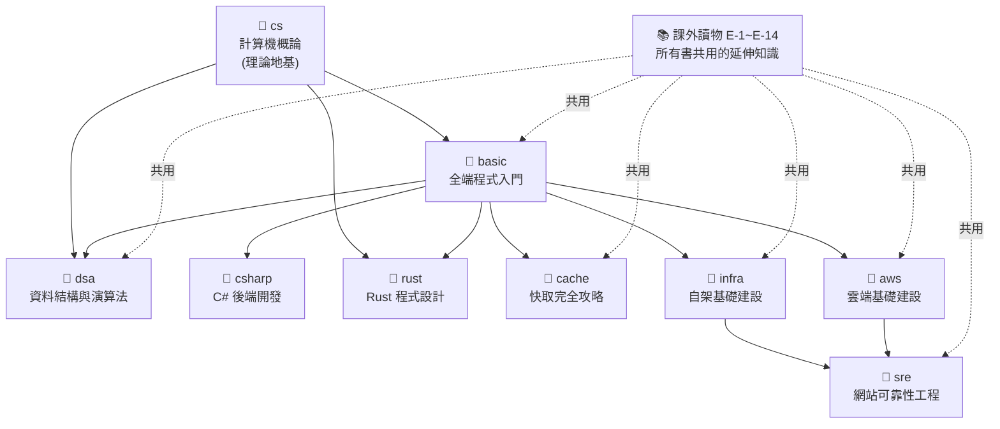

# 全端工程師養成課程

> 一套從零開始、用大量圖表與生活化比喻寫成的中文程式教學。
> 目標不是「背熟一門語言」，而是建立**程式思維與架構觀**——在寫第一行程式碼之前，就先看懂全局。

這個專案像一座圖書館：`lessons/` 底下每個資料夾是**一本獨立的書**，`課外讀物/` 是所有書共用的延伸知識庫。你可以照著一本書從頭讀，也可以挑有興趣的主題切入。

---

## 課程地圖



上圖：`cs`（計算機概論）是底層理論地基；`basic` 是程式入門；兩者打底後可接 `dsa`（資料結構與演算法）練效率思維、`rust`（系統級語言）深入記憶體，或往後端（csharp）、快取（cache）、自架（infra）、雲端（aws）發展；infra / aws 之後可接 sre 學「讓系統跑得可靠」。課外讀物則被所有書交叉引用。

---

## 課程一覽

| 書 | 主題 | 你學完能做什麼 | 章節數 | 狀態 |
|----|------|--------------|:----:|:----:|
| 📐 **[cs](lessons/cs/課程大綱.md)** | 計算機概論 | 打開電腦黑盒子：資料表示、硬體、程式執行、作業系統、網路的底層直覺 | 50 | ✅ |
| 📘 **[basic](lessons/basic/課程大綱.md)** | 全端程式入門 | 建立程式思維，用 TypeScript 從前端、後端、資料庫到部署做出完整 app | 53 | ✅ |
| 📐 **[dsa](lessons/dsa/課程大綱.md)** | 資料結構與演算法 | 分析複雜度（Big-O）、熟悉各種資料結構與經典演算法，選對解法 | 38 | ✅ |
| 🦀 **[rust](lessons/rust/課程大綱.md)** | Rust 程式設計 | 駕馭所有權/借用/生命週期，用 Axum + 資料庫做出高效能 Web 後端 | 52 | ✅ |
| 📗 **[csharp](lessons/csharp/課程大綱.md)** | C# 後端開發 | 用 C# / ASP.NET Core 獨立開發、測試、部署一個完整後端 API | 0 | 📝 僅大綱 |
| 📙 **[cache](lessons/cache/課程大綱.md)** | 快取完全攻略 | 看懂、設計、除錯各層快取（瀏覽器 / CDN / Redis / DB），避開經典的坑 | 30 | ✅ |
| 📕 **[infra](lessons/infra/課程大綱.md)** | 自架基礎建設 | 獨立管理 Linux 伺服器、架設服務、設網路安全、自動化與監控 | 44 | ✅ |
| 📒 **[aws](lessons/aws/課程大綱.md)** | 雲端基礎建設 | 安全地使用 AWS、讀懂 VPC/EKS 架構圖、把 app 部署上雲、控管帳單 | 53 | ✅ |
| 📓 **[sre](lessons/sre/課程大綱.md)** | 網站可靠性工程 | 定義 SLO、建立觀測性、設計告警、主導事故處理、為系統設計韌性 | 44 | ✅ |

> `csharp` 目前只有大綱、章節內容尚未撰寫。

### 📚 課外讀物（E 系列，所有書共用）

不屬於任何單一本書的通用知識，主線課程標記 `[課外讀物 E-X]` 的地方就是延伸入口。
完整索引見 **[課外讀物總目錄](課外讀物/課程大綱.md)**。

| 系列 | 主題 | | 系列 | 主題 |
|------|------|---|------|------|
| E-1 | 終端機操作 | | E-8 | Git 版本控制 |
| E-2 | npm 與套件生態 | | E-9 | 測試（Testing） |
| E-3 | 網路通訊基礎 | | E-10 | Web Security 基礎 |
| E-4 | 資料庫進階 | | E-11 | 效能與快取 |
| E-5 | 趣味小知識 | | E-12 | 軟體設計模式（含 DAL） |
| E-6 | Best Practices & Clean Code | | E-13 | 規模化與分散式架構 |
| E-7 | SOLID 原則 | | E-14 | 觀測性（ELK / 三支柱） |

---

## 專案結構

```
programming-tutorial/
├── CLAUDE.md            # 撰寫規範（寫/改課程前必讀）
├── README.md           # 你正在看的這份
├── lessons/            # 多本獨立課程，一個子資料夾一本
│   ├── basic/          # 每本書都有自己的 課程大綱.md
│   │   ├── 課程大綱.md
│   │   ├── intro/
│   │   ├── part-0/ … part-7/
│   │   └── ...
│   ├── cs/  dsa/  rust/  csharp/  cache/  infra/  aws/  sre/
├── 課外讀物/            # 所有書共用的延伸閱讀（E-1 ~ E-14）
│   ├── 課程大綱.md       # 課外讀物總目錄（共用）
│   ├── E-1-terminal/ … E-14-observability/
└── poc/                # 漸進式範例專案 V1~V8（搭配 basic 的 Part 解鎖）
```

---

## 怎麼開始

1. **想學程式 / 全端開發** → 從 [`basic` 課程大綱](lessons/basic/課程大綱.md) 開始，照 Part 0 → Part 7 順序讀。
2. **想了解某個主題**（雲端 / 快取 / 維運…）→ 直接打開對應書的 `課程大綱.md`，依章節編號讀。
3. **遇到 `[課外讀物 E-X]` 標記** → 點進去看延伸知識；不看不影響主線，看了更懂「為什麼」。

> 這些 `.md` 在任何 Markdown 閱讀器都能看，並針對 **[Obsidian](https://obsidian.md/)** 最佳化——內部連結、Mermaid 圖表都可直接點擊／渲染。建議用 Obsidian 開啟整個資料夾，體驗最完整。

---

## 寫作風格（給共筆者）

所有章節遵循統一規範，詳見 **[CLAUDE.md](CLAUDE.md)**。核心原則：

- **比喻先行**：先用生活類比或 pseudo code 說明概念，再用 Mermaid 圖視覺化，最後才給正式程式碼。
- **新術語第一次出現就解釋**，不假設讀者已懂。
- **一章只講一個核心概念**，附小練習與課外讀物引導。
- 程式碼範例遵守命名 / 函式 / TypeScript / 錯誤處理等品質標準，並在適當處引導至 SOLID、Clean Code 課外讀物。

要新增或續寫某本書的章節時，**先讀該書的 `課程大綱.md`**，再依大綱的章節編號撰寫。
