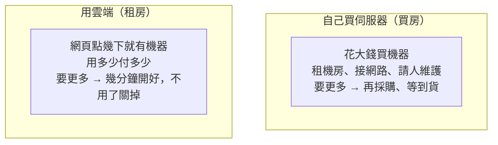

# [aws-1-1] 雲端計算的誕生：為什麼公司不再自己買伺服器

> **本章目標**：理解「雲端」到底是什麼，以及為什麼現在幾乎所有公司都把伺服器搬上雲，而不是自己買機器。

## 你會學到

- 「雲端（Cloud）」其實是什麼（不是什麼神祕的東西）
- 用「租房 vs 買房」理解自架 vs 雲端
- 雲端帶來的幾個關鍵改變
- AWS 在這個故事裡的角色

## 概念說明

### 「雲端」沒有那麼玄

「雲端」聽起來很高科技、很抽象。但它的本質其實很樸實：

> **雲端 = 別人（雲端商）幫你準備好的一大堆電腦，你透過網路租來用，用多少付多少。**

就這樣。所謂「把東西放上雲端」，意思是「**把你的程式跑在別人的電腦上，那些電腦放在別人的機房裡**」。那個「別人」，就是 AWS、Google Cloud、Azure 這些雲端商。

「雲（Cloud）」這個名字，來自工程師畫網路架構圖時，習慣用一朵雲代表「網路另一端、我不用管細節的地方」。久了，「那一端的運算資源」就被叫做雲端了。

---

### 用「租房 vs 買房」來理解

要懂雲端的價值，先看「沒有雲端的年代」公司怎麼弄伺服器——這就像**買房 vs 租房**的差別：



| | 自己買伺服器（買房） | 用雲端（租房） |
|---|-------------------|--------------|
| 前期成本 | **巨大**（買機器、租機房、佈線）| 幾乎為零，用多少付多少 |
| 要更多時 | 採購、等貨、安裝（數週）| 點幾下，**幾分鐘**就有 |
| 用不到時 | 機器擺著，錢照燒 | **關掉就不用付錢** |
| 維護 | 自己請人顧硬體、換壞掉的 | 雲端商負責底層硬體 |
| 尖峰應付 | 要按「最高峰」買，平時浪費 | **自動擴縮**，要多少給多少（SRE 課學過）|

就像租房——你不用一次掏出幾百萬買房、不用自己修水電，搬進去就能住、不住了退租就好。對大多數公司來說，這個彈性和成本優勢，遠勝「自己買一整批伺服器」。

---

### 雲端帶來的幾個關鍵改變

雲端不只是「把機器換個地方放」，它根本改變了做事方式：

**① 從「資本支出」變「營運支出」**：以前要先砸一大筆錢買設備（資本支出）；現在像付水電費一樣，用多少付多少（營運支出）。新創公司不用一開始就燒大錢買伺服器。

**② 從「數週」變「數分鐘」**：以前要一台新伺服器，採購到上線要好幾週；現在點幾下、幾分鐘搞定。這讓「快速實驗、快速擴展」變得可能。

**③ 彈性擴縮**：流量大就自動加機器、流量小就減（SRE Part 7-3、infra Part 9）。你不用為了「萬一爆量」而長期養一堆閒置機器。

**④ 站在巨人肩膀上**：雲端商提供大量「現成的服務」——資料庫、快取、AI、儲存…（後面 Part 6 會看到）。你不用什麼都自己架，可以專注做你的產品。

---

### AWS 是誰？

**AWS（Amazon Web Services，亞馬遜網路服務）** 是這個故事的主角之一——目前全球最大的雲端商。

有趣的是它的起源：Amazon 原本是電商，為了應付自己的巨大流量，建了強大的基礎設施。後來他們發現「**這套基礎設施，可以租給別人用**」——於是 2006 年推出 AWS，把自己的運算能力變成一門生意。結果這門生意大到不行，現在是 Amazon 最賺錢的部門之一。

今天，從 Netflix、Airbnb 到無數新創，背後都跑在 AWS 上。學會 AWS，等於拿到進入現代軟體業基礎建設的鑰匙——這也是這門課的目標。

> 這門 AWS 課和你學過的 infra 課互補：**infra 教你「自己架（買房）」的底層原理，AWS 教你「用雲端（租房）」怎麼把這些落地。** 因為你懂底層，學雲端會特別快——你會一直「啊，這不就是 infra 學的那個嗎，只是 AWS 幫我管」。

## 範例：一家新創的選擇

```
情境：三個人的新創團隊，要做一個 App，剛開始沒什麼使用者

❌ 自己買伺服器（買房）：
   - 先花幾十萬買機器、租機房
   - 萬一 App 沒紅 → 機器全砸手裡
   - 萬一突然爆紅 → 來不及加機器，當機流失使用者

✅ 用 AWS（租房）：
   - 第一天：用很小的資源起步，幾乎不花錢（甚至在免費額度內）
   - App 沒紅 → 關掉就好，損失極小
   - App 爆紅 → 自動擴縮，幾分鐘加機器扛住流量
   - 把省下的錢和精力，專注做產品
```

對絕大多數團隊——尤其是還在摸索、不確定會多大的——雲端的彈性是壓倒性的優勢。這就是為什麼「公司不再自己買伺服器」成了主流。

## 小練習

### 練習 1：用租房解釋雲端

不看上面，用「租房 vs 買房」的類比，向朋友解釋「為什麼公司要用雲端，而不是自己買伺服器」。

<details>
<summary>參考解答</summary>

這是開放題，重點是把類比講清楚。示範講法：

> 自己買伺服器就像**買房**：一開始要掏一大筆錢（買機器、租機房、佈線、請人維護），而且買了就是你的——用不到也擺著燒錢，想住大一點還得重新裝潢、等很久。用雲端則像**租房**：搬進去就能住（點幾下、幾分鐘就有機器），用多少付多少（像付月租），不住了退租就好（關掉就不再付錢），水電維修（底層硬體）房東（AWS）幫你顧。

關鍵要帶到三個對比：**前期成本**（買房巨大 vs 租房幾乎為零）、**擴縮速度**（買房採購要數週 vs 租房幾分鐘）、**不用時的成本**（買房照燒 vs 租房關掉就省）。對大多數還在摸索、不確定會多大的公司，租房這種彈性與低前期成本是壓倒性優勢。

</details>

---

### 練習 2：雲端的關鍵優勢

回答：對一個「不確定會不會紅」的新創 App，雲端最關鍵的兩個優勢是什麼？

<details>
<summary>參考解答</summary>

對「不確定會不會紅」的新創，最關鍵的兩個優勢是：

1. **低前期成本、風險小（資本支出變營運支出）**：不用一開始就砸幾十萬買機器。第一天用很小的資源起步，幾乎不花錢（甚至在免費額度內）。萬一 App 沒紅，關掉就好，損失極小——不會像「買房」那樣機器全砸手裡。

2. **彈性擴縮（要多少給多少）**：萬一 App 突然爆紅，雲端能在幾分鐘內自動加機器扛住流量，不會因為來不及採購而當機、流失使用者；平時流量小又能縮回去，不必為了「萬一爆量」長期養一堆閒置機器。

一句話總結：**沒紅時賠得少、紅了又扛得住**——這正是「不確定性」下最需要的兩件事。

</details>

---

### 練習 3：什麼時候「買房」還是划算？

雲端不是萬靈丹。想想看：什麼情況下，「自己買伺服器」反而可能比較划算？（提示：可以回想 infra Part 9-3 自架 vs 雲端的取捨——超大規模、超穩定流量、特殊硬體需求…）

<details>
<summary>參考解答</summary>

雲端是「租房」，租久了、租很多，總價可能比「買房」貴。以下情境自架反而可能划算：

1. **超大規模且流量穩定**：當你的用量非常大又長期穩定（例如像 Dropbox 早期那樣有海量儲存需求），長期租金會遠超過自己買機器攤提的成本。這類公司常會「反向」把部分業務從雲端搬回自建機房省錢。因為量夠大、又穩定，前期投資能被長時間攤平。

2. **極度可預測的長期負載**：沒有明顯尖離峰、幾乎 24 小時滿載的工作負載，享受不到雲端「用不到就關掉省錢」的好處，自架的固定成本反而更低（或在雲端至少該用 Reserved/Savings Plans 而非隨需）。

3. **特殊硬體或極致效能需求**：需要特製硬體、特殊網路架構、或要壓榨到極致的低延遲，雲端的標準化機型不一定滿足，自建更能客製。

4. **強法規 / 資料主權要求**：某些產業（金融、政府、軍事）法規要求資料與硬體必須完全自己掌控、放在自家機房，這時自架是硬性條件。

核心取捨：**雲端拿彈性換單價**。當你「不需要彈性」（量大又穩）、或「彈性換不到好處」，買房就可能更划算。這正是 infra Part 9-3 談的自架 vs 雲端取捨。

</details>

## 課外讀物

> 想了解「自己架（買房）」那一面的完整原理 → 參見 **infra 課程**（`lessons/infra/課程大綱.md`）
