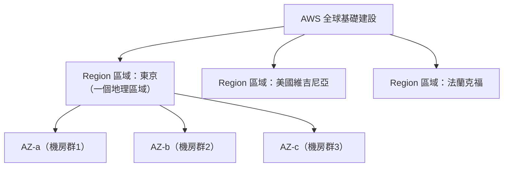

# [aws-1-2] AWS 是一間什麼樣的店？Region、AZ、Edge

> **本章目標**：搞懂 AWS 的全球架構——Region（區域）、Availability Zone（可用區）、Edge Location（邊緣節點），以及為什麼你「選在哪裡開機器」這件事很重要。

## 你會學到

- AWS 的全球基礎建設長什麼樣
- Region（區域）是什麼、怎麼選
- Availability Zone（可用區）是什麼、為什麼有好幾個
- Edge Location（邊緣節點）跟前兩者的差別

## 概念說明

### AWS 是一張遍布全球的「機房網」

上一章說雲端是「別人的一大堆電腦」。那這些電腦放在哪？答案是——**AWS 在全世界蓋了非常多機房**，組成一張全球網路。

但這些機房不是隨便散落的，而是有清楚的三層結構：**Region（區域）→ Availability Zone（可用區）→ Edge Location（邊緣節點）**。理解這個結構很重要，因為它直接影響你的服務「跑在哪、快不快、穩不穩」。



---

### Region（區域）：選一個地理位置

**Region（區域）** 是一個**地理區域**——例如「東京」「新加坡」「美國維吉尼亞」「法蘭克福」。AWS 在全球有幾十個 Region。

你在 AWS 開資源時，**第一件事就是選一個 Region**。怎麼選？三個主要考量：

| 考量 | 說明 |
|------|------|
| **離使用者近** | Region 離使用者越近，連線延遲越低、越快（光速也是有限的！）|
| **法規 / 資料落地** | 有些法規要求「資料必須存在某個國家境內」 |
| **價格** | 不同 Region 價格略有差異 |

例如你的使用者主要在台灣，選「東京」或「新加坡」Region 通常比選「美國」快很多——因為資料不用繞半個地球。

> ⚠️ 新手常踩的坑：**在 A Region 開的資源，在 B Region 看不到**。如果你「東西不見了」，先確認你在 AWS 控制台**右上角選的 Region 對不對**。

---

### Availability Zone（可用區）：同一區域裡的多個獨立機房

一個 Region 裡面，又分成好幾個 **Availability Zone（可用區，簡稱 AZ）**。

> 你在 SRE Part 8-3、infra Part 9-2 已經學過 AZ 的概念了！這裡再鞏固：**一個 AZ 就是一群「獨立的機房」——有各自的電力、網路、冷卻，彼此實體隔離（但又靠高速網路相連）。**

為什麼一個 Region 要有好幾個 AZ？為了**容錯**：

- 如果你只把資源放在「一個 AZ」，那個 AZ 機房出事（斷電、火災），你的服務就全掛。
- 如果你把資源**分散到多個 AZ**（這就是 Multi-AZ），一個 AZ 掛了，其他 AZ 的還在——服務繼續。

用類比（呼應 SRE Part 8-3）：Region 像「一個城市」，AZ 像「城市裡相隔一段距離的好幾棟大樓」。把雞蛋分散到不同大樓，一棟失火，不會全毀。

**這就是雲端「高可用」的基礎**——而且 AWS 把它做得很容易，你只要把資源設定成跨多個 AZ 就好（Part 4、Part 6 會實作）。

---

### Edge Location（邊緣節點）：離使用者更近的「前哨站」

第三層是 **Edge Location（邊緣節點）**。它和 Region/AZ 的角色不同：

- Region/AZ 是「**運算與資料的家**」——你的伺服器、資料庫真正住的地方。
- Edge Location 是「**散布在全球、離使用者超近的前哨站**」——數量比 Region 多很多，主要用來**快取內容、加速存取**。

你在 basic 課程、課外讀物 E-11-5 學過 **CDN（內容傳遞網路）** 吧？AWS 的 CDN 服務（CloudFront，Part 6 會學）就是靠這些 Edge Location 運作的：

```
使用者在台灣要看一張圖
  → 不用大老遠去美國的 Region 拿
  → 從「最近的 Edge Location（例如台北）」拿快取好的副本
  → 快很多！
```

用類比：Region 像「總倉庫」，Edge Location 像「遍布各地的便利商店」——買常見的東西（靜態內容）去最近的便利商店就好，不用跑總倉庫。

---

### 三者怎麼配合

把三層串起來，這就是 AWS 全球架構的全貌：

```
Region（地理區域，選離使用者近的）
  └── 多個 AZ（獨立機房，分散放資源達成高可用）
        └── 你的伺服器、資料庫真正住這裡

Edge Location（遍布全球的前哨站）
  └── 快取內容，讓全球使用者就近、快速存取
```

理解這個結構，你就能做出好的架構決策：**選對 Region（離使用者近）、跨多 AZ（高可用）、用 Edge 加速（CloudFront）**。這三件事，是你之後設計任何 AWS 架構的基本功。

## 範例：為一個服務規劃地理架構

```
情境：一個主要服務台灣與日本使用者的 App

Region 選擇：
  → 選「東京（ap-northeast-1）」Region
  → 因為離台灣、日本都近，延遲低

AZ 配置（高可用）：
  → 把伺服器和資料庫，分散到東京 Region 的「3 個 AZ」
  → 一個 AZ 機房出事，其他 2 個還能服務（Multi-AZ）

Edge 加速：
  → 用 CloudFront，讓圖片、影片等靜態內容
    從離使用者最近的 Edge Location 提供
  → 即使使用者偶爾在國外，也能就近快速存取
```

這個規劃同時顧到了「快（選對 Region + Edge）」和「穩（跨 AZ）」——這就是 AWS 全球架構給你的能力。

## 小練習

### 練習 1：三層架構

不看上面，用一句話分別解釋 Region、Availability Zone、Edge Location 是什麼。

---

### 練習 2：為什麼要 Multi-AZ

回答：如果把所有資源都放在「同一個 AZ」，有什麼風險？為什麼要分散到多個 AZ？（提示：呼應 SRE Part 8-3、infra Part 9-2）

---

### 練習 3：做地理決策

你的服務使用者主要在歐洲。

1. 你會選哪個區域附近的 Region？為什麼？
2. 如果要高可用，AZ 該怎麼配置？
3. 如果使用者偶爾散布到其他洲，什麼能幫你加速？

## 課外讀物

> Edge Location 的核心應用是 CDN，想深入理解 CDN 怎麼加速 → [課外讀物 E-11-5：CDN 是什麼？](../../../課外讀物/E-11-performance/E-11-5-cdn.md)
