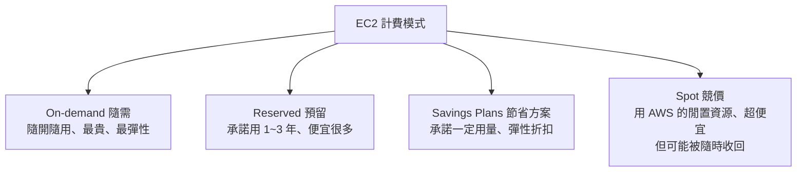

# [aws-1-3] 先搞懂錢：Free Tier、計費模式、別收到天價帳單

> **本章目標**：在動手開任何資源之前，先搞懂 AWS 怎麼收費、免費方案能用什麼、以及為什麼有人會收到天價帳單——讓你能安心、不怕地學習。

## 你會學到

- AWS 的計費基本原則：用多少付多少
- 免費方案（Free Tier）有哪幾種、能用什麼
- 幾種計費模式：On-demand / Reserved / Spot / Savings Plans
- 「天價帳單」是怎麼發生的、怎麼避免

## 概念說明

### 為什麼「先談錢」？

學 AWS，最讓新手害怕的不是技術，而是——**「我會不會不小心被收一大筆錢？」**

這個擔心是合理的，而且很重要。所以這門課刻意**在你動手開任何資源之前，先把錢講清楚**。搞懂計費、設好防護，你才能放心大膽地學、動手做實驗，而不用提心吊膽。

下一章（1-4）你就會親手設定「預算警示」——但要先懂原理。

---

### AWS 計費的基本原則：用多少付多少

AWS 的核心收費原則，就是上一章說的「租房」精神：

> **用多少付多少（pay-as-you-go）。** 你用了多少運算、多少儲存、多少流量，就付多少；關掉不用的資源，就不再付錢。

但「用多少」的計算方式，依服務而不同，常見的計費維度：

| 計費維度 | 例子 |
|---------|------|
| **時間** | 一台 EC2 機器，開著就按「每小時 / 每秒」計費 |
| **容量** | S3 儲存，按「存了多少 GB」計費 |
| **流量** | 資料「傳出」AWS 的網路流量，按 GB 計費 |
| **請求次數** | 某些服務按「呼叫幾次」計費 |

關鍵心法：**「開著的資源就在花錢」**。一台 EC2 你忘了關，它就 24 小時一直計費——即使你根本沒在用。這是天價帳單的常見來源之一（下面詳述）。

---

### 免費方案（Free Tier）：學習的好朋友

好消息——AWS 有 **免費方案（Free Tier）**，讓你能免費試用很多服務。它分三種類型，要分清楚：

| 類型 | 意思 | 例子 |
|------|------|------|
| **12 個月免費** | 註冊後 12 個月內免費（有額度上限）| 每月 750 小時的小型 EC2、5GB S3 儲存 |
| **永久免費** | 一直免費（在額度內）| Lambda 每月前 100 萬次請求 |
| **試用型** | 短期試用某服務 | 某些服務的限時試用 |

對學習來說，**12 個月免費 + 永久免費**已經很夠用了。這門課的動手做，都會盡量控制在免費額度內。

> ⚠️ 但要小心兩個陷阱：
> 1. **免費額度有上限**——例如「750 小時 EC2」。如果你開了 2 台一直跑，一個月就超過 750 小時（一台一個月約 720 小時），超出的部分要錢。
> 2. **不是所有服務都有免費額度**——有些服務一用就計費。動手前要留意。

---

### 幾種計費模式（了解即可）

對「按時間計費」的資源（如 EC2），AWS 有幾種付費模式，價格差很多。現在了解概念就好，之後省錢時用得上：



| 模式 | 特性 | 適合 |
|------|------|------|
| **On-demand（隨需）** | 隨開隨用、不綁約，但**最貴** | 學習、測試、流量不定 |
| **Reserved（預留）** | 承諾用 1~3 年，**便宜很多**（最多省 7 成）| 穩定、長期的工作負載 |
| **Savings Plans** | 承諾一定用量，換折扣，比 Reserved 彈性 | 用量穩定但想保留彈性 |
| **Spot（競價）** | 用 AWS 的閒置資源，**超便宜**（省 9 成），但**可能被隨時收回** | 可中斷的工作（批次運算）|

**學習階段用 On-demand 就好**（搭配免費額度）。等你有穩定的正式服務，再用 Reserved / Savings Plans 省大錢。這呼應了 SRE 課「容量規劃 + 成本」的取捨。

---

### 「天價帳單」是怎麼發生的

每隔一陣子就有新聞：「某人學 AWS，一覺醒來收到幾十萬帳單」。這不是嚇你，是真的會發生。常見原因：

1. **忘了關資源**：開了測試用的機器/資料庫，學完忘了關，它 24 小時一直計費。**最常見。**
2. **開到貴的資源**：手滑開了一台超大規格的機器，或啟用了昂貴的服務，沒注意。
3. **金鑰外洩**：把 AWS 的存取金鑰不小心上傳到公開的 GitHub → 被駭客撿到 → 拿去開一堆機器挖礦 → 天價帳單。**這是最可怕的一種**（Part 2 IAM 會教怎麼防）。
4. **流量爆量**：被攻擊或設計不良，產生海量的計費流量。

好消息是——**這些幾乎都能防**。防護的核心就是下一章要做的事，以及貫穿這門課的好習慣。

---

### 怎麼避免天價帳單（防護總覽）

| 防護 | 怎麼做 | 在哪學 |
|------|--------|--------|
| **設定預算警示** | 超過設定金額就寄信通知你 | **下一章 1-4** |
| **學完就關資源** | 養成「實驗完關掉」的習慣 | 全課貫穿 |
| **保護金鑰、開 MFA** | 別讓金鑰外洩、帳號被盜 | Part 2 IAM |
| **定期看帳單** | Cost Explorer 看花在哪 | Part 10 |
| **善用免費額度** | 盡量待在 Free Tier 內 | 本章 |

最重要、也最該第一個做的——**設定預算警示**。它像一個保險絲：花費一超過你設的金額（例如 1 美元），就立刻寄信通知你，讓你及時發現「咦，怎麼開始花錢了」。下一章就帶你設好它。

## 範例：一次安全的學習花費規劃

```
情境：我要學這門 AWS 課，怎麼控制花費？

① 設定預算警示（下一章做）：
   設「每月預算 5 美元，超過 1 美元就寄信通知」
   → 一有意外花費，馬上知道

② 善用 Free Tier：
   用免費額度內的小型 EC2、S3
   → 大部分練習免費

③ 用 On-demand：
   學習階段不綁約，隨開隨用

④ 養成關資源的習慣：
   每次練習完，把開的 EC2、資料庫關掉/刪掉
   → 不留「忘了關還在計費」的資源

⑤ 保護帳號：
   開 MFA、絕不把金鑰上傳 GitHub（Part 2）

結果：整門課的學習花費，可以控制在很低、甚至接近零。
```

照這套做，你就能安心學習，不用怕帳單。

## 小練習

### 練習 1：計費基本原則

回答：

1. AWS 計費的核心原則是什麼？
2. 為什麼「忘了關一台 EC2」會一直花錢，即使你沒在用它？

---

### 練習 2：分清 Free Tier 類型

回答：Free Tier 的「12 個月免費」和「永久免費」差在哪？為什麼「免費額度有上限」這件事要特別小心？

---

### 練習 3：診斷天價帳單

下面哪些是「天價帳單」的常見原因？對每一個，想一個防範方法：

1. 開了測試機器忘記關
2. 把 AWS 金鑰上傳到公開 GitHub
3. 手滑開了一台超大規格機器

> 提示：預算警示、關資源習慣、金鑰保護（Part 2）。

## 課外讀物

> 計費和成本管理的深入（Cost Explorer、Budgets）在 Part 10 詳述（同課程 `aws-10-3`）。下一章先動手設好「預算警示」這道防線。
