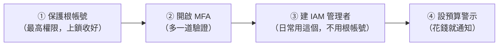

# [aws-1-4] 🔧 動手做：安全地開好你的帳號 + 設定預算警示

> **本章目標**：把帳號的安全與防爆帳基礎一次設好——保護根帳號、開啟 MFA、建立 IAM 管理者帳號、並設定預算警示。這是你動任何其他東西「之前」該做的第一件事。

## 你會學到

- 為什麼「根帳號」要上鎖、不要日常使用
- 開啟 MFA（多因素驗證）保護帳號
- 建立一個 IAM 管理者帳號給日常使用
- 設定預算警示（防爆帳的關鍵防線）

## 概念說明

### 動手前，先建好「安全網」

上一章講了天價帳單和安全風險。這一章就把防線實際建起來。**這是你在 AWS 做任何其他事之前，該完成的第一件事**——就像搬進新家第一件事是裝好門鎖和煙霧偵測器。

要做四件事：

> 前提：你已經註冊好一個 AWS 帳號（用 email + 信用卡註冊）。如果還沒，先去 aws.amazon.com 註冊。

---

### 為什麼根帳號要「上鎖收好」

你註冊 AWS 用的那個 email 帳號，叫**根帳號（root account）**。它有**至高無上的權限**——能做帳號裡的任何事，包括關閉帳號、改帳單。

正因為它權限太大，**一旦被盜，後果不堪設想**（駭客能拿它做任何事、開一堆機器、看你的帳單）。所以 AWS 和所有安全最佳實踐都強烈建議：

> **根帳號設好強密碼 + MFA 之後，就「收起來」，平常絕對不要用它。** 日常操作改用權限受限的 IAM 帳號。

這完全呼應你 infra Part 2-6 學的——「別用 root 日常操作，平常用一般使用者」。AWS 的根帳號就是 Linux root 的雲端版，同樣的安全原則。

---

### MFA：多一道鎖

**MFA（Multi-Factor Authentication，多因素驗證）** 是「**除了密碼，還要再驗證一個東西**」才能登入。最常見的是手機上的驗證器 App（如 Google Authenticator），每 30 秒產生一組動態碼。

為什麼重要？因為——**就算密碼被偷了，駭客沒有你的手機，還是登不進去。** 它把帳號安全大幅提升。根帳號**一定**要開 MFA，IAM 管理者帳號也建議開。

---

### 為什麼要另建「IAM 管理者」

既然根帳號要收起來，那日常誰來操作？答案是建立一個 **IAM 使用者**，給它管理權限，平常用它。

好處（呼應 infra Part 2-6 的「一般使用者 + sudo」）：

- 日常用 IAM 帳號，根帳號安全地收著、不暴露。
- IAM 帳號的權限可以控制（雖然管理者權限也很大，但至少不是「能改帳單、關帳號」的根帳號）。
- 之後團隊每個人可以有自己的 IAM 帳號，方便管理與追蹤。

## 程式碼範例

> AWS 大部分設定在網頁「主控台（Console）」點選操作。下面是步驟說明（介面細節可能隨時間略有調整，但邏輯不變）。

### ① 用根帳號登入，並開啟 MFA

1. 用註冊的 email 登入 AWS Console（這是少數該用根帳號的時刻）。
2. 右上角帳號名 → **Security credentials（安全憑證）**。
3. 找到 **Multi-factor authentication (MFA)** → Assign MFA device。
4. 選「Authenticator app」，用手機的驗證器 App 掃 QR code，輸入兩組連續的動態碼完成綁定。

完成後，根帳號就有了 MFA 保護。

---

### ② 建立 IAM 管理者帳號

1. 在 Console 搜尋並進入 **IAM** 服務。
2. 左側 **Users** → Create user。
3. 取個名字（例如 `admin-你的名字`）。
4. 勾選「Provide user access to the AWS Management Console」（讓它能登入網頁）。
5. 權限：選「Attach policies directly」→ 勾選 **AdministratorAccess**（管理者權限）。
   > 注意：這給了很大的權限，所以這個帳號也要好好保護、也建議開 MFA。Part 2 會教更精細的權限控制（最小權限原則）。
6. 建立完成，記下登入網址、使用者名稱、密碼。

之後**用這個 IAM 帳號登入做日常操作**，根帳號就收起來。

---

### ③ 設定預算警示（防爆帳關鍵！）

這是這章最重要的一步。

1. 在 Console 搜尋並進入 **Billing and Cost Management**。
2. 左側找 **Budgets（預算）** → Create budget。
3. 選「Cost budget」。
4. 設定金額：例如「每月 5 美元」（依你的學習預算）。
5. 設定警示門檻：例如「實際花費達到 **1 美元**（或預算的 20%）時通知」。
   > 設一個很低的門檻（如 1 美元）當「早期警報」——這樣一有意外花費，你馬上就知道。
6. 填入接收通知的 email。
7. 完成。

之後，只要花費超過你設的門檻，AWS 就會**寄信通知你**。這就是你的「保險絲」——萬一有資源忘了關、或被異常使用，你能第一時間發現處理，而不是月底才看到天價帳單。

---

### ④ 額外建議：開啟帳單警示與設定

- 在 Billing 設定裡，啟用「Receive billing alerts」。
- 可以的話，也為「預測花費（forecasted）」設一個警示——它會在「照目前速度，這個月預計會花超過 X」時提早通知。

## 小練習

### 練習 1：完成安全設定

實際完成這四步：根帳號開 MFA、建立 IAM 管理者帳號、設定預算警示。之後改用 IAM 帳號登入。

---

### 練習 2：理解根帳號的原則

回答：

1. 為什麼根帳號設好之後要「收起來、不要日常使用」？
2. 這和你在 infra Part 2-6 學的「別用 Linux root 日常操作」是不是同一個道理？

---

### 練習 3：測試你的預算警示

設好預算警示後，確認你填的 email 正確。想想看：如果哪天你不小心開了一台機器忘了關，這個警示會在什麼時候、怎麼救你？

> 你現在有了安全的帳號和防爆帳的保險絲，可以放心動手了。下一章就讓你體驗第一個成就——把一個網頁公開到全世界！

## 課外讀物

> 帳號安全是整體 Web 安全的一環，想建立完整的安全觀 → [課外讀物 E-10-1：Web 安全總覽 — OWASP Top 10](../../../課外讀物/E-10-security/E-10-1-web-security-overview.md)
