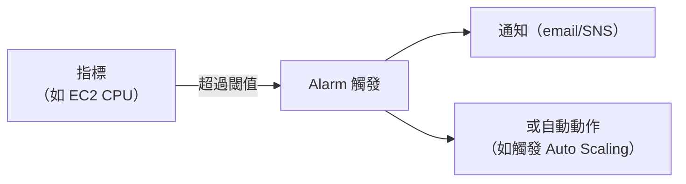

# [aws-10-1] CloudWatch：Log、Metrics、Alarm

> **本章目標**：理解 CloudWatch 這個 AWS 的監控中樞——怎麼收集日誌與指標、設定告警，把你 infra/SRE 學的觀測能力用 AWS 受管服務實現。

## 你會學到

- CloudWatch 是什麼、做哪些事
- CloudWatch Logs（日誌）、Metrics（指標）、Alarms（告警）
- 它怎麼對應你 infra/SRE 學的觀測概念
- 怎麼用它監控你的 AWS 資源

## 概念說明

### CloudWatch：AWS 的監控中樞

線上出問題時怎麼找線索？你 infra Part 7、SRE Part 3 學過——看日誌、看指標、設告警。在 AWS，這些由 **CloudWatch** 統一提供：

> **CloudWatch 是 AWS 的「監控中樞」——它收集你各種 AWS 資源的日誌與指標、畫成圖、並在異常時告警。**

它對應你學過的（這章是「舊概念的 AWS 落地」）：

| CloudWatch 功能 | 對應你學過的 |
|----------------|------------|
| **Logs（日誌）** | infra Part 7-1 的日誌、SRE 三支柱的 Logs |
| **Metrics（指標）** | infra Part 7-2 的指標、SRE 黃金訊號/Prometheus |
| **Alarms（告警）** | SRE Part 4 的告警 |
| **Dashboards** | infra Part 7-4、SRE Part 3-4 的儀表板 |

換句話說——**CloudWatch 是「AWS 受管版的 Prometheus + Grafana + Alertmanager」**（你 infra Part 7 自己架的那套）。差別是 AWS 幫你顧好，且和 AWS 服務深度整合。

---

### CloudWatch Metrics（指標）

AWS 的各種服務**自動把指標送到 CloudWatch**——EC2 的 CPU、RDS 的連線數、ALB 的請求數、Lambda 的執行次數… 全都自動有，不用你設定收集（對比 infra 課要自己裝 node_exporter）。

你可以：

- 看這些指標的圖表（趨勢）。
- 對它們設告警（下面）。
- 做成儀表板（呼應 SRE Part 3-4 的儀表板設計原則——依黃金訊號組織、別塞雜訊）。

> 也能送「自訂指標」——你的應用層指標（如 SRE Part 3-6 的業務指標）可以推送到 CloudWatch。

---

### CloudWatch Logs（日誌）

各服務的日誌也能集中到 CloudWatch Logs：

- **Lambda** 的輸出自動進 CloudWatch Logs（aws-8 的 Lambda log 就在這看）。
- **ECS/EKS** 容器的日誌可以送到這裡。
- **EC2** 上裝 agent 也能把日誌送來。

這呼應 infra Part 7-1——只是從「散落在各機器的 /var/log」變成「集中在 CloudWatch」，方便跨資源查詢。你可以用 **Logs Insights** 對日誌做查詢分析（找錯誤、追問題）。

---

### CloudWatch Alarms（告警）

**Alarm（告警）** 讓你「對某個指標設條件，達到就通知/動作」——這正是 SRE Part 4 的告警，AWS 版：



例如：

- 「EC2 CPU > 80% 持續 5 分鐘 → 寄信通知」（SRE Part 4 的告警）。
- 「ALB 的 5xx 錯誤率 > 1% → 通知」（SRE 對症狀告警，4-4）。
- 「CPU 高 → 自動觸發 Auto Scaling 加機器」（aws-3-4，告警驅動擴縮）。

**重要——把 SRE Part 4 的告警智慧用上**：別對一堆無謂的指標告警（告警疲勞，SRE Part 4-2）；對「症狀」告警（SRE 4-4）；只在「真的需要行動」時才通知（SRE 4-1）。CloudWatch 給你工具，但「怎麼設計好告警」靠的是你 SRE 學的判斷力。

> 你 aws-1-4 設的「預算警示」，背後也是 CloudWatch 的告警機制。所以你其實早就用過它了！

---

### CloudWatch vs 自架 Prometheus/Grafana

| | CloudWatch | 自架 Prometheus/Grafana（infra Part 7）|
|---|-----------|----------------------------------------|
| 維運 | AWS 全託管（aws-6-1）| 自己架、自己顧 |
| AWS 整合 | 深度整合，指標自動有 | 要自己接 |
| 跨雲/可移植 | 綁 AWS | 通用、可移植 |
| 成本 | 按用量計費 | 自己的機器成本 |

選擇又是取捨（呼應 aws-6-1）：用 AWS 就用 CloudWatch 最省心；要跨雲、要 Prometheus 生態，就自架（或用 AWS 的 Managed Prometheus/Grafana）。很多團隊兩者並用——CloudWatch 看 AWS 服務、Prometheus 看應用層。

## 範例：用 CloudWatch 監控一個服務

```
一個跑在 ECS + RDS 的服務，用 CloudWatch 監控：

Metrics（自動有，畫成儀表板，依黃金訊號 SRE 3-4）：
  - ALB：請求數（流量）、5xx 錯誤率（錯誤）、回應時間（延遲）
  - ECS：CPU/記憶體使用率（飽和度）
  - RDS：連線數、CPU、可用儲存空間

Logs：
  - ECS 容器日誌 → CloudWatch Logs
  - 用 Logs Insights 查「最近的錯誤」

Alarms（用 SRE Part 4 的智慧設計）：
  - [通知] ALB 5xx 錯誤率 > 1% 持續 5 分鐘（對症狀告警）
  - [通知] RDS 可用儲存 < 10%（容量預警，趨勢型）
  - [自動動作] ECS CPU > 70% → 觸發擴縮（aws-3-4）
  - 避免：對 CPU 瞬間尖峰告警（告警疲勞，SRE 4-2）

→ 出問題時：看 Alarm 知道哪裡不對 → 看 Metrics 圖確認 → 看 Logs 找根因
   （SRE Part 3-2 三支柱的除錯流程）
```

## 小練習

### 練習 1：CloudWatch 是什麼

回答：CloudWatch 提供哪三大功能？它相當於你 infra Part 7 自己架的什麼組合？

---

### 練習 2：設計告警

用 SRE Part 4 的智慧，為一個 web 服務設計 2~3 個 CloudWatch 告警。記得：對症狀、別擾民、只在需要行動時通知。

---

### 練習 3：對照與選擇

回答：CloudWatch 和自架 Prometheus/Grafana 各有什麼優劣？什麼情況用哪個？

## 課外讀物

> 監控的核心方法論（黃金訊號、告警設計、三支柱）在 SRE 課完整教過 → 參見 **SRE 課程** Part 3、Part 4（`lessons/sre/課程大綱.md`）
