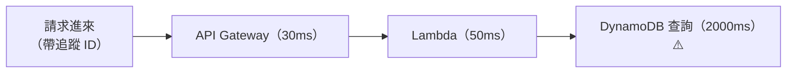

# [aws-10-2] AWS X-Ray：分散式追蹤

> **本章目標**：理解 X-Ray 怎麼追蹤一個請求穿過多個 AWS 服務的旅程，把 SRE 學的「分散式追蹤」用 AWS 實現。

## 你會學到

- 為什麼 AWS 上的請求需要分散式追蹤
- X-Ray 是什麼、怎麼運作
- 它怎麼對應 SRE 學的 Trace/Span
- X-Ray 在除錯時的價值

## 概念說明

### 複習：分散式追蹤解決什麼

你 SRE Part 3-5 學過分散式追蹤——在微服務裡，一個請求穿過很多服務，「**到底哪一段慢/錯**」很難查。追蹤用「一個請求的完整旅程」解決它。

在 AWS 上這問題更明顯——一個請求可能穿過：API Gateway → Lambda → DynamoDB，或 ALB → ECS → RDS → ElastiCache… 一堆 AWS 服務。出問題時，是哪個服務、哪一段慢？

**X-Ray** 就是 AWS 的分散式追蹤服務（對應 SRE Part 3-5 的概念，AWS 版）。

---

### X-Ray 怎麼運作

X-Ray 的核心和 SRE Part 3-5 學的完全一樣——**Trace 與 Span**：

> **給每個請求一個追蹤 ID，讓它一路帶著穿過各服務，把每段的耗時、成功/失敗記錄下來，最後組成一張「請求旅程的瀑布圖」。**



- **Trace**：一個請求的完整旅程（SRE 3-5）。
- **Segment / Subsegment**：旅程中的每一段（對應 SRE 的 Span）——某個服務做某件事的耗時記錄。

X-Ray 收集這些，畫成：

- **Service Map（服務地圖）**：視覺化「你的請求會經過哪些服務、它們怎麼串」，哪個服務有問題會標紅。
- **Trace 瀑布圖**：單一請求的每段耗時（像 SRE Part 3-5 那種一段段的圖）——一眼看出「卡在哪一段」。

---

### X-Ray 在除錯時的價值

回到 SRE Part 3-2 的三支柱除錯流程，X-Ray 補上「Traces」這根（CloudWatch 提供 Metrics 和 Logs）：

```
① CloudWatch Metrics 發現異常
   「ALB 的 p99 延遲飆高」
        ↓
② X-Ray 定位是哪一段（Traces）← 這章
   「追一個慢請求，發現卡在『呼叫 DynamoDB』那段 2 秒」
        ↓
③ CloudWatch Logs 找根因
   「看那個服務的日誌，發現某查詢沒用索引」
```

X-Ray 讓「AWS 上跨服務的請求」變得可追蹤——不用在一堆服務的日誌裡大海撈針，直接看 trace 就知道「是哪個服務、哪一段」的問題。這在微服務、serverless 架構特別有價值。

---

### 怎麼啟用 X-Ray

X-Ray 需要在你的應用「埋點」——加入 X-Ray 的 SDK，讓它在處理請求時產生追蹤資料。很多 AWS 服務有內建整合：

- **Lambda**：開個設定就能啟用 X-Ray 追蹤。
- **API Gateway、ECS** 等：也能整合。
- 應用程式碼裡用 X-Ray SDK 標記想追蹤的段落。

啟用後，到 X-Ray 主控台就能看 Service Map 和 trace。

> 這部分偏開發（要在程式埋點），SRE/維運要懂的是「**怎麼讀 X-Ray 的圖來定位問題**」——這呼應 SRE Part 3-5「SRE 要懂的是怎麼用 trace 定位問題」。

## 範例：用 X-Ray 抓出慢的服務

```
情境：使用者反映某個 API 很慢，這個 API 跨多個服務

① CloudWatch 確認：該 API 的 p95 延遲 = 2.5 秒（平常 300ms）

② 打開 X-Ray 的 Service Map：
   看到請求經過：API Gateway → Lambda → DynamoDB → 外部 API
   其中「外部 API」那個節點標紅 ⚠️

③ 看一個慢請求的 trace 瀑布圖：
   API Gateway     [▓] 20ms
   Lambda          [▓] 60ms
   DynamoDB        [▓] 40ms
   呼叫外部 API     [▓▓▓▓▓▓▓▓▓▓▓▓] 2,300ms ← 兇手！

④ 定位：問題在「呼叫外部 API」那段
   → 去看那段的 log（CloudWatch）找原因
   → 發現外部 API 在逾時（呼應 SRE Part 8-1 該加逾時/斷路器！）

沒有 X-Ray：你得在 4 個服務的日誌裡翻找，猜半天
有 X-Ray：30 秒看圖定位
```

這就是 X-Ray 的價值——讓「AWS 上跨服務的效能問題」一目了然。

## 小練習

### 練習 1：X-Ray 解決什麼

回答：為什麼 AWS 上（尤其微服務/serverless）的請求需要分散式追蹤？X-Ray 對應你 SRE Part 3-5 學的什麼？

---

### 練習 2：三支柱整合

回答：在 AWS 上，CloudWatch（Metrics/Logs）和 X-Ray（Traces）怎麼配合，組成 SRE Part 3-2 的完整三支柱除錯流程？

---

### 練習 3：讀一個 trace

某 X-Ray trace 顯示請求總共 1,800ms：API Gateway 20ms、Lambda 80ms、RDS 查詢 1,650ms、回應 50ms。

1. 問題在哪一段？
2. 你接下來會用什麼（哪支柱）去查那段「為什麼」慢？

## 課外讀物

> 分散式追蹤的完整概念（Trace/Span、三支柱）在 SRE 課教過 → 參見 **SRE 課程** Part 3-5（`lessons/sre/課程大綱.md`）
