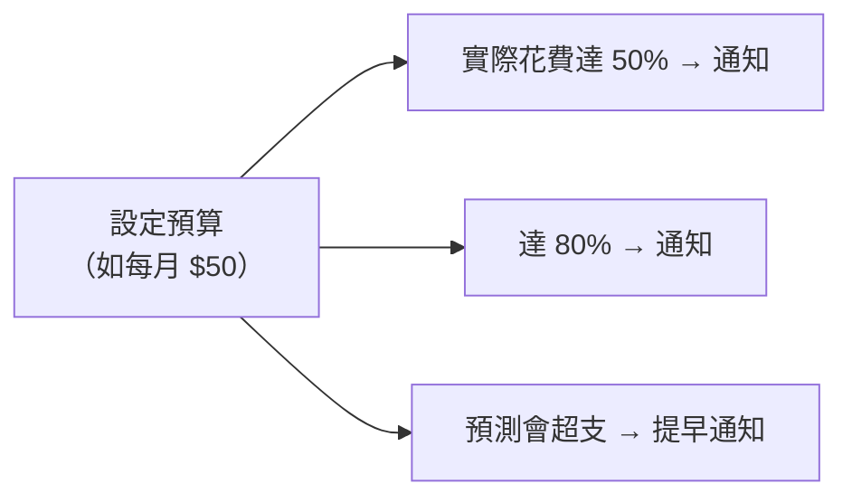

# [aws-10-3] Cost Explorer 與 Budgets：看懂帳單、避免爆帳

> **本章目標**：學會用 Cost Explorer 分析花費、用 Budgets 設定預算控管，把貫穿整門課的「防爆帳」意識變成具體工具與習慣。

## 你會學到

- 怎麼用 Cost Explorer 看「錢花在哪」
- Budgets 怎麼設定預算與警示（深化 aws-1-4）
- 常見的省錢策略總整理
- 把成本管理變成日常習慣

## 概念說明

### 成本管理的總整理

「防爆帳」這條線貫穿了整門課——aws-1-3 講計費、aws-1-4 設預算警示、各章的「關資源」提醒（NAT、Fargate、ALB…）。這章把成本管理做個總整理，給你完整的工具與習慣。

成本管理有三件事：**看懂花費（Cost Explorer）→ 設控管（Budgets）→ 主動省錢（策略）**。

---

### Cost Explorer：看「錢花在哪」

**Cost Explorer** 是 AWS 的「帳單分析工具」——它把你的花費**視覺化**，讓你看懂「錢到底花在哪」：

- **按服務**：EC2 花多少、RDS 花多少、NAT Gateway 花多少…（揪出意外的花費，例如「咦，NAT Gateway 怎麼這麼貴」）。
- **按時間**：花費趨勢，這個月比上個月多了嗎？
- **按標籤（Tag）**：如果你給資源貼了標籤（如專案、團隊），能看「哪個專案花最多」。

用途：**定期看 Cost Explorer，揪出「異常的、忘了關的、可優化的」花費**。例如發現「有台 EC2 一直開著但沒在用」（忘了關，aws-1-3 的天價帳單來源）、或「某個服務花得比預期多」。

> 小技巧：**幫資源貼標籤（Tag）** 是成本管理的好習慣——之後能用 Cost Explorer 依標籤分析「哪個專案/環境/團隊花多少」，責任清楚。

---

### Budgets：設定預算與警示

**Budgets** 你 aws-1-4 用過（設預算警示）。這裡深化它的用法：



Budgets 能設多種警示：

- **實際花費警示**：花到某金額/某比例就通知（aws-1-4 設的那種）。
- **預測花費警示**：AWS 預測「照目前速度，這個月會花超過 X」就**提早**通知——讓你在真正超支前就發現。
- **用量預算**：不只看錢，也能對「用量」設預算（如「EC2 小時數」）。

最佳實踐（呼應 aws-1-4）：

- **一定要設**——這是「防爆帳」最重要的防線，學習帳號和正式帳號都該設。
- **設低門檻當早期警報**（如「超過 $1 就通知」）——一有意外花費馬上知道。
- **設預測警示**——在超支前提早反應。

---

### 省錢策略總整理

把整門課的省錢方法整理成一份清單：

| 策略 | 說明 | 在哪學 |
|------|------|--------|
| **關掉不用的資源** | 最重要——學完關 EC2/NAT/ALB | aws-1-3 + 各章 |
| **用對的計費模式** | 穩定的用 Reserved/Savings Plans（省最多 7 成）| aws-1-3 |
| **用對的規格** | 別過度配置，選剛好的（含 Graviton 省電機型）| aws-3-3 |
| **善用 Free Tier** | 學習盡量待在免費額度 | aws-1-3 |
| **S3 生命週期** | 舊資料自動轉便宜級別/刪除 | aws-5-3 |
| **自動擴縮** | 流量小時自動縮，不養閒置機器 | aws-3-4 |
| **Serverless** | 閒置零成本（流量不定的工作）| aws-8-1 |
| **小心隱藏成本** | NAT Gateway、跨區流量、閒置的 Elastic IP… | aws-4-4 + 各章 |

核心心法（呼應 SRE「剛剛好」、aws 全課的取捨）：**不是「越省越好」，而是「不浪費」**——花該花的（可靠性、效能值得的投資），砍掉浪費的（忘了關的、過度配置的、閒置的）。

---

### 把成本管理變成習慣

成本管理不是「出事才看」，而是日常紀律：

```
日常：
  - 每次學習/測試完，關掉/刪掉開的資源（最重要的習慣）
  - 給資源貼標籤，方便追蹤

定期（如每週/每月）：
  - 看 Cost Explorer，揪出異常或可優化的花費
  - 檢查有沒有「忘了關、閒置」的資源

防護（一次設好）：
  - Budgets 預算警示（aws-1-4）
  - 預測警示
```

養成這些習慣，你就能安心地用 AWS——既能放手做、又不怕帳單失控。這正是 aws-1-3 開頭說的「搞懂錢，才能安心學習與工作」。

## 範例：一次成本健檢

```
月中收到 Budgets 警示「已用掉預算的 80%，但月份才過一半」：

① 打開 Cost Explorer，按服務看：
   EC2: $5（預期內）
   RDS: $8（預期內）
   NAT Gateway: $32 ⚠️（咦？怎麼這麼多？）

② 調查 NAT Gateway：
   發現上次練習 aws-4-8 建的 VPC + NAT Gateway 忘了刪
   → NAT Gateway 一直開著計費（aws-4-4 的成本提醒成真）

③ 處理：
   terraform destroy（aws-9-3）或手動刪掉那個 VPC + NAT
   → 花費立刻停止

④ 預防：
   - 以後練習用完立刻 destroy
   - 把預算警示門檻設更低，更早發現

→ 因為有 Budgets 警示 + Cost Explorer，月中就抓到、止血
   而不是月底收到爆掉的帳單
```

這就是成本管理工具的價值——**讓你及早發現、及早處理**，把「天價帳單」扼殺在搖籃裡。

## 小練習

### 練習 1：兩個工具

回答：Cost Explorer 和 Budgets 各做什麼？它們怎麼配合幫你防爆帳？

---

### 練習 2：省錢策略

不看上面，列出至少 4 個你學過的 AWS 省錢策略。

---

### 練習 3：揪出隱藏成本

回答：哪些 AWS 資源是「容易被忘記、卻一直計費」的隱藏成本來源？（提示：aws-4-4 的 NAT、閒置的 Elastic IP、忘了關的 EC2…）你會怎麼定期揪出它們？

## 課外讀物

> 「剛剛好、不浪費」的成本思維，呼應 SRE 的容量規劃與「擁抱風險」 → 參見 **SRE 課程** Part 7、Part 1-3（`lessons/sre/課程大綱.md`）
