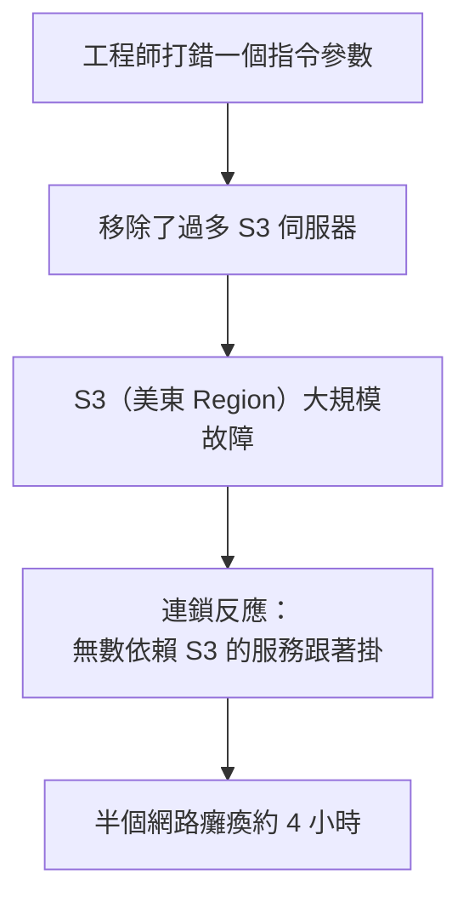

# [aws-10-4] 趣味：AWS 大當機事件——一個打錯的指令

> **本章目標**：透過 AWS 史上著名的大當機事件，輕鬆地理解「即使是最強的雲端商也會出事」，並從中學到寶貴的可靠性教訓。

## 你會學到

- 一個真實的大規模雲端事故故事
- 「人為失誤 + 系統設計」怎麼釀成大災難
- 從事故學到的可靠性教訓（呼應 SRE Part 5）
- 為什麼「依賴單一供應商」也是一種風險

## 概念說明

### 連 AWS 也會掛

學了一整門 AWS，你可能覺得「雲端好強大、好可靠」。但這章要講一個重要的事實——**即使是 AWS，也會出大事**。理解這點，才能設計出真正可靠的系統（呼應 SRE Part 1-3「擁抱風險」、Part 8「為失敗而設計」）。

最有名的案例之一，是 **2017 年的 AWS S3 大當機**。

---

### 故事：一個打錯的指令

> 2017 年 2 月，AWS 工程師在維護 S3 系統時，要執行一個指令，移除「少數幾台」處理計費的伺服器。
>
> 但他**打錯了一個參數**——結果這個指令移除了「**遠比預期多**」的伺服器，把 S3 一個重要子系統的大量容量一次砍掉。

接下來發生了骨牌效應：

因為**太多服務依賴 S3**（網站、App、甚至 AWS 自己的其他服務），S3 一掛，連鎖效應讓**大半個網際網路**出問題——無數知名網站、App 都受影響，持續約 4 小時。

更諷刺的是——**AWS 自己的「服務健康狀態頁面」也依賴 S3**，所以連「顯示『S3 出問題了』的那個頁面」都掛了，一開始連狀態都更新不了。

---

### 從這個事故學到什麼

這個故事很戲劇化，但藏著好幾個你學過的可靠性教訓（呼應 SRE 課）：

**① 人會犯錯，系統要防呆（SRE Part 5-3 無咎文化）**

工程師打錯指令——但 SRE 的觀點是：**真正的問題不是「那個人」，而是「系統允許一個打錯的指令造成這麼大破壞」**。事後 AWS 的改善正是這個方向——加入「移除容量的安全檢查、限制單次移除的量」（防呆機制）。這完全是 SRE Part 5-3「對事不對人、修系統而非怪人」的體現。

**② 連鎖故障的威力（SRE Part 8-1）**

一個服務（S3）掛掉，拖垮無數依賴它的服務——這正是 SRE Part 8-1 的「連鎖故障」。教訓：設計系統時要考慮「**依賴的服務掛了怎麼辦**」（降級、快取、斷路器——SRE Part 8）。

**③ 連監控/狀態頁都不能依賴會掛的東西**

AWS 的狀態頁依賴 S3，結果一起掛——這提醒我們：**監控、告警、緊急應變的工具，不該依賴「正在出事的那個系統」**（呼應 SRE 監控的獨立性）。

**④ 依賴單一供應商也是風險**

這麼多服務「只用單一 Region 的 S3」，所以一起遭殃。教訓：關鍵服務要考慮**跨 Region、甚至跨雲**的備援（SRE Part 8-3 的 Multi-Region）——雖然成本高，但對「絕不能停」的服務值得。

---

### 這對你的意義

學了這個故事，回頭看你整門課學的可靠性設計，會更有感：

| 這個事故暴露的問題 | 你學過的對策 |
|------------------|------------|
| 人為失誤造成大破壞 | 防呆機制、IaC 的 plan 預覽（aws-9-3）、最小權限（aws-2-2）|
| 連鎖故障 | 為失敗而設計、斷路器、降級（SRE Part 8）|
| 過度依賴單一點 | 冗餘、Multi-AZ/Region（aws-4-7、SRE 8-3）|
| 沒從錯誤學習 | 無咎 postmortem（SRE Part 5）|

**核心領悟**：雲端很強，但**不是萬無一失**。一個真正專業的工程師，不會「盲目相信雲端永遠不掛」，而是**假設「連 AWS 都會出事」，並為此設計**（SRE Part 8「為失敗而設計」、Part 1-3「擁抱風險」）。

---

### 輕鬆但深刻

這章是「趣味」章節，但故事背後的教訓很深刻——**最強的雲端商、最厲害的工程師，都會犯錯、都會出事。** 可靠性不是「靠某個東西永遠不壞」，而是「**接受一切都會壞，並設計成壞了也能撐住、能快速恢復、能從中學習**」。這正是這門課（和 SRE 課）想傳達的核心精神。

> 下次有人說「上雲就高枕無憂了」，你可以跟他講這個故事——雲端是工具，不是免死金牌。怎麼用它設計可靠的系統，才是真本事。

## 小練習

### 練習 1：故事重點

用自己的話講一遍這個 AWS S3 大當機的故事：起因是什麼、怎麼擴大、影響多大？

---

### 練習 2：對應教訓

從這個事故，找出至少兩個「對應你 SRE 課學過的概念」的教訓（如連鎖故障、無咎文化、防呆…）。

---

### 練習 3：反思

回答：學了這個故事，你對「上雲就萬無一失」這種想法有什麼看法？一個專業工程師該抱持什麼態度？

## 課外讀物

> 「為失敗而設計」「無咎事後檢討」是這個故事的核心教訓，SRE 課深入教過 → 參見 **SRE 課程** Part 5、Part 8（`lessons/sre/課程大綱.md`）
