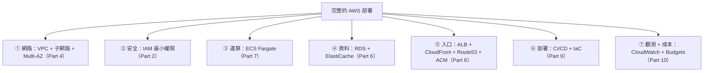
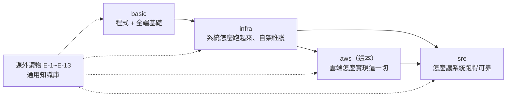

# [aws-10-5] 🏆 總整理專案：完整部署一個 app 上 AWS

> **本章目標**：把整門 AWS 課學的全部整合——把一個真實 app 完整部署上 AWS（VPC + ECS + RDS + ALB + CloudFront + 自訂網域 + 監控 + 預算），這是你的 AWS 畢業專案。

## 你會學到

- 把 Part 1~10 的能力整合成一個完整的雲端部署
- 一個正式級 AWS 架構該有的所有要素
- 怎麼驗收「我具備 AWS 實戰能力了」
- 你的下一步

## 概念說明

### 你的 AWS 畢業專案

恭喜你走到 AWS 課的最後。回顧這趟旅程：從「雲端是什麼」開始，學了帳號安全、IAM、EC2、VPC、儲存、受管服務、容器、Serverless、CI/CD、IaC、觀測與成本。

這一章，把所有東西**組裝成一個完整的、正式級的雲端服務**。目標是部署一個真實 app，配齊一個專業 AWS 架構該有的一切：



每一塊你都學過、都動手做過——這章是總整合。

---

### 完整架構藍圖

把你 aws-7-9 看懂的那種架構，自己親手蓋出來：

```
                使用者
                  ↓
         Route 53（DNS, 6-6）
                  ↓
       CloudFront（CDN + HTTPS, 6-5）
                  ↓
  ╔══════════════════════════════════════╗ VPC（Part 4）
  ║  公開子網路（跨 AZ-a/b）               ║
  ║    ALB（6-4, 用 ACM 憑證 6-6）         ║
  ║         ↓                             ║
  ║  私有子網路（跨 AZ-a/b）               ║
  ║    ECS Fargate 服務（7-4）            ║ ← 你的 app（跨 AZ、自動擴縮）
  ║    （image 來自 ECR 7-2）             ║
  ║         ↓                             ║
  ║  私有子網路（跨 AZ-a/b）               ║
  ║    RDS Multi-AZ（6-2）                ║ ← 資料庫（高可用）
  ║    ElastiCache（6-3）                 ║ ← 快取
  ╚══════════════════════════════════════╝
   全程：IAM 最小權限（Part 2）
        CloudWatch 監控 + 告警（10-1）
        Budgets 預算控管（10-3）
        整個架構用 Terraform 寫成 IaC（9-3）
        GitHub Actions 自動部署（9-1）
```

---

### 部署流程（整合所有 Part）

```
① 用 IaC（Terraform, 9-3）建好基礎設施：
   VPC + 子網路 + IGW/NAT（Part 4）
   RDS Multi-AZ（6-2）+ ElastiCache（6-3）
   ECS cluster、ALB（6-4, 7-4）
   IAM Role 最小權限（Part 2）
   → 一份程式碼建出整個架構

② 把 app 容器化、推上 ECR：
   Dockerfile（infra Part 5）→ build → push 到 ECR（7-2）

③ 部署到 ECS Fargate（7-4）：
   ECS service 跨 AZ 跑容器、接 ALB、設自動擴縮

④ 設定入口與網域：
   ACM 憑證（6-6）→ CloudFront（6-5）→ Route 53 指向（6-6）
   → https://myapp.com 上線

⑤ 設定 CI/CD（9-1）：
   GitHub Actions：push → 測試 → build → 推 ECR → 部署 ECS
   → 之後改程式碼，push 就自動上線

⑥ 設定觀測與成本（Part 10）：
   CloudWatch 儀表板（黃金訊號）+ 告警
   Budgets 預算警示

完成！一個正式級的雲端服務上線了。
```

---

### 驗收清單：你具備 AWS 實戰能力了嗎？

對照這份清單，每項都能做到，你就具備了 AWS 的核心實戰能力：

- [ ] 能安全地管理帳號（root 保護、IAM、MFA、預算警示）（Part 1-2）
- [ ] 懂 IAM，能設計最小權限的 Role/Policy（Part 2）
- [ ] 能開 EC2、選對規格、理解計費（Part 3）
- [ ] **能設計並讀懂 VPC 架構**（公開/私有、IGW/NAT、SG、路由、Multi-AZ）（Part 4）
- [ ] 懂 S3 與儲存選型（EBS/EFS/S3）（Part 5）
- [ ] 能用受管服務（RDS/ElastiCache/ALB/CloudFront/Route53）（Part 6）
- [ ] 能把 app 部署到容器平台（ECS Fargate），讀懂 EKS 架構（Part 7）
- [ ] 懂 Serverless（Lambda），能做運算選型（Part 8）
- [ ] 能用 CI/CD 自動部署、用 IaC（Terraform）管理基礎設施（Part 9）
- [ ] 能監控（CloudWatch/X-Ray）、控管成本（Part 10）
- [ ] 能在各種選擇間做出合理的「取捨」

---

### 三本書 + 課外讀物：你的完整能力地圖

走到這裡，你完成了整個學習旅程的最後一塊。把全貌串起來：



- **basic** 給你寫程式、做全端的能力。
- **infra** 讓你懂「系統怎麼跑起來、怎麼自架維護」——AWS 的底層原理。
- **aws**（這本）讓你懂「雲端怎麼實現這一切，並提供託管、擴展、高可用」。
- **sre** 讓你懂「怎麼用數據和工程，讓這一切跑得可靠」。

四本書 + 共用的課外讀物，組成了「**從寫第一行程式，到設計、部署、運維一個可靠的雲端系統**」的完整能力。而你在 infra 打的底，讓你學 AWS 特別快、特別深——因為你不只會點按鈕，你**真懂底層在做什麼**。

---

### 你的下一步

| 方向 | 怎麼做 |
|------|--------|
| **考證照** | AWS 的 Solutions Architect 等證照，能系統驗證你的能力 |
| **深化 K8s** | EKS / Kubernetes 是大型系統的核心（課外讀物 E-13-3）|
| **深化 SRE** | 把可靠性做到更深（SRE 課 + 經典書）|
| **實戰** | 把你的真實專案部署上 AWS，用這套架構 |

最重要的是——**去實踐**。你現在有完整的地圖和工具，剩下的是在真實專案中累積。每部署一個服務、每解決一個問題，你的功力就深一層。

## 小練習

### 練習 1：完整部署

把一個 app（你的專案或範例）完整部署上 AWS，盡量配齊：VPC、ECS、RDS、ALB、CloudFront、網域、監控、預算。用 IaC（Terraform）管理。

---

### 練習 2：對照驗收清單

誠實對照上面的驗收清單，哪幾項還不夠熟？回去重看對應的 Part，補強它。

---

### 練習 3：（終極挑戰）整合三本書

做一個真正完整的專案：
- 用 **basic** 的能力寫出 app
- 用 **infra** 的能力容器化、理解底層
- 用 **aws** 的能力部署上雲（這章的架構）
- 用 **sre** 的能力定 SLO、設監控告警、做可靠性設計

能做到這個，你就完成了從「初學程式」到「能獨立設計、部署、運維可靠雲端系統」的完整蛻變。🎓

> 恭喜你完成整門 AWS 課程，也完成了 basic → infra → aws → sre 的完整學習旅程！你現在具備的，是現代軟體工程最核心、最搶手的綜合能力——能寫程式、懂系統、會上雲、能把系統做得可靠。去把它用在你的專案、你的職涯上吧。這趟旅程辛苦了，也恭喜你！

## 課外讀物

> 想把可靠性做到更深 → 參見 **SRE 課程**（`lessons/sre/課程大綱.md`）；想看更大規模的架構演進 → [課外讀物 E-13-4：Monolith vs Microservices](../../../課外讀物/E-13-scaling/E-13-4-monolith-vs-microservices.md)
