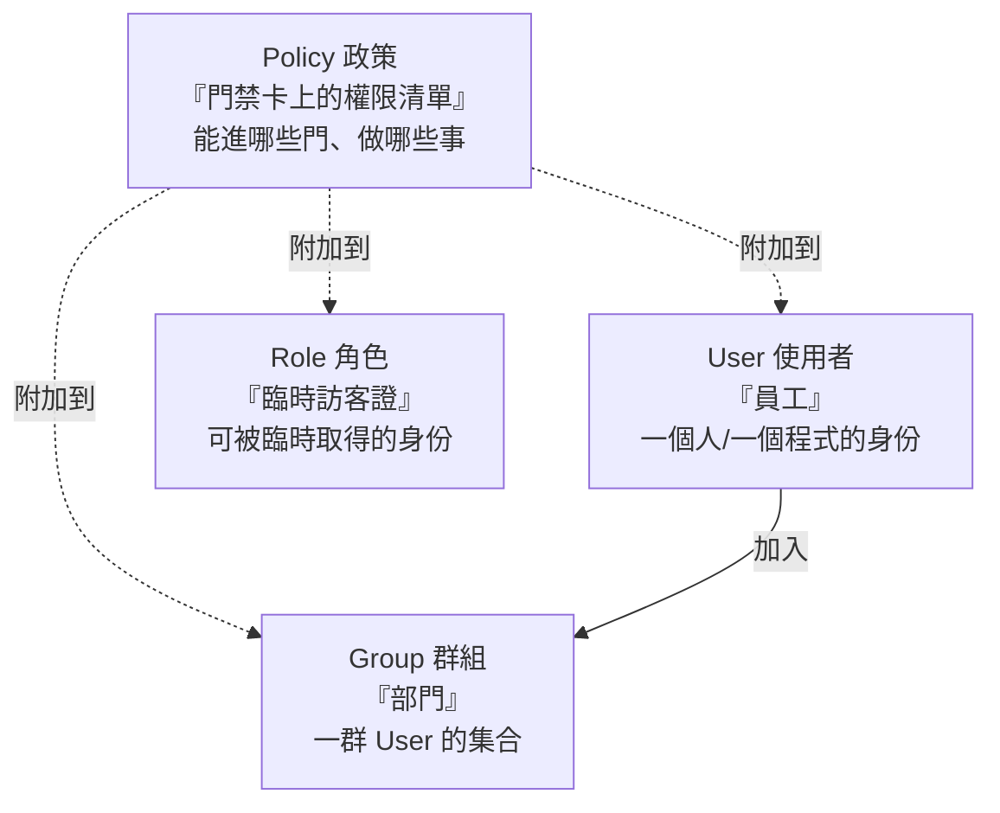

# [aws-2-1] IAM 是什麼？用「公司門禁卡」理解

> **本章目標**：理解 IAM 這個 AWS 安全的基石，搞懂 User、Group、Role、Policy 四個核心概念以及它們的關係。

## 你會學到

- IAM（身份與存取管理）在做什麼
- 四個核心：User、Group、Role、Policy
- 用「公司門禁系統」一次理解這四者
- User 和 Role 的關鍵差別（最容易混的點）

## 概念說明

### IAM 是 AWS 的「門禁系統」

你在 aws-1-4 已經用過 IAM 建管理者帳號了。這一章把它講透。

**IAM（Identity and Access Management，身份與存取管理）** 是 AWS 控制「**誰，能對什麼資源，做什麼事**」的系統。它是整個 AWS 安全的基石——所有「權限」相關的東西都歸它管。

用**一家公司的門禁系統**來理解：公司不會讓所有人都能進所有房間、開所有保險箱。而是發給每個人**門禁卡**，卡片決定「你能進哪些門、能碰哪些東西」。IAM 就是 AWS 的這套門禁系統。

而且 IAM 還有個重點——它本身是**免費**的，而且**極度重要**。aws-1-3 提過「金鑰外洩導致天價帳單」，根源就是 IAM 沒管好。把 IAM 學好，是用 AWS 的基本功與安全底線。

---

### 四個核心概念

IAM 有四個你一定要分清的概念。先看「公司門禁」的對照，再逐一解釋：



| IAM 概念 | 公司門禁類比 | 是什麼 |
|---------|------------|--------|
| **User（使用者）** | 員工 | 一個「身份」——可以是人，也可以是程式 |
| **Group（群組）** | 部門 | 一群 User 的集合，方便統一管權限 |
| **Role（角色）** | 臨時訪客證 / 職務 | 可以「被臨時取得」的身份（下面詳述）|
| **Policy（政策）** | 門禁卡上的權限清單 | 定義「能做什麼、不能做什麼」的規則 |

---

### Policy：權限的核心

**Policy（政策）** 是 IAM 的靈魂——它是一份**用 JSON 寫的規則文件**，定義「**允許或拒絕，對哪些資源，做哪些動作**」。

例如一份 policy 可能說：「允許讀取 S3 的某個 bucket」「允許開關 EC2」「拒絕刪除任何資料庫」。

Policy 本身不會做事，它要**附加（attach）**到 User、Group 或 Role 上才生效。就像「門禁權限」要寫進「某張卡」裡才有用。你在 aws-1-5 貼的那段 JSON、aws-1-4 給管理者的 `AdministratorAccess`，都是 policy。

> 怎麼讀、怎麼寫 policy 是核心技能，Part 2-3 會逐行解析。

---

### User vs Group

**User（使用者）** 代表一個「身份」。注意——它不一定是「人」：

- 可以是**人**：例如你 aws-1-4 建的管理者帳號，是給「你」用的。
- 可以是**程式**：例如某個外部程式要存取 S3，可以給它一個 IAM User + 金鑰。

**Group（群組）** 是「一群 User 的集合」，用來**統一管理權限**。例如建一個「Developers」群組、給它一組權限，然後把所有開發者 User 丟進去——他們就都有了那組權限。要改權限時，改群組一次就好，不用一個個改 User。這跟你 infra Part 2-2 學的 Linux 群組是同一個道理。

---

### Role：最容易混、但最重要的概念

**Role（角色）** 是 IAM 最強大、也最容易搞混的概念。關鍵差別：

> **User 是「固定屬於某人/某程式」的身份；Role 是「可以被『臨時取得』的身份」——任何被授權的人或服務，都能暫時「變成」這個 role，獲得它的權限。**

用類比：

- **User** 像你的「員工識別證」——固定是你的，代表「你」。
- **Role** 像辦公室的「臨時訪客證」或「某個職務的權限」——它不屬於特定某人，而是「**需要時，授權的人可以暫時戴上它**」，用完就脫下。

為什麼需要 Role？最常見的場景是**「讓 AWS 服務之間互相存取」**：

```
情境：你的 EC2 機器（Part 3）需要讀取 S3 的檔案

❌ 笨方法：在 EC2 裡寫死一組「IAM User 的金鑰」
   → 金鑰可能外洩、要手動輪換，很危險（天價帳單的根源之一！）

✅ 正確方法：建一個 Role「允許讀 S3」，把它「指派給」EC2
   → EC2 自動「戴上」這個 role，臨時獲得讀 S3 的權限
   → 完全不需要金鑰！AWS 自動處理，安全得多
```

**「給服務一個 Role，而不是給它金鑰」是 AWS 的安全最佳實踐。** 這能避免金鑰外洩的風險（呼應 aws-1-3 的天價帳單）。這個觀念在 Part 3（EC2 存 S3）、Part 7（容器）會反覆用到。

---

### 四者怎麼配合

把四個串起來，一個典型的權限設計長這樣：

```
人的權限：
  建立 User（每個人一個）
  → 把 User 加入 Group（如 Developers）
  → Group 附加 Policy（定義開發者能做什麼）
  → 改權限時改 Group 就好

服務的權限：
  建立 Role（如「EC2 讀 S3 角色」）
  → Role 附加 Policy（允許讀 S3）
  → 把 Role 指派給服務（如 EC2）
  → 服務臨時戴上 role，無需金鑰就有權限
```

記住大原則：**人用 User（+ Group）；服務用 Role；權限都由 Policy 定義。**

## 範例：一家公司的 IAM 設計

```
某公司在 AWS 的 IAM 規劃：

人的部分：
  - 每個員工一個 User（小明、小華…）
  - Group「Developers」：附加「能用開發資源」的 policy
    → 小明、小華都加進去
  - Group「Admins」：附加管理權限
    → 只有技術主管加進去
  - 改開發者權限 → 改 Developers group 一次搞定

服務的部分：
  - Role「web-server-role」：附加「能讀 S3、能寫 log」的 policy
    → 指派給網頁伺服器的 EC2
    → EC2 無需金鑰就能存取它該存取的東西

根帳號：
  - 設好 MFA 後收起來（aws-1-4），絕不日常使用
```

這個設計體現了 IAM 的精髓——**用 Group 管人、用 Role 管服務、用 Policy 定義權限、根帳號收好**。下一章會講「這些權限該給多大」——最小權限原則。

## 小練習

### 練習 1：四個概念

不看上面，用「公司門禁」的類比，分別解釋 User、Group、Role、Policy 是什麼。

---

### 練習 2：User vs Role

回答：

1. User 和 Role 最關鍵的差別是什麼？
2. 為什麼「讓 EC2 用 Role 而不是寫死金鑰」比較安全？（提示：金鑰外洩、aws-1-3 的天價帳單）

---

### 練習 3：設計一個權限

某情境：你有一個 Lambda 函式（Part 8），需要寫入一個 DynamoDB 資料表。你應該用 User 還是 Role 給它權限？為什麼？

## 課外讀物

> IAM 是帳號安全的核心，想了解整體的安全威脅與防護 → [課外讀物 E-10-1：Web 安全總覽 — OWASP Top 10](../../../課外讀物/E-10-security/E-10-1-web-security-overview.md)
