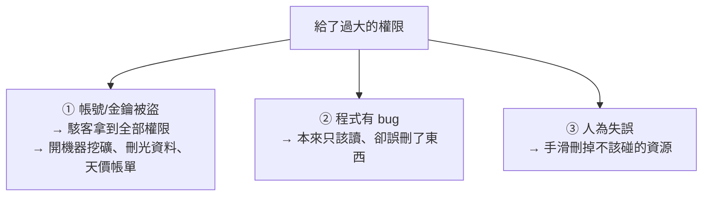

# [aws-2-2] 最小權限原則：只給剛好夠用的權限

> **本章目標**：理解「最小權限原則」這個安全的黃金法則，知道為什麼「方便起見全開」是危險的習慣，以及怎麼在實務上落實它。

## 你會學到

- 最小權限原則（Principle of Least Privilege）是什麼
- 為什麼「全給管理員權限」是個壞習慣
- 怎麼在 IAM 實務上落實最小權限
- 它怎麼限制「出事時的損害範圍」

## 概念說明

### 黃金法則：只給「剛好夠用」的權限

上一章學了怎麼用 IAM 給權限。這一章回答一個更重要的問題：**該給多少權限？**

答案是 SRE/資安界的黃金法則——**最小權限原則（Principle of Least Privilege）**：

> **每個 User、每個 Role，只給它「完成工作所需的『最小』權限」，不多給一點。**

一個只需要「讀取 S3 某個 bucket」的程式，就只給它「讀取那個 bucket」的權限——**不要**給它「讀寫所有 S3」，更不要給它「管理整個 AWS」。

你其實已經見過這個原則了——infra Part 2-6 的「別用 root、用一般使用者」、SRE Part 1-3 的信念，全都是同一個精神在不同場景的體現。

---

### 為什麼「方便起見全開」很危險

新手最常見的壞習慣是：**「設權限好麻煩，乾脆給 AdministratorAccess（全部權限）算了。」**

這很方便，但極度危險。原因是——**權限越大，「出事時的損害」就越大**。這個「出事」可能是：



**① 被盜時損害最大**：aws-1-3 的天價帳單慘案，根源就是「一個權限過大的金鑰外洩」。如果那個金鑰只能讀一個 bucket，駭客撿到也做不了什麼；但如果它是 AdministratorAccess，駭客就能為所欲為。

**② 限制 bug 的破壞**：如果一個程式只該「讀取」資料，那就只給它讀的權限。萬一程式有 bug 想刪東西，因為「沒有刪的權限」，AWS 會擋下來——權限成了你的安全網。

**③ 防人為失誤**：權限小，手滑能造成的破壞也小。

核心思想：**假設「壞事一定會發生」（呼應 SRE Part 8「為失敗而設計」），那就把「萬一發生時的損害」限制到最小。** 最小權限就是在縮小「爆炸半徑」。

---

### 怎麼落實最小權限

理想很美好，但實務上怎麼做？幾個方法：

**① 從「什麼都不給」開始，按需求加**

不要從「全開」往下刪，而是從「空白」往上加。先給最基本的，發現「欸，它需要讀 S3」再加「讀 S3」。這樣加出來的權限，天然就是最小的。

**② 用 AWS 的「受管政策」當起點，再收窄**

AWS 提供很多現成的 policy（例如 `AmazonS3ReadOnlyAccess` 只能讀 S3）。比起 `AdministratorAccess`，這些範圍小的受管政策是更好的起點。能用「唯讀」就別用「完整」。

**③ 限定到「特定資源」，而非「所有資源」**

policy 裡可以指定「只能對『這一個 bucket』操作」，而不是「所有 bucket」。範圍縮到剛好需要的那個資源（Part 2-3 會看到 JSON 怎麼寫）。

**④ 定期檢視、移除沒用的權限**

權限會隨時間累積（「之前加的，現在不用了」）。定期回顧、把用不到的權限收掉，避免「權限膨脹」。

---

### 一個常見的取捨：方便 vs 安全

要誠實面對——最小權限**比較麻煩**。每次都要想「這到底需要什麼權限」、要設定得更細。所以很多人偷懶全開。

但這個取捨很值得：**多花一點設定的麻煩，換來「出事時損害有限」的巨大保障。** 尤其在正式環境，這個原則不是「建議」，而是「必須」。

學習階段，你 aws-1-4 給自己的管理者帳號用了 `AdministratorAccess`（為了學習方便）——這在「你自己一個人、有 MFA 保護」的學習帳號還可接受。但當你開始給「服務」「團隊成員」「正式環境」設權限時，就要嚴格落實最小權限。

## 範例：最小權限的實踐對比

```
情境：一個程式需要「讀取 S3 上 my-app-data 這個 bucket 的檔案」

❌ 違反最小權限（圖方便）：
   給它 AdministratorAccess（全部權限）
   → 萬一這個程式的金鑰外洩：
     駭客能刪光你所有資料、開機器挖礦、改帳單… 災難

⚠️ 好一點，但還不夠：
   給它 AmazonS3FullAccess（能讀寫所有 S3）
   → 金鑰外洩：駭客能動你「所有」bucket，還是太大

✅ 最小權限：
   給它一份 policy：「只能『讀取』『my-app-data 這一個 bucket』」
   → 金鑰外洩：駭客頂多讀到這一個 bucket 的內容
     不能刪、不能碰其他資源 → 損害被限制到最小
   → 而且如果程式有 bug 想刪東西，會被擋下來
```

看出層層收窄了嗎？從「全部」→「所有 S3」→「一個 bucket 的唯讀」。每收窄一層，出事時的損害就小一截。這就是最小權限的價值——**用設定的麻煩，換損害的可控**。

## 小練習

### 練習 1：解釋黃金法則

用自己的話說明「最小權限原則」。它和 infra Part 2-6「別用 root」、SRE Part 8「為失敗而設計」有什麼共通的精神？

---

### 練習 2：為什麼全開很危險

回答：給一個程式 `AdministratorAccess`，在「金鑰外洩」和「程式有 bug」兩種情況下，各會造成什麼後果？最小權限怎麼限制這些損害？

---

### 練習 3：收窄權限

某 Lambda 函式需要「寫入一個特定的 DynamoDB 資料表」。下面三種給法，哪個最符合最小權限？為什麼其他兩個不好？

1. AdministratorAccess
2. AmazonDynamoDBFullAccess（能讀寫所有 DynamoDB）
3. 只能「寫入那一個特定資料表」的自訂 policy

## 課外讀物

> 最小權限是縮小「爆炸半徑」的安全思維，呼應 SRE 的可靠性與資安原則 → [課外讀物 E-10-1：Web 安全總覽 — OWASP Top 10](../../../課外讀物/E-10-security/E-10-1-web-security-overview.md)
