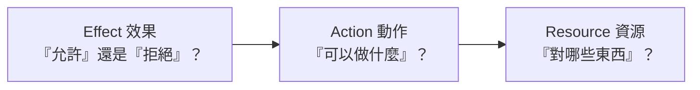

# [aws-2-3] 🔧 動手做：讀懂並寫一份 IAM Policy

> **本章目標**：逐行拆解 IAM Policy 的 JSON 結構，讓你能讀懂、也能自己寫出符合最小權限的政策——這是 AWS 最核心的實務技能之一。

## 你會學到

- IAM Policy 的 JSON 結構（Effect / Action / Resource）
- 逐行讀懂一份政策在說什麼
- 自己寫一份「最小權限」的政策
- 怎麼測試與套用政策

## 概念說明

### 為什麼要會讀寫 Policy

Policy（政策）是 IAM 的核心（aws-2-1）。你 aws-1-5 貼過一段、aws-1-4 用過受管政策。這一章讓你**真正看懂這些 JSON 在說什麼，並能自己寫**。

這是 AWS 最實用的技能之一——面試會問、工作天天用、看懂公司的權限設定全靠它。好消息是：**Policy 的結構其實很簡單，學會幾個關鍵欄位就能讀懂九成。**

---

### Policy 的核心結構

一份 IAM Policy 就是一份 JSON，核心是回答三個問題：



用一句話組起來：「**對【Resource 哪些資源】，【Effect 允許/拒絕】，做【Action 哪些動作】。**」

例如：「對【my-app-data 這個 bucket】，【允許】，做【讀取】。」

## 程式碼範例

### 逐行拆解一份 Policy

看 aws-1-5 那段公開讀取的政策（稍微完整版），逐行解釋：

```json
{
  "Version": "2012-10-17",
  "Statement": [
    {
      "Sid": "AllowReadMyBucket",
      "Effect": "Allow",
      "Action": "s3:GetObject",
      "Resource": "arn:aws:s3:::my-app-data/*"
    }
  ]
}
```

| 欄位 | 意思 |
|------|------|
| `Version` | 政策語言的版本，**固定填 `"2012-10-17"`**（這是當前版本，不是日期，照填就對）|
| `Statement` | 政策的主體，是一個**陣列**——可以放多條規則 |
| `Sid` | Statement ID，給這條規則取的名字（選填，方便辨識）|
| `Effect` | **`Allow`（允許）** 或 **`Deny`（拒絕）** |
| `Action` | 允許/拒絕「做什麼動作」，格式是 `服務:動作`（如 `s3:GetObject` = S3 的讀取物件）|
| `Resource` | 對「哪些資源」，用 **ARN** 指定（下面解釋）|

整段翻成白話：「**允許**，對 `my-app-data` 這個 bucket 裡的**所有物件**（`/*`），執行**讀取**（`s3:GetObject`）。」

---

### ARN 是什麼

`Resource` 那欄那串 `arn:aws:s3:::my-app-data/*` 叫 **ARN（Amazon Resource Name）**——AWS 用來「**唯一指定一個資源**」的標準格式，像資源的「完整地址」。

格式大致是：`arn:aws:服務:區域:帳號:資源`。不同服務格式略有不同（S3 比較特別，省略了區域和帳號）。你不用背格式，**會看、會在範本裡替換成自己的資源**就夠了。

重點是 `Resource` 決定了「範圍」——這正是落實最小權限（2-2）的關鍵：

- `arn:aws:s3:::my-app-data/*` → 只有「這一個 bucket」
- `arn:aws:s3:::*` 或 `"*"` → 「所有 S3 資源」（範圍太大，違反最小權限！）

---

### 寫一份最小權限的 Policy

來實際寫一份——「**只能讀寫『my-app-uploads』這一個 bucket**」的政策（比 2-2 的範例更具體）：

```json
{
  "Version": "2012-10-17",
  "Statement": [
    {
      "Sid": "ReadWriteUploadsBucket",
      "Effect": "Allow",
      "Action": [
        "s3:GetObject",
        "s3:PutObject"
      ],
      "Resource": "arn:aws:s3:::my-app-uploads/*"
    }
  ]
}
```

注意幾個體現最小權限的設計：

- `Action` 用**陣列**列出「剛好需要的動作」——只有讀（`GetObject`）和寫（`PutObject`），**沒有**刪除（`DeleteObject`）。如果這個程式不需要刪，就別給。
- `Resource` 限定在 **`my-app-uploads` 這一個 bucket**，不是所有 S3。
- 沒有用 `"Action": "s3:*"`（所有 S3 動作）或 `"Resource": "*"`（所有資源）——那會違反最小權限。

這就是「剛好夠用」的政策——程式能做它該做的（讀寫這個 bucket），但多一點都不行。

---

### Deny 的優先權

一個重要規則：**如果一份政策同時有 Allow 和 Deny，Deny 永遠贏。**

```json
{
  "Effect": "Deny",
  "Action": "s3:DeleteObject",
  "Resource": "*"
}
```

就算別的政策允許了刪除，只要有一條 Deny 刪除，最終結果就是「不能刪」。這常用來設「護欄」——例如「無論如何，都不准刪除正式環境的資料」。

預設邏輯是：**沒有明確 Allow 的，就是拒絕（隱性拒絕）**。所以你只要列出「要允許什麼」，沒列的自動被擋——這天然支持最小權限。

---

### 怎麼套用與測試

1. **套用**：在 IAM 建立一個 policy（貼上 JSON），然後 attach 到 User / Group / Role（aws-2-1）。
2. **測試**：AWS 有個 **IAM Policy Simulator**（政策模擬器）工具，可以模擬「某個身份能不能做某個動作」，不用真的執行就能驗證你的政策對不對。寫完政策，用它測一下，確認「該能做的能做、該擋的擋住」。

## 小練習

### 練習 1：讀懂一份 Policy

不看解釋，翻譯下面這份政策在說什麼：

```json
{
  "Version": "2012-10-17",
  "Statement": [
    {
      "Effect": "Allow",
      "Action": "s3:GetObject",
      "Resource": "arn:aws:s3:::company-reports/*"
    }
  ]
}
```

---

### 練習 2：寫一份最小權限 Policy

寫一份政策：「**只能『讀取』（不能寫、不能刪）『public-images』這一個 bucket 的物件**」。

> 提示：Effect=Allow、Action 只放 `s3:GetObject`、Resource 限定那個 bucket。

---

### 練習 3：找出違反最小權限的 Policy

下面哪一份違反最小權限？為什麼？

```json
A: { "Effect": "Allow", "Action": "s3:GetObject", "Resource": "arn:aws:s3:::my-bucket/*" }
B: { "Effect": "Allow", "Action": "s3:*", "Resource": "*" }
```

> 提示：B 允許了「所有 S3 動作」對「所有資源」——這就是 2-2 說的危險全開。

## 課外讀物

> Policy 是 JSON 格式，和你在 basic/前端課程接觸的 JSON 是同一種結構，只是用來描述權限規則。
