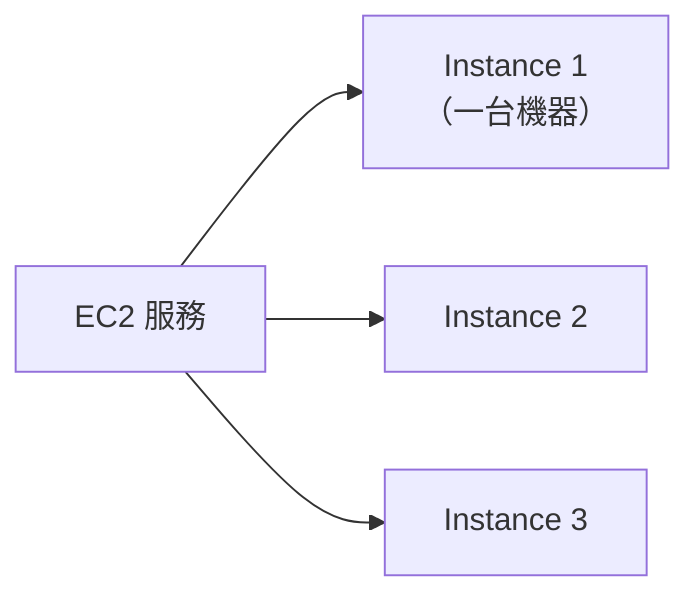
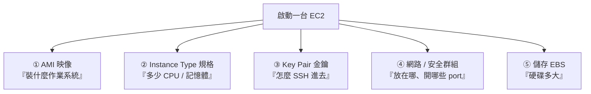

# [aws-3-1] EC2 是什麼？在雲端租一台電腦

> **本章目標**：理解 EC2 這個 AWS 最核心的運算服務——它就是「在雲端租一台電腦」，以及租一台機器要決定哪些事。

## 你會學到

- EC2 是什麼、為什麼叫這個名字
- 「執行個體（Instance）」是什麼
- 租一台 EC2 要決定的幾件事（規格、映像、儲存、網路、金鑰）
- EC2 和你 infra 課學的伺服器的關係

## 概念說明

### EC2 = 在雲端租一台電腦

aws-1-5 你用 S3 放了靜態網頁，但也發現「S3 只能放檔案，不能跑程式」。要跑後端程式、要運算，你需要一台「真正的電腦」。在 AWS，這台電腦就是 **EC2**。

**EC2（Elastic Compute Cloud，彈性運算雲）** 一句話：

> **EC2 就是「在雲端租一台電腦」——你選好規格、開機，幾分鐘後就有一台可以 SSH 進去、跑任何東西的伺服器。**

名字裡的 **Elastic（彈性）** 是重點——你可以隨時開、隨時關、隨時改大小，用多少付多少（呼應 aws-1-1 的租房精神）。這就是「彈性」。

回想 infra Part 1-3 學的「伺服器住在哪」——實體機、VM、雲主機。**EC2 就是「雲主機」的代表**：它本質是 AWS 幫你開的一台虛擬機（VM），跑在 AWS 的實體機上。你 infra 課學的所有 Linux 操作、架服務的知識，在 EC2 上**完全適用**——因為它就是一台 Linux 機器。

---

### 「執行個體（Instance）」是什麼

在 EC2 的世界，你開出來的每一台機器，叫一個 **Instance（執行個體）**。



你可以開一台、也可以開一百台 instance。每台都是獨立的伺服器。「開一台 EC2」的正式說法就是「啟動一個 EC2 instance」。

---

### 租一台 EC2 要決定的事

開一台 EC2 時，AWS 會問你幾個問題——這些決定了「你租的是什麼樣的機器」。先了解這幾項，下一章動手時就不會迷路：



**① AMI（Amazon Machine Image，機器映像）**：決定機器「裝什麼」——作業系統（Ubuntu、Amazon Linux…）和預裝的軟體。像是「機器的出廠範本」。（aws-3-4 會深入）

**② Instance Type（執行個體類型）**：決定機器的「規格」——幾顆 CPU、多少記憶體。例如 `t3.micro`（小）、`m7g.large`（中）。選錯會「不夠力」或「浪費錢」。（aws-3-3 會深入怎麼選）

**③ Key Pair（金鑰對）**：決定你「怎麼 SSH 進去」。AWS 用金鑰登入（就是你 infra Part 2-6 學的 SSH 金鑰！），開機器時要指定一把金鑰，之後用它連線。

**④ 網路與安全群組**：決定機器「放在哪個網路（VPC，Part 4）」、「開放哪些 port（Security Group）」。Security Group 就是 EC2 的防火牆（呼應 infra Part 3-3 的 ufw，但這是在雲端那一層）。

**⑤ 儲存（EBS）**：決定機器的「硬碟」——多大、什麼類型。這個硬碟叫 EBS（Part 5 會深入）。

---

### EC2 的計費（複習 aws-1-3）

EC2 是「按時間計費」的典型——**機器開著就計費（按秒/小時），關掉就不計**（儲存另計）。所以：

- 學習時用 `t3.micro` 之類的小規格（在 Free Tier 12 個月免費額度內）。
- **練習完記得關掉或終止**（aws-1-3 的關資源習慣）——這是「忘了關 EC2」天價帳單的防範。

> 「停止（stop）」和「終止（terminate）」不同：stop 是關機（之後可再開，硬碟資料還在，但硬碟仍小額計費）；terminate 是徹底刪除（機器和預設硬碟都沒了）。學習用完，想保留就 stop，不要了就 terminate。

## 範例：EC2 能拿來做什麼

```
EC2 是「一台你完全掌控的雲端電腦」，所以幾乎什麼都能跑：

- 跑你的後端 API（接上 aws-1-5 的前端，補完「能跑程式」的部分）
- 架網站（Nginx + 你的應用，就是 infra Part 4 學的那套，搬到雲端）
- 跑資料庫（不過 Part 6 會告訴你，用受管的 RDS 通常更好）
- 跑容器（Docker，infra Part 5 學的，Part 7 會用 EC2 跑容器叢集）
- 任何需要「一台 Linux 機器」的工作

關鍵：EC2 給你一台「完整的、你說了算的」機器
→ 最大彈性，但也代表「機器的維護要你自己管」（呼應 Part 6 受管服務的取捨）
```

EC2 是 AWS 最基礎、最萬用的運算服務。理解它，你就有了「在雲端跑任何東西」的能力。下一章就帶你親手開一台、SSH 進去、架個服務——把你的 infra 功力用在雲端上。

## 小練習

### 練習 1：EC2 是什麼

用一句話解釋 EC2。它和你 infra Part 1-3 學的「雲主機」是什麼關係？

---

### 練習 2：開機器要決定什麼

不看上面，回想開一台 EC2 要決定哪幾件事（至少 4 項），各決定了機器的什麼。

---

### 練習 3：stop vs terminate

回答：

1. EC2 的「停止（stop）」和「終止（terminate）」有什麼差別？
2. 你做完一個練習，想「下週繼續用這台機器」，該 stop 還是 terminate？為什麼？

## 課外讀物

> EC2 就是一台 Linux 機器，你 infra 課學的所有系統管理、架服務知識都用得上 → 參見 **infra 課程**（`lessons/infra/課程大綱.md`）
