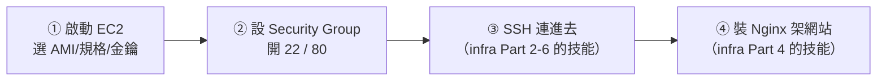

# [aws-3-2] 🔧 動手做：開一台 EC2、SSH 進去、架 web server

> **本章目標**：親手啟動一台 EC2、用 SSH 連進去、裝上 Nginx 架起一個對外網站——把你的 infra 功力第一次用在 AWS 雲端機器上。

## 你會學到

- 在 AWS Console 啟動一台 EC2 instance
- 用金鑰 SSH 連進 EC2
- 設定 Security Group 開放正確的 port
- 在 EC2 上架起一個 Nginx 網站

## 概念說明

### 這一章把 infra 搬上雲

這是個令人興奮的時刻——你 infra 課學的「SSH 登入、裝 Nginx、架網站」，這次要在**真正的雲端機器**上做一遍。你會發現：**一旦 SSH 進去，它就是一台普通的 Linux 機器，infra 學的全部適用。** AWS 的部分只是「怎麼把這台機器開出來、怎麼讓它能被連到」。

流程：



> 用 Free Tier 的 `t3.micro`（或 `t2.micro`），練習花費接近零。**做完記得 terminate**（aws-1-3、3-1）。

## 程式碼範例

### 第一步：啟動一台 EC2

1. 確認**右上角 Region** 選好（如東京）。Console 搜尋進入 **EC2** → **Launch instance**。
2. **Name**：取個名字（如 `my-first-server`）。
3. **AMI**：選 **Ubuntu**（這門課和 infra 課一致；或 Amazon Linux 也行）。選有標 "Free tier eligible" 的。
4. **Instance type**：選 **t3.micro**（或 t2.micro，Free tier eligible）。
5. **Key pair**：**Create new key pair**，取名、下載那個 `.pem` 私鑰檔（**這是你 SSH 進去的鑰匙，下載後好好保存，不會再給第二次**）。
6. **Network settings**：先用預設 VPC（Part 4 會深入網路）。重點是 **Security Group**——下一步設定。
7. 暫時先啟動，下面調整 Security Group。

### 第二步：設定 Security Group（防火牆）

Security Group 是 EC2 的防火牆（雲端那一層，呼應 infra Part 3-3）。要開放：

| Type | Port | Source | 用途 |
|------|------|--------|------|
| SSH | 22 | My IP（建議）| 讓你 SSH 進去 |
| HTTP | 80 | Anywhere | 讓大家連網站 |

> ⚠️ **SSH（22）的 Source 建議選「My IP」**（只允許你自己的 IP 連），而不是「Anywhere」——這縮小攻擊面（呼應 infra Part 3-3、aws-2-2 最小權限的精神）。網站的 80 才需要對所有人開。

啟動 instance。等狀態變成 "Running"，記下它的 **Public IPv4 address（公開 IP）**。

### 第三步：SSH 連進去

在你電腦的終端機（WSL 也可以，呼應 infra Part 0），先把下載的金鑰權限設好（SSH 要求私鑰不能被別人讀，infra Part 2-2 的權限概念）：

```bash
chmod 400 你的金鑰.pem
```

然後連線（Ubuntu AMI 的預設使用者是 `ubuntu`）：

```bash
ssh -i 你的金鑰.pem ubuntu@你的EC2公開IP
```

第一次問信任輸入 `yes`。成功的話——**你人就在這台雲端機器裡了！** 跑個 `whoami`、`uname -a`（infra Part 1-4 的「認識機器」），確認這就是一台 Ubuntu。

### 第四步：裝 Nginx 架網站（infra Part 4 重現）

接下來完全是 infra Part 4 學的，在雲端機器上做一遍：

```bash
# 更新套件清單（infra Part 2-5）
sudo apt update

# 裝 Nginx（infra Part 4-3）
sudo apt install nginx -y

# 確認服務在跑（infra Part 4-1）
systemctl status nginx
```

改一下首頁內容，證明是你的：

```bash
echo "<h1>🚀 我的網站跑在 AWS EC2 上！</h1>" | sudo tee /var/www/html/index.html
```

### 第五步：見證成果

打開瀏覽器，連 `http://你的EC2公開IP`。你應該看到「🚀 我的網站跑在 AWS EC2 上！」

**恭喜——你親手在雲端開了一台機器、SSH 進去、架起了一個對外網站。** 這結合了 aws（開機器、Security Group）和 infra（SSH、Nginx）的能力。如果連不到，照 infra Part 3-4 分層排查：先確認 EC2 是 Running、Security Group 有開 80、Nginx 在跑。

---

### 第六步：清理（重要！）

練習完，依 aws-1-3 的習慣清理：

- 短期還要用 → **Stop**（關機，之後可再開）。
- 不要了 → **Terminate**（徹底刪除，不再計費）。

> 在 EC2 console 選取 instance → Instance state → Stop / Terminate。別讓它忘了關一直計費。

## 小練習

### 練習 1：完成完整流程

照六步，開一台 EC2、SSH 進去、架起 Nginx 網站，從瀏覽器看到你的網頁。最後記得清理。

---

### 練習 2：理解 Security Group

回答：

1. 為什麼 SSH（22）的 Source 建議設「My IP」而不是「Anywhere」？
2. 如果你忘了開 80 port，會發生什麼？（提示：用 infra Part 3-4 的排查思路想）

---

### 練習 3：對照 infra

回答：這次在 EC2 上做的事，哪些是「AWS 特有的」、哪些是「infra 課學過、在哪台 Linux 都一樣的」？

> 提示：開機器、Security Group、公開 IP 是 AWS 的；SSH、apt、Nginx、systemctl 是通用 Linux 的。這就是「先學 infra、再學 AWS 會很快」的原因。

## 課外讀物

> SSH 連線、Nginx 設定的完整原理，在 infra 課有詳細教學 → 參見 **infra 課程** Part 2-6、Part 4（`lessons/infra/課程大綱.md`）
