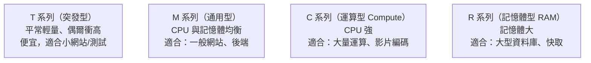
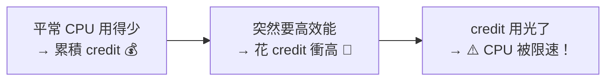

# [aws-3-3] 執行個體家族：T3 / M7g / C7g / R7g 怎麼選

> **本章目標**：看懂 EC2 執行個體類型的命名規則，知道不同「家族」適合什麼工作，並理解 T 系列特有的「Burstable Credit」機制。

## 你會學到

- EC2 instance type 的命名規則怎麼解讀
- 幾個主要家族：T（突發）、M（通用）、C（運算）、R（記憶體）
- T 系列的「Burstable Credit（突發額度）」是什麼、要小心什麼
- 怎麼為你的工作選對規格

## 概念說明

### 為什麼有這麼多種規格

aws-3-2 你用了 `t3.micro`。但 AWS 有**幾百種** instance type（`t3.micro`、`m7g.large`、`c7g.xlarge`…），名字看起來像亂碼。為什麼這麼多？

因為不同工作，需要的「資源比例」不同：

- 有的吃 **CPU**（影片編碼、大量運算）。
- 有的吃 **記憶體**（大型資料庫、快取）。
- 有的很平衡（一般網站）。

如果只有一種規格，要嘛「CPU 夠但記憶體浪費」、要嘛反過來。所以 AWS 分成不同「家族」，讓你選「資源比例剛好符合需求」的——這也是省錢的關鍵（呼應 aws-2-2、SRE 的「剛剛好」）。

---

### 解讀命名規則

instance type 的名字其實有結構，學會讀就不怕：

```
m7g.large
│││  └──── 大小 size：micro < small < medium < large < xlarge < 2xlarge...
││└─────── 額外特性：g = 用 AWS 自研的 Graviton (ARM) 晶片（較省電省錢）
│└──────── 世代 generation：數字越大越新（7 比 5 新）
└───────── 家族 family：m = 通用型（下面解釋）
```

| 部分 | 例子 | 意思 |
|------|------|------|
| **家族** | `m`、`c`、`r`、`t` | 這台機器「擅長什麼」（CPU? 記憶體?）|
| **世代** | `7`、`5` | 第幾代，越新越好（效能/價格比更優）|
| **特性** | `g`（Graviton）、`i`（Intel）、`a`（AMD）| 用什麼晶片 |
| **大小** | `micro`、`large`、`xlarge` | 規格多大（CPU/記憶體越多越貴）|

所以 `m7g.large` = 「通用型、第 7 代、Graviton 晶片、large 大小」。`c7g.xlarge` = 「運算型、第 7 代、Graviton、更大」。看懂了吧？

> 小知識：`g` 的 **Graviton** 是 AWS 自己設計的 ARM 架構晶片，通常**更省電、更便宜**，CP 值高。新專案可以優先考慮 Graviton 機型（但要確認你的軟體支援 ARM）。

---

### 主要家族

記幾個最常用的家族，對應它們「擅長什麼」：


```mermaid
graph TB
    T["T 系列（突發型）<br/>平常輕量、偶爾衝高<br/>便宜，適合小網站/測試"]
    M["M 系列（通用型）<br/>CPU 與記憶體均衡<br/>適合：一般網站、後端"]
    C["C 系列（運算型 Compute）<br/>CPU 強<br/>適合：大量運算、影片編碼"]
    R["R 系列（記憶體型 RAM）<br/>記憶體大<br/>適合：大型資料庫、快取"]
```

| 家族 | 偏向 | 適合的工作 |
|------|------|-----------|
| **T**（如 t3、t4g）| 突發、便宜 | 流量低、偶爾尖峰的小網站、開發測試、學習 |
| **M**（如 m7g）| 均衡 | 一般網站、後端 API（不確定就選它）|
| **C**（如 c7g）| CPU 強 | 運算密集：批次處理、影片轉檔、科學運算 |
| **R**（如 r7g）| 記憶體大 | 記憶體密集：大型資料庫、Redis 快取、大數據 |

選法口訣：**不確定就用 M（通用）；CPU 不夠用 C；記憶體不夠用 R；想省錢的小服務用 T。**

---

### T 系列的「Burstable Credit」陷阱

T 系列（你 aws-3-2 用的 t3.micro 就是）特別便宜，但有個機制要懂，否則會踩坑——**Burstable（突發）+ Credit（額度）機制**。

它的設計是：

> T 系列假設你「**平常 CPU 用得很少，偶爾需要衝高**」。平常低用量時，它會**累積「CPU 額度（credit）」**；需要衝高效能時，**消耗額度**來換取突發的高效能。

用類比：像手機的「**儲值**」——平常少用就存點額度，偶爾要爆發時花額度換高速。


```mermaid
graph LR
    LOW["平常 CPU 用得少<br/>→ 累積 credit 💰"]
    BURST["突然要高效能<br/>→ 花 credit 衝高 🚀"]
    EMPTY["credit 用光了<br/>→ ⚠️ CPU 被限速！"]
    LOW --> BURST --> EMPTY
```

**陷阱在這**：如果你的工作「持續吃高 CPU」（而不是偶爾），credit 會被花光，然後——**CPU 被強制限速**，機器突然變超慢。很多人不知道這個機制，發現「機器莫名其妙變慢」卻找不出原因，其實就是 credit 耗盡了。

所以：

- T 系列適合「**平常閒、偶爾忙**」的工作（小網站、測試）。
- 「**持續高負載**」的工作（如一直在運算的服務），別用 T 系列——會被限速。改用 M/C 等「效能穩定」的家族。

（學習階段你的機器多半很閒，t3.micro 完全沒問題。）

## 範例：為不同工作選規格

```
工作一：個人部落格（流量很低、偶爾有人來看）
  → t3.micro 或 t3.small（T 系列）
  → 平常超閒，credit 充足，便宜划算

工作二：中型電商的後端 API（穩定的中等流量）
  → m7g.large（M 通用型，Graviton 省錢）
  → 流量穩定，需要「效能穩定不被限速」→ 不用 T 系列

工作三：影片轉檔服務（持續吃滿 CPU）
  → c7g.xlarge（C 運算型）
  → CPU 密集，需要強運算力

工作四：大型 Redis 快取（要塞大量資料在記憶體）
  → r7g.large（R 記憶體型）
  → 記憶體需求大

選錯的後果：
  - 用 t3 跑「持續高 CPU」的工作 → credit 耗盡、被限速、變超慢
  - 用超大規格跑小網站 → 浪費錢
→ 選「剛好符合資源需求」的，才是對的（呼應 aws-2-2、SRE「剛剛好」）
```

## 小練習

### 練習 1：解讀名字

不看上面，解讀 `c7g.xlarge` 這個 instance type：家族是什麼、第幾代、什麼晶片、大概多大？它適合什麼工作？

<details>
<summary>參考解答</summary>

照命名規則一段一段拆 `c7g.xlarge`：

- **家族 `c`**：Compute（運算型），代表這台機器 **CPU 強**。
- **世代 `7`**：第 7 代，數字越大越新，效能/價格比越好。
- **晶片 `g`**：Graviton——AWS 自研的 ARM 架構晶片，通常更省電、更便宜。
- **大小 `xlarge`**：比 large 更大一級（micro < small < medium < large < xlarge < 2xlarge…），CPU / 記憶體較多、也較貴。

合起來：**「運算型、第 7 代、Graviton 晶片、xlarge 大小」的機器**。

**適合什麼工作**：因為是 C 家族（CPU 強），適合**運算密集**的工作，例如影片轉檔/編碼、批次資料處理、科學運算這類「一直在算」的任務。

</details>

---

### 練習 2：理解 Burstable Credit

回答：

1. T 系列的「credit」機制怎麼運作？
2. 為什麼「持續高 CPU」的工作不該用 T 系列？會發生什麼？

<details>
<summary>參考解答</summary>

**1. credit 機制怎麼運作：**

T 系列（突發型）假設你「**平常 CPU 用得很少、偶爾才需要衝高**」。它的運作像手機儲值：

- **平常低用量時**，機器會**慢慢累積「CPU 額度（credit）」**。
- **需要衝高效能時**，就**消耗累積的 credit**，換取一段突發的高 CPU 效能。
- 只要平常閒的時間夠、credit 補得回來，就能一直「平時存、尖峰花」，又便宜又夠用。

**2. 為什麼「持續高 CPU」不該用 T 系列、會發生什麼：**

因為 T 系列的高效能是**靠燒 credit 換來的，而 credit 有限**。如果工作是「持續吃滿 CPU」（而不是偶爾衝一下），它會**一直花 credit 卻沒時間累積**，很快就把 credit 花光。credit 一旦耗盡，機器的 **CPU 會被強制限速（節流）**，效能被壓到基準線以下，機器突然變超慢。

很多人不知道這個機制，只看到「機器莫名其妙變慢」卻查不出原因——其實就是 credit 耗盡被限速了。所以持續高負載的工作應該改用 **M / C 這類「效能穩定、不靠 credit」的家族**，才不會被限速。

</details>

---

### 練習 3：選規格

為下面的工作各選一個合適的家族（T/M/C/R）並說明理由：

1. 一個給少數內部同事用的測試環境
2. 一個流量穩定的公司官網後端
3. 一個需要把大量資料載入記憶體做即時分析的服務

<details>
<summary>參考解答</summary>

用口訣：**不確定就用 M；CPU 不夠用 C；記憶體不夠用 R；想省錢的閒置小服務用 T。**

1. **測試環境（少數內部同事用）→ 選 T 系列**（如 `t3.micro` / `t3.small`）。理由：流量很低、大部分時間閒著，只有偶爾有人來測，正好符合「平常閒、偶爾忙」的突發型情境，credit 充足又最便宜。

2. **流量穩定的公司官網後端 → 選 M 系列（通用型）**（如 `m7g.large`）。理由：一般網站/後端 CPU 與記憶體需求均衡，而且「流量穩定」代表 CPU 使用是**持續性**的——不能用 T 系列（會被限速），要選效能穩定的 M。不確定選什麼時，M 也是安全的預設值。

3. **把大量資料載入記憶體做即時分析 → 選 R 系列（記憶體型）**（如 `r7g.large`）。理由：這種工作的瓶頸是**記憶體容量**（要塞大量資料在 RAM 裡），R 家族記憶體最大，正好對症。

</details>

## 課外讀物

> 選對規格是「容量規劃」的一環，SRE 課深入了這個主題 → 參見 **SRE 課程** Part 7（`lessons/sre/課程大綱.md`）
