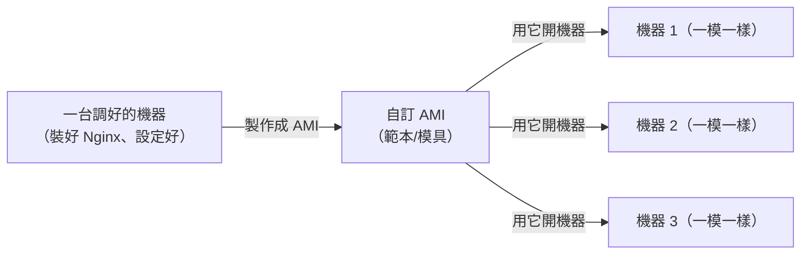
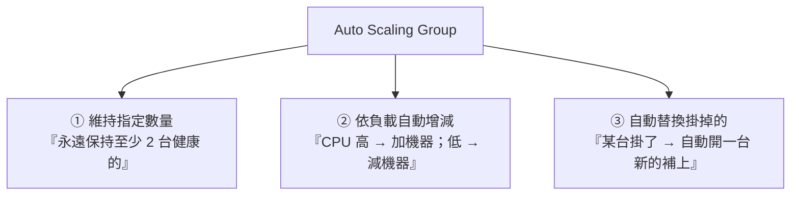

# [aws-3-4] AMI 與 Auto Scaling：複製機器 vs 自動調整台數

> **本章目標**：理解 AMI（機器映像）怎麼讓你「複製出一模一樣的機器」，以及 Auto Scaling 怎麼根據流量自動增減機器——這是雲端「彈性」的核心。

## 你會學到

- AMI（機器映像）是什麼、怎麼用它複製機器
- Auto Scaling Group 怎麼自動增減機器
- 它怎麼實現 SRE/infra 學的「水平擴展 + 高可用」
- 「黃金映像」與啟動範本的概念

## 概念說明

### 問題：要 10 台一模一樣的機器，怎麼辦？

aws-3-2 你手動開了一台 EC2、SSH 進去裝 Nginx。但如果你需要**10 台一模一樣的機器**呢？總不能手動開 10 次、每台都重裝一遍吧（這正是 infra Part 6-3 說的「手動設定 + 設定漂移」的問題）。

AWS 用兩個工具解決這件事：**AMI**（複製機器的範本）和 **Auto Scaling**（自動管理機器數量）。

---

### AMI：機器的「出廠範本」

**AMI（Amazon Machine Image，機器映像）** 你 aws-3-1 見過——開機器時要選它，決定「裝什麼作業系統」。但 AMI 更強大的用法是：

> **你可以把「一台已經設定好的機器」，做成一個 AMI（快照範本），之後用這個 AMI 開出來的機器，全都和原本那台一模一樣。**

用類比：AMI 像「**機器的出廠範本 / 餅乾模具**」（呼應 infra Part 5-2 的 image 概念，其實同源思想）。你把一台機器調校到完美（裝好軟體、設定好），拍成 AMI；之後用這個 AMI 「壓」出來的機器，每台都帶著一樣的軟體和設定。



這種「事先做好一個包含所有設定的範本」叫 **黃金映像（Golden Image）**。它解決了「複製機器」的問題，也讓「開新機器」變超快（因為軟體都預裝好了，不用每次重裝）。

> 對照 infra Part 6 的 IaC：黃金映像（AMI）和 Ansible 是兩種「讓機器可重現」的思路——AMI 是「事先打包好整台」，Ansible 是「開機後自動設定」。實務上常搭配使用。

---

### Auto Scaling：自動增減機器

有了「能複製機器的 AMI」，下一步是**自動管理「要幾台」**。這就是 **Auto Scaling（自動擴縮）**——你 SRE Part 7-3、infra Part 9 學過概念，這裡是 AWS 的實現。

核心是 **Auto Scaling Group（ASG，自動擴縮群組）**，它幫你做三件事：



**① 維持數量**：你設「最少 2 台、最多 10 台、期望 2 台」，ASG 就保證「永遠有 2 台健康的機器在跑」。

**② 依負載擴縮**：設定規則（如「平均 CPU > 70% 就加機器、< 30% 就減」，呼應 SRE Part 7-3）。流量來了自動加、退了自動減——這就是雲端「彈性」最具體的展現，也是 aws-1-1 說的「用多少付多少」。

**③ 自動替換掛掉的**：ASG 持續健康檢查。某台機器掛了，它**自動把它換成一台新的**（用 AMI 開）。這就是 SRE Part 8-3、infra Part 9-2 的「自我修復 / 故障轉移」——機器掛了自己補，使用者無感。

---

### AMI + ASG 怎麼配合

兩者合起來，就是雲端「彈性 + 高可用」的完整實現：

```
① 把調好的機器做成 AMI（黃金映像）
② 設定一個「啟動範本」：用這個 AMI + 選好的 instance type + Security Group
③ 建立 Auto Scaling Group，告訴它：
   - 用上面的啟動範本來開機器
   - 維持 2~10 台
   - CPU > 70% 加、< 30% 減
   - 跨多個 AZ 分散（高可用！呼應 aws-1-2）
④ 通常前面再放一個負載平衡器（Part 6 的 ALB）分流到這些機器

結果：
  - 流量大 → 自動用 AMI 開更多一模一樣的機器（水平擴展）
  - 流量小 → 自動減少機器（省錢）
  - 某台掛了 → 自動替換（自我修復）
  - 跨 AZ → 一個機房掛了還有別的（高可用）
```

這就把你在 infra/SRE 學的「水平擴展、冗餘、故障轉移、自動擴縮」全部用 AWS 的工具實現了。**你之前學的所有可靠性概念，在這裡找到了雲端的落地方式。**

---

### 為什麼這需要「無狀態」設計

一個重要前提（呼應 SRE Part 7-3）：要能「隨意增減機器」，你的應用必須是**無狀態（stateless）**的——任何一台機器都能處理任何請求，機器上不存「只有它有」的重要資料。

因為 ASG 隨時會增減、替換機器。如果某台機器上存了重要資料，它被替換掉時資料就沒了。所以：**重要的資料要存在機器之外**（資料庫 RDS、S3、快取——Part 5、6）。機器本身要能「隨時被丟棄、隨時被複製」（呼應 infra Part 6-3 的「牲畜模式」）。

## 範例：一個會自動擴縮的網站架構

```
電商網站的彈性架構：

① 黃金映像：
   把「裝好應用的機器」做成 AMI

② Auto Scaling Group：
   - 用那個 AMI 開機器
   - 最少 2 台（保證冗餘）、最多 20 台、跨 3 個 AZ
   - CPU > 70% 加機器、< 30% 減機器

③ 負載平衡器（Part 6）在前面分流

實際運作：
  平日深夜（流量低）：ASG 縮到 2 台 → 省錢
  白天尖峰（流量高）：自動擴到 8 台 → 扛得住
  雙 11（爆量）：自動衝到 20 台 → 撐住大促
  某台機器當機：ASG 自動換一台新的 → 使用者無感
  某個 AZ 整個掛掉：其他 AZ 的機器繼續服務 → 高可用

→ 容量、成本、可靠性，全部自動搞定
```

這就是雲端最迷人的能力——你在 infra 要手動費力做的擴展與高可用（Part 9），AWS 用 AMI + ASG 幫你自動化了。

## 小練習

### 練習 1：AMI 解決什麼問題

用「餅乾模具」的類比，解釋 AMI 怎麼解決「要很多台一模一樣的機器」的問題。它和 infra Part 6 的「設定漂移」問題有什麼關聯？

---

### 練習 2：Auto Scaling Group 的三個功能

不看上面，說出 ASG 幫你做的三件事。其中「自動替換掛掉的機器」對應你 SRE/infra 學的什麼概念？

---

### 練習 3：理解無狀態的必要

回答：為什麼「能自動擴縮」的應用，必須設計成「無狀態」？如果某台機器上存了重要資料，當 ASG 把它替換掉時會發生什麼？重要資料該存哪？

## 課外讀物

> Auto Scaling 是 SRE「擴展策略」的雲端實現，infra Part 9 是它的概念基礎 → 參見 **SRE 課程** Part 7-3、**infra 課程** Part 9（各自的課程大綱）
