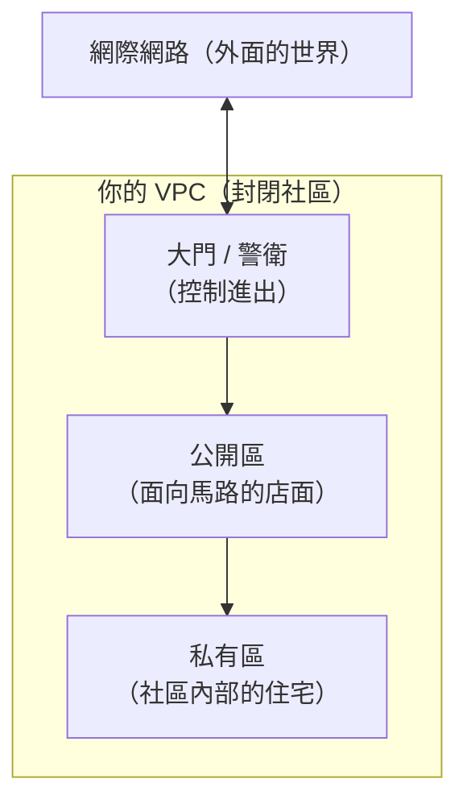

# [aws-4-1] VPC 是什麼？雲端裡你自己的私有網路

> **本章目標**：理解 VPC 這個「公司雲端架構」最核心的概念——它是你在 AWS 裡的「私有網路」，用「封閉社區 + 門禁」來建立直覺。

## 你會學到

- VPC（虛擬私有雲）是什麼、為什麼需要它
- 用「封閉社區」理解 VPC
- VPC 裡有哪些主要組成（先建立全景）
- 為什麼說 VPC 是理解公司雲端架構的核心

## 概念說明

### 為什麼 Part 4 是核心

大綱說 Part 4 是「理解公司雲端架構最核心的章節」——這不是誇張。當你進公司，看到的雲端架構圖，**大部分就是在畫 VPC**：哪些東西在公開區、哪些躲在私有區、流量怎麼流、防火牆怎麼設。看懂 VPC，你就看懂了公司雲端架構的骨架。

而且你有個巨大優勢——**你 infra Part 3（網路與連線）已經學過 IP、子網路、防火牆、路由的概念了**。VPC 就是把這些概念，用 AWS 的方式實現。所以這個 Part 對你會「似曾相識」，學得特別快。

---

### VPC 是什麼

**VPC（Virtual Private Cloud，虛擬私有雲）** 一句話：

> **VPC 是「AWS 裡，專屬於你的、隔離的私有網路」。你的 EC2、資料庫等資源，全都住在 VPC 裡面。**

回想 aws-3-2 開 EC2 時，有個「Network settings」選了「預設 VPC」——那台機器就是被放進了一個 VPC。VPC 決定了「你的資源在什麼網路環境裡、能不能連到外面、外面能不能連到它、彼此怎麼溝通」。

---

### 用「封閉社區」來理解

VPC 最好的類比是一個**有門禁的封閉社區**：



| 社區 | VPC | 之後在哪學 |
|------|-----|-----------|
| 整個封閉社區 | VPC 本身 | 本章 |
| 社區的地址範圍 | CIDR（IP 範圍）| 4-2 |
| 社區裡的不同區塊 | Subnet（子網路）| 4-3 |
| 面向馬路的店面 | 公開子網路 | 4-3 |
| 社區內部的住宅 | 私有子網路 | 4-3 |
| 社區大門 | Internet/NAT Gateway | 4-4 |
| 每戶的門鎖 / 社區圍牆 | Security Group / NACL | 4-5 |
| 社區的道路指引 | Route Table | 4-6 |

整個 Part 4 就是在一個一個蓋好這個「社區」的各個部分。這一章先建立「社區」的整體概念。

---

### 為什麼需要「自己的私有網路」

你可能想：「我的東西放 AWS 上不就好了，為什麼還要一個『私有網路』？」三個理由：

**① 隔離與安全**：VPC 把你的資源「圍起來」，和別人的資源、和開放的網際網路隔開。你能精確控制「什麼能進來、什麼能出去」。沒有 VPC，你的資料庫可能直接暴露在網路上（超危險）。

**② 分層防護**：VPC 讓你把資源分成「公開」和「私有」（4-3）。例如——網頁伺服器放公開區（要讓使用者連），但**資料庫放私有區（躲起來，外面完全連不到，只有內部的網頁伺服器能連）**。這是「公司雲端架構」最核心的安全設計，呼應 infra Part 3-2 的跳板機、私有機器概念。

**③ 完全掌控網路**：你能自訂 IP 範圍、切分子網路、設定路由規則、設防火牆——就像 infra Part 3 在自己的機器上做的，但這是在整個雲端網路的層次。

---

### 預設 VPC vs 自訂 VPC

AWS 帳號一開始就附帶一個**預設 VPC**（所以 aws-3-2 你不用設定就能開 EC2）。它方便、能直接用，適合學習與快速測試。

但正式環境，公司通常會**自訂 VPC**——精確規劃 IP 範圍、子網路、路由、安全規則，打造符合需求的網路架構。aws-4-8 你會親手建一個自訂 VPC，把這個 Part 學的全部組起來。

---

### VPC 是「區域級」的

一個重要事實：**VPC 屬於一個 Region**（aws-1-2）。你在「東京 Region」建的 VPC，就只存在於東京。但 VPC 可以**跨越該 Region 的多個 AZ**——這正是實現 Multi-AZ 高可用的基礎（4-7）：你把資源分散到 VPC 內不同 AZ 的子網路，一個 AZ 掛了還有別的。

## 範例：一個典型公司的 VPC 全景

```
某公司在東京 Region 的 VPC（先看全貌，細節後面章節學）：

VPC（整個封閉社區，IP 範圍 10.0.0.0/16）
│
├── 公開子網路（面向馬路的店面，跨 2 個 AZ）
│   └── 放：負載平衡器、給外部連的網頁伺服器
│       → 這些「需要被外界連到」的，放這裡
│
├── 私有子網路（社區內部住宅，跨 2 個 AZ）
│   └── 放：應用伺服器、資料庫、快取
│       → 這些「不該被外界直接連」的，躲在這裡
│       → 只有公開區的資源能連進來
│
├── Internet Gateway（社區大門）→ 讓公開區能連網際網路
├── Route Table（道路指引）→ 規定封包怎麼走
└── Security Group（每戶門鎖）→ 控制每個資源開哪些 port
```

這就是你進公司會看到的那種「雲端架構圖」的本質——一個規劃好的 VPC。看起來複雜，但它就是「一個有門禁、分公開/私有區、有大門和道路規則的社區」。接下來的章節，我們一塊一塊把它拆解清楚。

## 小練習

### 練習 1：VPC 是什麼

用「封閉社區」的類比，向朋友解釋 VPC 是什麼、為什麼需要它。

---

### 練習 2：為什麼資料庫要躲起來

回答：為什麼「網頁伺服器放公開區、資料庫放私有區」是好的設計？如果把資料庫也放公開區、直接暴露在網路上，有什麼風險？（提示：呼應 infra Part 3 的私有機器、aws-2-2 最小權限）

---

### 練習 3：對照 infra

回答：VPC 裡的「子網路、防火牆、路由」這些概念，你在 infra 哪個 Part 學過類似的？這對你學 VPC 有什麼幫助？

## 課外讀物

> VPC 的網路概念建立在 IP、子網路、路由之上，infra 課的網路 Part 是最好的基礎 → 參見 **infra 課程** Part 3（`lessons/infra/課程大綱.md`）
