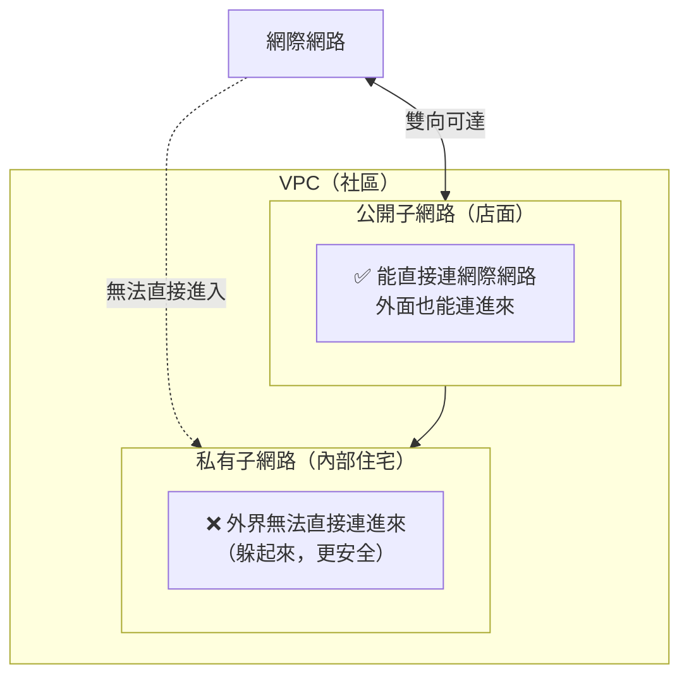
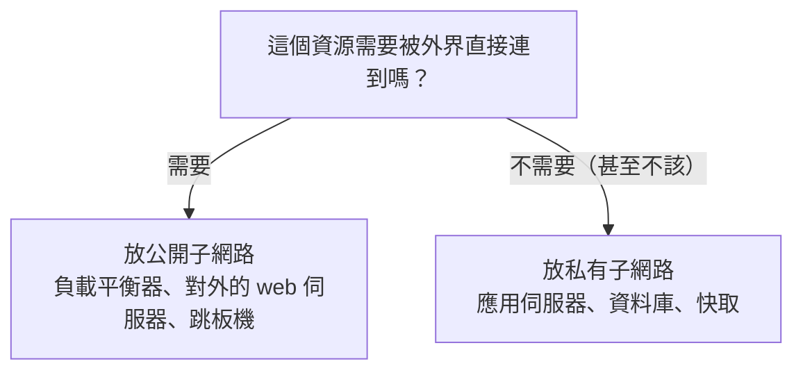

# [aws-4-3] 公開子網路 vs 私有子網路：什麼該躲起來

> **本章目標**：理解子網路（Subnet）怎麼把 VPC 切分，以及「公開」與「私有」子網路的關鍵差別——這是 VPC 安全設計的核心。

## 你會學到

- 子網路（Subnet）是什麼、為什麼要切分 VPC
- 公開子網路 vs 私有子網路的關鍵差別
- 什麼資源該放公開、什麼該躲在私有
- 子網路和 AZ 的關係

## 概念說明

### 子網路：把社區切成不同區塊

aws-4-1 把 VPC 比喻成「封閉社區」。但一個社區內部不會是一整塊——會分成「面向馬路的店面區」「內部的住宅區」等。**子網路（Subnet）** 就是把 VPC 這個大網路，**切分成更小的區塊**。

每個子網路：

- 分到 VPC 範圍裡的一段 IP（aws-4-2，例如 `10.0.1.0/24`）。
- 屬於**一個 AZ**（重要！下面講）。
- 可以設定成「公開」或「私有」。

而「公開 vs 私有」這個區分，是 VPC 安全設計的**核心**。

---

### 公開 vs 私有：差在「能不能直接連到網際網路」

這是這章最重要的概念。兩種子網路的關鍵差別：



| | 公開子網路（Public Subnet） | 私有子網路（Private Subnet） |
|---|---------------------------|----------------------------|
| 能被網際網路直接連到 | ✅ 可以 | ❌ 不行（躲起來） |
| 能主動連網際網路 | ✅ 可以 | ⚠️ 要透過 NAT（4-4） |
| 類比 | 面向馬路的店面 | 社區內部的住宅 |
| 放什麼 | 需要被外界連的資源 | 不該被外界直接碰的資源 |

> 技術上，「公開」與「私有」的差別，在於這個子網路的「路由」有沒有通往 Internet Gateway——這是 4-4、4-6 會講的。這章先掌握「概念上的差別」。

---

### 什麼該放公開、什麼該躲私有

判斷原則很簡單——**問「這個資源需不需要被外界直接連到？」**



**放公開子網路**：

- **負載平衡器（ALB，Part 6）**：要接收使用者的請求，當然要對外。
- **跳板機（Bastion，infra Part 3-2）**：唯一對外開放 SSH 的入口。
- 有時是直接對外的 web 伺服器。

**放私有子網路（躲起來）**：

- **資料庫（RDS，Part 6）**：**絕對不該**直接暴露在網路上！只該讓內部的應用連。放私有區。
- **應用伺服器 / 後端**：通常不直接對外（讓負載平衡器轉發進來就好）。
- **快取（如 Redis）**：內部用，躲私有區。

**核心安全原則**（呼應 aws-2-2 最小權限、infra Part 3 的私有機器）：

> **能躲起來的就躲起來。** 一個資源放在私有子網路、外界根本連不到，那它的攻擊面就小得多——駭客連「敲門」的機會都沒有。把資料庫暴露在公網，是最危險也最常見的錯誤之一。

---

### 私有的資源怎麼運作？

你可能疑惑：「資料庫躲在私有子網路、外界連不到，那我的應用怎麼連它？使用者怎麼用到它的功能？」

答案是**透過公開區的資源「代為轉手」**：

```
使用者 → 公開子網路的負載平衡器（對外）
       → 私有子網路的應用伺服器（內部轉發）
       → 私有子網路的資料庫（更內部）
```

外界只摸得到最外層的負載平衡器；應用和資料庫都躲在私有區，由內部一層層往裡轉。這就是「分層防護」——把最寶貴的（資料庫）藏在最裡面（呼應 infra Part 3-2 跳板機、SRE 的縱深防禦）。

---

### 子網路與 AZ：高可用的基礎

關鍵事實：**每個子網路只屬於「一個 AZ」**。一個子網路不能跨 AZ。

這帶來一個重要的設計含義——要做 **Multi-AZ 高可用**（4-7），你必須在**每個 AZ 都建子網路**：

```
AZ-a：一個公開子網路 + 一個私有子網路
AZ-b：一個公開子網路 + 一個私有子網路
```

這樣你的資源才能「分散到不同 AZ」（例如資料庫主節點在 AZ-a 的私有子網路、副本在 AZ-b 的私有子網路）——一個 AZ 掛了，另一個還在。這就是為什麼 aws-4-2 的 IP 規劃要切出「跨 2 個 AZ 的公開+私有」共 4 個子網路。

## 範例：一個三層架構的子網路規劃

```
經典的「三層式」VPC 子網路設計（跨 2 個 AZ）：

公開子網路（AZ-a: 10.0.1.0/24, AZ-b: 10.0.3.0/24）
  └── 負載平衡器（ALB）
      → 唯一對外的入口，接收使用者請求

私有子網路 - 應用層（AZ-a: 10.0.2.0/24, AZ-b: 10.0.4.0/24）
  └── 應用伺服器（後端 API）
      → 不對外，只接受負載平衡器轉發進來的請求

私有子網路 - 資料層（更裡面，或同私有區）
  └── 資料庫（RDS）、快取（Redis）
      → 最寶貴，藏最深，只有應用層連得到

流量路徑：
  使用者 → ALB（公開）→ 應用（私有）→ 資料庫（私有，最深）

安全效果：
  外界只能碰到 ALB；應用和資料庫完全躲在私有區，連不到
  即使 ALB 被攻破，攻擊者還要再穿過好幾層才碰得到資料
```

這就是你在公司會看到的標準 VPC 架構——**分層、把寶貴的東西藏在最裡面**。看懂這個，你就看懂了大半的雲端架構圖。

## 小練習

### 練習 1：公開 vs 私有

用「店面 vs 內部住宅」的類比，解釋公開子網路和私有子網路的關鍵差別。

---

### 練習 2：放哪裡

下面的資源，該放公開還是私有子網路？為什麼？

1. 負載平衡器
2. 資料庫
3. 後端應用伺服器
4. 跳板機（Bastion）

---

### 練習 3：理解高可用前提

回答：

1. 一個子網路可以跨多個 AZ 嗎？
2. 那要做「跨 2 個 AZ 的高可用」，子網路該怎麼規劃？
3. 為什麼把資料庫放私有子網路，比放公開安全很多？

## 課外讀物

> 「把寶貴資源藏在最裡面」的分層防護，呼應 infra 的跳板機與私有機器設計 → 參見 **infra 課程** Part 3-2（`lessons/infra/課程大綱.md`）
