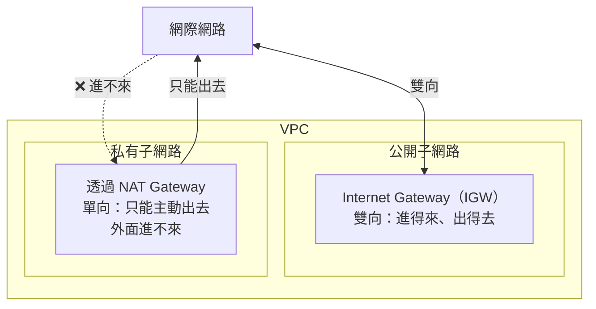

# [aws-4-4] Internet Gateway vs NAT Gateway：誰能進出

> **本章目標**：理解 Internet Gateway 和 NAT Gateway 這兩個「社區大門」的差別——誰讓資源能被外界拜訪、誰只讓資源能主動出門。

## 你會學到

- Internet Gateway（IGW）是什麼、讓什麼成為可能
- NAT Gateway 是什麼、解決什麼問題
- 「能主動出門」和「能被外界拜訪」的關鍵差別
- 為什麼私有子網路也常需要「能上網」

## 概念說明

### 兩種「門」，方向不同

aws-4-3 說公開子網路「能連網際網路」、私有子網路「躲起來」。但「連網際網路」其實有**兩個方向**，要分清楚：

- **被外界主動連進來**（外面 → 你）：例如使用者連你的網站。
- **自己主動連出去**（你 → 外面）：例如你的伺服器要去下載軟體更新、呼叫外部 API。

Internet Gateway 和 NAT Gateway 就是處理這兩種方向的「門」。搞懂它們的差別，是 VPC 的一個關鍵。



---

### Internet Gateway（IGW）：社區的「正門」

**Internet Gateway（IGW，網際網路閘道）** 是讓 **VPC 能和網際網路雙向溝通**的門。

- 它附加在 VPC 上（一個 VPC 一個 IGW）。
- **公開子網路**之所以「公開」，正是因為它的路由通往 IGW（4-6 會講路由）。
- 有了 IGW，公開子網路的資源既能「被外界連進來」、也能「主動連出去」——**雙向**。

用類比：IGW 是社區的「**正門**」——面向馬路、雙向通行。店面（公開子網路）靠它做生意（讓客人進來、也能出貨）。

所以你 aws-3-2 開的那台 EC2 有公開 IP、能被瀏覽器連到，就是因為它在公開子網路、走 IGW。

---

### 問題：私有子網路也需要「上網」

私有子網路躲起來、外界連不到（4-3），這很安全。但出現一個實際問題：

> 私有子網路的資源（如應用伺服器、資料庫），常常**需要「主動連出去」**——例如：
> - 下載軟體更新（`apt update`，infra Part 2-5）
> - 呼叫外部 API（例如金流、寄信服務）
> - 從外部拉取資料

但它在私有子網路、不能走 IGW（走了就變公開了）。怎麼讓它「**能主動出去，但外界仍然進不來**」？

這就是 **NAT Gateway** 要解決的。

---

### NAT Gateway：只出不進的「側門」

**NAT Gateway（NAT 閘道）** 讓私有子網路的資源能「**主動連出網際網路，但外界無法主動連進來**」——單向的門。

它的運作（NAT = Network Address Translation，網路位址轉換，infra Part 3 碰過概念）：

- NAT Gateway 放在**公開子網路**裡。
- 私有子網路的資源要出門時，把流量**先送到 NAT Gateway**，由它「代為」連出去（用它的公開 IP）。
- 回應會經 NAT Gateway 轉回給私有資源。
- 但**外界無法透過 NAT Gateway 主動連進私有資源**——它只「代為出門」，不「引人進來」。

用類比：NAT Gateway 像社區的「**側門 + 代收/代寄櫃台**」——住宅區的人（私有資源）可以透過這個櫃台寄東西出去、收回信件，但外人不能從這個側門闖進住宅。只出不進（嚴格說是「能出、以及收出去那筆的回應」，但不能被外界主動發起）。

---

### IGW vs NAT Gateway 對照

| | Internet Gateway | NAT Gateway |
|---|------------------|-------------|
| 用在哪 | 公開子網路 | 服務私有子網路（自己放在公開子網路）|
| 方向 | **雙向**（進得來、出得去）| **單向**（只能主動出去）|
| 外界能主動連到嗎 | ✅ 能 | ❌ 不能 |
| 類比 | 正門（雙向）| 側門 + 代收櫃台（只出）|
| 費用 | 免費 | **要錢**（按時間 + 流量計費，注意成本！）|

> ⚠️ 成本提醒（呼應 aws-1-3）：**NAT Gateway 是要錢的**（一直開著按小時計費 + 流量費），而且常被新手忽略，是帳單上「咦這什麼費用」的常見來源。學習時用完記得刪掉。

---

### 為什麼這個設計很美

把這個機制連回安全：私有子網路的資源——

- **外界完全連不到它**（沒有 IGW，最安全）。
- **但它自己能出門**做該做的事（透過 NAT Gateway 下載更新、呼叫 API）。

這達成了「**既安全、又實用**」的平衡：資料庫躲得好好的、誰都連不到它，但它還是能去下載安全更新。這就是專業 VPC 設計的精妙之處——**安全不代表與世隔絕，而是精確控制「什麼方向能通」。**

## 範例：流量的進與出

```
一個典型 VPC 的「進」與「出」：

【外界連進來（使用者訪問網站）】
  使用者 → IGW（正門）→ 公開子網路的負載平衡器
         → （內部）→ 私有子網路的應用 → 私有子網路的資料庫
  注意：外界只能透過 IGW 連到公開區，碰不到私有區

【私有資源主動出去（應用要呼叫外部金流 API）】
  私有子網路的應用 → NAT Gateway（側門，在公開子網路）
                   → IGW → 網際網路 → 金流 API
  回應沿原路回來
  注意：是「應用主動發起」，金流 API 無法反過來主動連進應用

結果：
  - 使用者進得來（到公開區的入口）✅
  - 私有資源能主動出門辦事 ✅
  - 但外界無法主動闖進私有區 ✅（最關鍵的安全保障）
```

## 小練習

### 練習 1：兩種門的差別

用「正門 vs 側門代收櫃台」的類比，解釋 Internet Gateway 和 NAT Gateway 的差別。關鍵在「方向」——各是什麼方向？

---

### 練習 2：為什麼私有子網路需要 NAT

回答：

1. 私有子網路的資料庫，為什麼可能需要「主動連出網際網路」？舉一個例子。
2. 為什麼不能讓它直接走 IGW（那會有什麼問題）？
3. NAT Gateway 怎麼同時做到「能出去」又「外界進不來」？

---

### 練習 3：成本意識

回答：IGW 和 NAT Gateway，哪個要錢？為什麼新手要特別注意 NAT Gateway 的費用？（提示：呼應 aws-1-3 的帳單意識）

## 課外讀物

> NAT（網路位址轉換）的基礎概念，infra 課的網路 Part 有提及 → 參見 **infra 課程** Part 3（`lessons/infra/課程大綱.md`）
