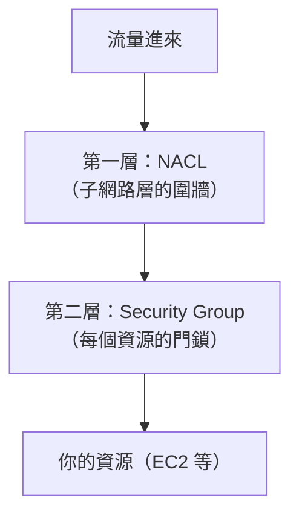

# [aws-4-5] Security Group vs NACL：兩層防火牆

> **本章目標**：理解 AWS VPC 裡的兩層防火牆——Security Group（執行個體層）和 NACL（子網路層），知道它們的差別與何時用哪個。

## 你會學到

- Security Group（安全群組）是什麼、怎麼運作
- NACL（網路存取控制清單）是什麼
- 兩者的關鍵差別：層級、有狀態 vs 無狀態
- 實務上怎麼用這兩層

## 概念說明

### VPC 裡有兩層防火牆

infra Part 3-3 你學過防火牆（ufw）。AWS VPC 把防火牆做成**兩層**，這呼應你 infra Part 3-3 學的「雲端 SG + 主機防火牆是兩層」——這章深入雲端這層的兩個機制：



- **Security Group（SG）**：掛在**每個資源（如 EC2）**上的防火牆——「每戶的門鎖」。
- **NACL**：掛在**整個子網路**上的防火牆——「社區的圍牆」。

兩層都要通過，流量才能到達資源。下面分別講，重點在它們的差別。

---

### Security Group：資源的「門鎖」（最常用）

**Security Group（安全群組）** 是你**最常用**的 VPC 防火牆。你 aws-3-2 開 EC2 時設過——它控制「這個資源開放哪些 port、誰能連」。

特點：

- **作用在「資源層級」**：掛在 EC2、資料庫等單個資源上。同一個子網路裡的不同資源，可以有不同的 SG。
- **只能設「允許」規則（allow）**：你列出「允許什麼進來、允許什麼出去」，沒列的自動拒絕（呼應 aws-2-3 政策的「隱性拒絕」、最小權限）。
- **有狀態（stateful）**：這是關鍵特性——**「你允許進來的連線，它的回應自動允許出去」**，不用另外設。（下面詳述）

例如 aws-3-2 你設的 SG：「允許 22（SSH）、80（HTTP）進來」。

---

### 「有狀態」是什麼意思

「有狀態（stateful）」是 SG 的重要特性，也是它好用的原因。意思是：

> **SG 會「記得」連線。如果你允許一個請求進來，那這個請求的「回應」會自動被允許出去——你不用為「回應」另外設規則。**

用類比：SG 像一個聰明的門衛——他記得「剛剛放某人進來辦事」，所以那個人辦完要出去時，他自動放行，不用再檢查。

實務上的方便：你只要設「允許 80 進來」，使用者請求進來、伺服器的回應出去，全自動搞定。不用再設一條「允許回應出去」。

---

### NACL：子網路的「圍牆」

**NACL（Network ACL，網路存取控制清單）** 是另一層防火牆，作用在**整個子網路**。

特點（和 SG 對比著記）：

- **作用在「子網路層級」**：套用到整個子網路裡的所有資源。
- **能設「允許」和「拒絕」規則**：和 SG 不同，NACL 可以明確「拒絕（deny）」——這讓它能做「黑名單」（例如「擋掉某個惡意 IP」）。
- **無狀態（stateless）**：**它不記得連線**。你允許了「進來」，還要**另外**允許「回應出去」——進出都要各自設規則。這比較麻煩。
- **有順序**：規則按編號順序套用。

NACL 比較少手動動它——大多數情況，**預設的 NACL（全部允許）+ 用 SG 控制就夠了**。NACL 通常用在「需要在子網路層級做額外防護」的進階場景，例如明確封鎖某些 IP。

---

### Security Group vs NACL 對照

| | Security Group | NACL |
|---|----------------|------|
| 層級 | 資源（如 EC2）| 整個子網路 |
| 允許/拒絕 | 只能「允許」 | 「允許」和「拒絕」都行 |
| 狀態 | **有狀態**（回應自動放行）| **無狀態**（進出要各自設）|
| 常用度 | **天天用** | 較少手動動 |
| 類比 | 每戶的門鎖 | 社區的圍牆 |

**實務心法**：

> **日常用 Security Group 就好**（控制每個資源開哪些 port）。NACL 維持預設、或只在「要在子網路層擋特定 IP」等進階需求時才動它。

新手只要把 Security Group 學好，就能應付九成情況。NACL 知道「它存在、是子網路層的額外一道、能做拒絕」即可。

---

### 兩層怎麼配合

流量要到達資源，**兩層都要通過**（呼應 infra Part 3-3 的「縱深防禦」）：

```
流量進來
  → 先過 NACL（子網路圍牆）：通過嗎？
  → 再過 Security Group（資源門鎖）：通過嗎？
  → 都通過 → 到達資源
  → 任一層擋下 → 進不來
```

這種「多層防護」的好處：就算一層設錯或被繞過，還有另一層。但也要注意——**如果連不上，兩層都要檢查**（infra Part 3-4 排查時要記得這點）。

## 範例：用兩層保護一個架構

```
保護一個 web 伺服器（EC2，在公開子網路）：

Security Group（資源門鎖，主要用這個）：
  允許進來：80（HTTP）、443（HTTPS）from Anywhere
            22（SSH）from My IP（只有你能 SSH，aws-3-2 的最小權限）
  → 有狀態，所以回應自動放行，不用設出站規則

NACL（子網路圍牆，通常用預設）：
  維持預設「全部允許」，讓 SG 去做精細控制
  （除非有特殊需求，例如要在整個子網路層擋掉某段惡意 IP）

保護資料庫（RDS，在私有子網路，Part 6）：
  Security Group：
    只允許「來自應用伺服器 SG」的資料庫 port（如 5432）
    → 連「來源」都精確限定成「只有應用伺服器能連」
    → 連私有子網路裡的其他資源都不能亂連資料庫
    → 這是最小權限的極致（aws-2-2）
```

注意資料庫那段的高明之處——SG 的來源可以設成「**另一個 SG**」，意思是「只有掛著『應用伺服器 SG』的資源能連我」。這比用 IP 還精確，是 AWS 安全設計的常用手法。

## 小練習

### 練習 1：兩層的差別

用「門鎖 vs 圍牆」的類比，說明 Security Group 和 NACL 的差別（層級、能不能拒絕、有沒有狀態）。

---

### 練習 2：理解「有狀態」

回答：

1. Security Group 的「有狀態」是什麼意思？
2. 因為它有狀態，你設了「允許 80 進來」，需要另外設「允許回應出去」嗎？為什麼？

---

### 練習 3：設計防火牆

你有一個資料庫在私有子網路，只該讓「應用伺服器」連。你會怎麼設它的 Security Group？（提示：來源可以設成應用伺服器的 SG，而不是開給所有人）

## 課外讀物

> 「兩層防火牆 / 縱深防禦」的概念，infra 課 Part 3-3 講過雲端 SG 與主機防火牆的關係 → 參見 **infra 課程** Part 3-3（`lessons/infra/課程大綱.md`）
