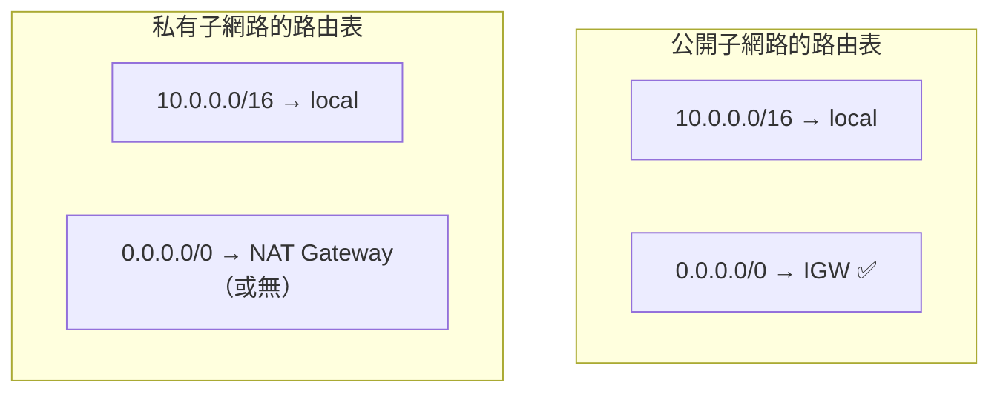

# [aws-4-6] Route Table：封包怎麼決定走哪條路

> **本章目標**：理解路由表（Route Table）怎麼決定 VPC 裡封包的去向，以及它如何真正定義了「一個子網路是公開還是私有」。

## 你會學到

- Route Table（路由表）是什麼、怎麼運作
- 路由規則怎麼讀（目的地 → 下一站）
- 路由表如何「決定」子網路是公開還是私有
- 公開子網路與私有子網路的路由表差別

## 概念說明

### Route Table：社區的「道路指引」

前面學了 VPC（社區）、子網路（區塊）、閘道（門）。但還缺一塊——**封包要怎麼知道「該往哪走」？** 要去網際網路走哪個門？要連 VPC 內部的其他資源走哪條路？

這由 **Route Table（路由表）** 決定。你 infra Part 3-1、3-4 碰過路由的概念，這是 AWS 的版本：

> **Route Table 是一張「道路指引表」——它規定「要去某個目的地，下一站該走哪裡」。每個子網路都關聯一張路由表。**

用類比：路由表像社區裡每個路口的「**路標**」——「要去市區（網際網路）走這條」「要去隔壁棟（VPC 內部）走那條」。封包照著路標走，就能到達目的地。

---

### 路由規則怎麼讀

一張路由表，是一條條「規則」，每條規則回答「**去哪裡（目的地）→ 走哪條路（目標）**」：

```
目的地 (Destination)        目標 (Target)
─────────────────────────────────────────
10.0.0.0/16                 local          ← VPC 內部，走內部網路
0.0.0.0/0                   igw-xxxxx      ← 其他所有地方（網際網路），走 IGW
```

逐條解讀：

- `10.0.0.0/16 → local`：目的地如果在「VPC 自己的 IP 範圍內」（aws-4-2 的 VPC CIDR），就走「local」——即 VPC 內部網路，資源之間直接互通。**這條是自動有的**，讓 VPC 內部能互相溝通。
- `0.0.0.0/0 → igw-xxx`：`0.0.0.0/0` 是「**所有其他位址**」（CIDR 表示「任何地方」）的意思。這條說「要去 VPC 以外的任何地方（即網際網路），走 Internet Gateway」。

路由的判斷邏輯：封包來時，路由表**從「最精確符合」的規則找起**。要去 `10.0.1.5`（VPC 內）→ 符合 `10.0.0.0/16` → 走 local。要去 `8.8.8.8`（外部）→ 不符合 VPC 範圍 → 落到 `0.0.0.0/0` → 走 IGW。

---

### 路由表「決定」了公開 vs 私有

這是這章最關鍵的洞察，回答了 aws-4-3 埋的伏筆——**子網路是「公開」還是「私有」，技術上就是由它的路由表決定的：**



| | 公開子網路 | 私有子網路 |
|---|-----------|-----------|
| 通往網際網路的路由 | `0.0.0.0/0 → IGW` | `0.0.0.0/0 → NAT`（或沒有）|
| 結果 | 能雙向連網際網路 → **公開** | 不能直接被連到 → **私有** |

關鍵理解：

> **「公開子網路」之所以公開，就是因為它的路由表有一條「`0.0.0.0/0 → Internet Gateway`」——讓它能雙向連網際網路。**
>
> **「私有子網路」沒有這條（或改成指向 NAT Gateway，只能出不能進）——所以外界連不到它。**

所以「公開/私有」不是一個你勾選的開關，而是**由「路由表怎麼設」決定的結果**。把路由指向 IGW，子網路就公開了；不指、或指向 NAT，就是私有。這就是 VPC 設計的底層機制。

---

### 路由表怎麼配合前面學的

把 Part 4 至此的拼圖串起來，路由表是「讓它們協同運作」的關鍵：

```
子網路（4-3）：切分出區塊
閘道（4-4）：IGW（雙向門）、NAT（只出門）
路由表（本章）：規定「去網際網路走哪個門」
   → 公開子網路的路由表指向 IGW → 它就公開了
   → 私有子網路的路由表指向 NAT（或不通外網）→ 它就私有了
```

換句話說——**閘道是「門」，路由表是「指引你走哪個門的路標」。** 兩者配合，才決定了流量的實際去向，也才定義了子網路的公開/私有性質。

## 範例：一個 VPC 的路由規劃

```
一個跨 AZ、有公開+私有子網路的 VPC，路由規劃：

【公開子網路的路由表】
  10.0.0.0/16  → local        （VPC 內部互通）
  0.0.0.0/0    → IGW           （去網際網路走正門，雙向）
  → 所以這裡的資源（負載平衡器）能被外界連到 ✅

【私有子網路的路由表】
  10.0.0.0/16  → local        （VPC 內部互通）
  0.0.0.0/0    → NAT Gateway   （要出去走側門，只出不進）
  → 所以這裡的資源（資料庫）外界連不到，但能主動下載更新 ✅

效果：
  使用者連網站 → 走公開子網路（有 IGW 路由）→ 摸得到負載平衡器
  使用者想連資料庫 → 資料庫在私有子網路（沒有 IGW 路由）→ 連不到 ✅ 安全
  資料庫要下載更新 → 走私有子網路的 NAT 路由 → 出得去 ✅ 實用
```

這就是把 4-3（子網路）、4-4（閘道）、4-6（路由）全部組起來的完整網路設計。看懂這個，你就理解了 VPC 流量控制的核心。

## 小練習

### 練習 1：讀懂路由規則

解讀這兩條路由：

```
10.0.0.0/16  → local
0.0.0.0/0    → igw-12345
```

1. 要連 `10.0.2.30`（VPC 內）會走哪條？
2. 要連 `1.1.1.1`（外部）會走哪條？
3. 這是公開還是私有子網路的路由表？

---

### 練習 2：公開 vs 私有的本質

回答：「子網路是公開還是私有」，技術上是由什麼決定的？（提示：不是一個開關，而是路由表怎麼設）

---

### 練習 3：設計路由

你要把一個子網路設成「私有，但裡面的資源能主動下載更新」。它的路由表 `0.0.0.0/0` 該指向什麼？如果指向 IGW 會怎樣？

## 課外讀物

> 路由（封包怎麼決定走哪條路）的基礎概念，infra 課的網路 Part 講過 → 參見 **infra 課程** Part 3（`lessons/infra/課程大綱.md`）
