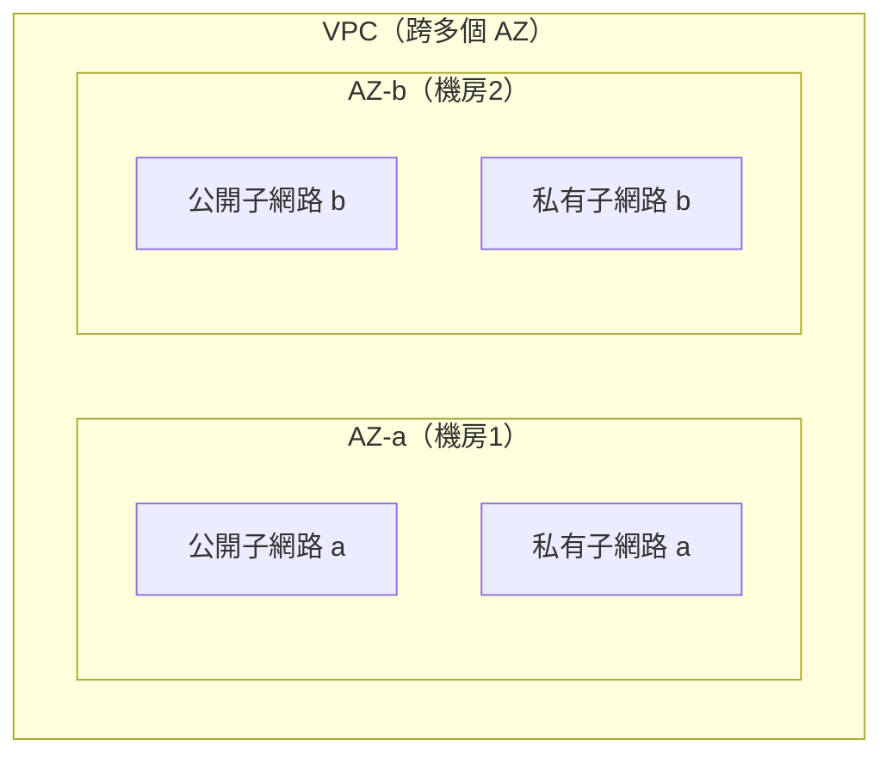
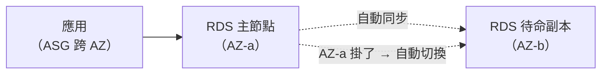

# [aws-4-7] Multi-AZ 架構：為什麼要分散到不同機房

> **本章目標**：理解 Multi-AZ 架構怎麼在 VPC 裡實現高可用，把 SRE/infra 學的「冗餘、消除單點故障」用 AWS 的方式落地。

## 你會學到

- 在 VPC 裡實現 Multi-AZ 的具體方式
- 為什麼「子網路分散到多 AZ」是高可用的基礎
- 哪些資源該跨 AZ、怎麼配置
- Multi-AZ 怎麼對應你學過的冗餘概念

## 概念說明

### 複習：為什麼要 Multi-AZ

你已經在 aws-1-2、SRE Part 8-3、infra Part 9-2 多次碰過這個概念了，這章把它在 VPC 裡落地。快速複習核心：

> **如果所有資源都放在「一個 AZ（機房）」，那個機房出事（斷電、火災、網路中斷），你的服務就全掛——這是「單點故障」。把資源分散到「多個 AZ」，一個掛了還有別的，這就是高可用。**

（AZ = 可用區 = 獨立的機房，aws-1-2。）

---

### 在 VPC 裡怎麼實現 Multi-AZ

關鍵接回 aws-4-3 的事實——**每個子網路只屬於一個 AZ**。所以要做 Multi-AZ，方法就是：

> **在「每個 AZ」都建立子網路，然後把資源「分散」到不同 AZ 的子網路。**



這就是為什麼 aws-4-2 的 IP 規劃、aws-4-3 的子網路設計，都是「跨 2 個 AZ、各有公開+私有」——**就是為了這一刻的 Multi-AZ**。現在你懂為什麼前面要那樣規劃了。

---

### 各種資源怎麼跨 AZ

不同資源有不同的 Multi-AZ 做法：

**① 應用伺服器（EC2）→ 用 Auto Scaling 跨 AZ**

把 Auto Scaling Group（aws-3-4）設定成「跨多個 AZ 的子網路開機器」。這樣機器會自動分散到不同 AZ。一個 AZ 掛了，其他 AZ 的機器繼續服務，ASG 還會在健康的 AZ 補開機器。

**② 負載平衡器（ALB，Part 6）→ 天生跨 AZ**

ALB 本身就設計成跨多個 AZ 運作，把流量分到各 AZ 的健康機器。它是 Multi-AZ 架構的流量入口。

**③ 資料庫（RDS，Part 6）→ Multi-AZ 選項**

RDS 有個「Multi-AZ」選項——它會在「另一個 AZ」自動維護一個**待命副本（standby）**。主資料庫所在的 AZ 掛了，RDS **自動切換（故障轉移）**到另一個 AZ 的副本。這正是 SRE Part 8-3 的「故障轉移」，AWS 幫你自動做好。



---

### Multi-AZ 對應你學過的概念

這章其實是「舊概念的雲端落地」，串一下你的知識：

| 你學過的概念 | 在 Multi-AZ 的體現 |
|------------|-------------------|
| 冗餘（infra Part 9-2）| 每個 AZ 都有資源，互為備份 |
| 消除單點故障（infra Part 9-2）| 不依賴單一 AZ |
| 故障轉移（SRE Part 8-3）| RDS Multi-AZ 自動切換 |
| 高可用（SRE/infra）| 一個 AZ 掛了，服務不中斷 |
| 水平擴展（infra Part 9-1）| ASG 跨 AZ 開機器 |

**你不是在學全新的東西，而是看到「AWS 怎麼讓這些可靠性設計變得很容易實現」。** 在 infra 課你要手動費力做的高可用，AWS 用 Multi-AZ + RDS + ASG + ALB 幫你自動化了大半——這正是雲端託管的價值（呼應 infra Part 9-3、SRE Part 8-3）。

---

### Multi-AZ 的成本與取捨

Multi-AZ 不是免費的——更多 AZ 的資源、RDS 的待命副本，都要錢。所以回到 SRE Part 1-3、8-3 的「剛剛好」：

- **正式、重要的服務** → 該做 Multi-AZ（防機房級故障，值得）。
- **學習、測試環境** → 單 AZ 就好（省錢，掛了無所謂）。

判斷依據還是「**這個服務掛掉的後果，值不值得 Multi-AZ 的成本**」（SRE 的 SLO 思維）。大多數正式服務做 Multi-AZ；Multi-Region（跨地區，SRE Part 8-3）則留給「絕不能停」的關鍵服務。

## 範例：一個 Multi-AZ 的完整架構

```
電商網站的 Multi-AZ 高可用架構（在一個 VPC，跨 2 AZ）：

         使用者
           ↓
    ALB（跨 AZ-a、AZ-b 的公開子網路）← 流量入口，天生跨 AZ
           ↓ 分流
   ┌───────┴───────┐
 AZ-a 私有子網路    AZ-b 私有子網路
   應用伺服器         應用伺服器      ← ASG 跨 AZ 開機器
   （ASG 管理）       （ASG 管理）
   ↓                  ↓
 RDS 主節點 ←自動同步→ RDS 待命副本   ← RDS Multi-AZ
 （AZ-a）            （AZ-b）

故障情境演練：
  AZ-a 整個機房掛掉：
    - ALB 偵測到 AZ-a 的機器不健康 → 流量全導到 AZ-b
    - ASG 在 AZ-b（或恢復後的 AZ-a）補開機器
    - RDS 自動把 AZ-b 的待命副本升為主節點
  → 結果：服務短暫波動後繼續，使用者幾乎無感 ✅
  → 這就是高可用（SRE 的「出事了使用者無感」）
```

對比單 AZ：如果全放 AZ-a，AZ-a 掛掉 = 整個服務掛掉。Multi-AZ 把「機房級災難」從「致命」變成「可承受的小波動」。

## 小練習

### 練習 1：怎麼實現 Multi-AZ

回答：在 VPC 裡，要做 Multi-AZ 高可用，子網路該怎麼規劃？（提示：呼應「每個子網路只屬於一個 AZ」）

---

### 練習 2：資料庫的故障轉移

回答：RDS 的「Multi-AZ」選項怎麼運作？主資料庫的 AZ 掛掉時會發生什麼？這對應你 SRE 學的什麼概念？

---

### 練習 3：成本取捨

下面的服務，該做 Multi-AZ 還是單 AZ 就好？說明理由：

1. 一個給你自己學習用的測試環境
2. 一個正式的線上購物網站
3. 一個處理金流、絕對不能停的核心服務（這個甚至可能要考慮什麼？）

## 課外讀物

> Multi-AZ 是「冗餘與故障轉移」的雲端實現，SRE/infra 課是它的概念基礎 → 參見 **SRE 課程** Part 8-3、**infra 課程** Part 9-2（各自的課程大綱）
