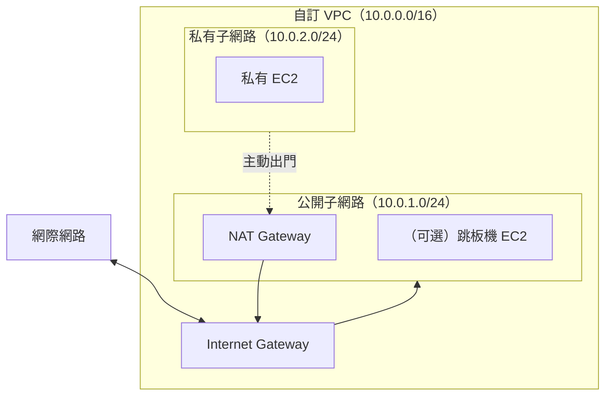

# [aws-4-8] 🔧 動手做：親手建一個 VPC

> **本章目標**：把整個 Part 4 學的組起來——親手建一個自訂 VPC，含公開/私有子網路、IGW、NAT、路由表，並把一台 EC2 正確放進私有子網路。

## 你會學到

- 從零建立一個自訂 VPC 的完整流程
- 設定子網路、IGW、NAT、路由表
- 驗證「公開的連得到、私有的躲起來」
- 把前面所有概念整合成一個能動的網路

## 概念說明

### 這一章在做什麼

Part 4-1~4-7 一塊一塊學了 VPC 的組件。這一章你要**親手把它們組成一個完整的 VPC**——這就是把抽象概念變成真實架構的時刻。

你要建的（呼應 aws-4-2 的 IP 規劃）：

> ⚠️ 成本提醒：**NAT Gateway 要錢**（aws-4-4）。學習做完後，記得把 NAT Gateway 刪掉，避免持續計費。或者這次先不建 NAT（私有 EC2 暫時不能上網但能練其他部分）。

## 程式碼範例

> AWS 有個「VPC and more」的精靈，能一鍵建好整套（含子網路、IGW、NAT、路由表）。但為了學習，下面說明「手動建」的邏輯，讓你真懂每塊在做什麼。實務上熟了可以用精靈加速。

### 第一步：建立 VPC

1. Console 進入 **VPC** → Create VPC。
2. 選「VPC only」（手動模式，學習用）。
3. Name：`my-vpc`。
4. IPv4 CIDR：`10.0.0.0/16`（aws-4-2 的規劃）。
5. 建立。

### 第二步：建立子網路（aws-4-3）

建兩個子網路（這次先做單 AZ 練習，正式要跨 AZ）：

1. 左側 Subnets → Create subnet，選 `my-vpc`。
2. **公開子網路**：Name `public-1a`、AZ 選 `ap-northeast-1a`、CIDR `10.0.1.0/24`。
3. **私有子網路**：Name `private-1a`、同一個 AZ、CIDR `10.0.2.0/24`。

> 正式環境要在「另一個 AZ」也各建一組，做 Multi-AZ（aws-4-7）。學習先做單 AZ 理解流程。

### 第三步：建立 Internet Gateway（aws-4-4）

1. 左側 Internet Gateways → Create → Name `my-igw` → 建立。
2. 選取它 → Actions → **Attach to VPC** → 選 `my-vpc`。

（IGW 是「正門」，要附加到 VPC 才生效。）

### 第四步：設定路由表，讓公開子網路「公開」（aws-4-6）

這是讓子網路「變公開」的關鍵——給它一條通往 IGW 的路由：

1. 左側 Route Tables → Create route table → Name `public-rt`、選 `my-vpc`。
2. 建好後，選它 → **Routes** → Edit routes → Add route：
   - Destination: `0.0.0.0/0`，Target: 選你的 IGW。
   - （`10.0.0.0/16 → local` 是自動有的）
3. **Subnet associations** → 把 `public-1a` 關聯到這張路由表。

現在 `public-1a` 有了 `0.0.0.0/0 → IGW`，它就**正式成為公開子網路**了（aws-4-6 的本質）。

私有子網路 `private-1a` 用預設路由表（沒有通往 IGW 的路由）→ 它就是私有的。

### 第五步（可選，會計費）：建立 NAT Gateway

讓私有子網路能「主動出門」：

1. 左側 NAT Gateways → Create → 放在**公開子網路** `public-1a`、配一個 Elastic IP。
2. 編輯**私有子網路的路由表**：加一條 `0.0.0.0/0 → 這個 NAT Gateway`。

這樣 `private-1a` 的資源能主動上網（下載更新等），但外界仍連不到它（aws-4-4）。

### 第六步：把 EC2 放進私有子網路驗證

1. 啟動一台 EC2（aws-3-2 的流程），但 Network 選 `my-vpc`、Subnet 選 **`private-1a`（私有）**。
2. 驗證它「躲起來了」：這台 EC2 **沒有公開 IP**、你**無法從外面直接 SSH 連到它**——這證明私有子網路生效了。
3. 要連它怎麼辦？透過公開子網路的跳板機（infra Part 3-2 的 bastion）跳進去——這正是「私有資源透過公開區存取」的實踐。

---

### 你完成了什麼

你親手建了一個完整的 VPC：

- VPC（10.0.0.0/16）+ 公開/私有子網路
- IGW 讓公開區雙向通網際網路
- 路由表決定了公開/私有
- （可選）NAT 讓私有區能主動出門
- 一台躲在私有子網路、外界連不到的 EC2

**這就是公司雲端架構的骨架**。你不只「看懂」VPC，還親手建了一個——這是很扎實的能力。

### ⚠️ 清理（重要）

學習做完，依序刪除（NAT Gateway 尤其要刪，它在計費）：終止 EC2 → 刪 NAT Gateway → 釋放 Elastic IP → 刪 VPC（會連帶清掉子網路、路由表等）。

## 小練習

### 練習 1：建一個 VPC

照步驟建一個含公開/私有子網路、IGW、路由表的 VPC。把一台 EC2 放進私有子網路，驗證「外面連不到它」。做完記得清理。

---

### 練習 2：理解「變公開」的那一步

回答：在這個流程裡，是「哪一步」讓 `public-1a` 真正變成公開子網路的？（提示：aws-4-6，路由表）

---

### 練習 3：連進私有 EC2

你的 EC2 在私有子網路、外界連不到。回想 infra Part 3-2，你會怎麼連進去管理它？（提示：透過公開子網路的跳板機）

## 課外讀物

> 「透過跳板機連進私有機器」的完整做法，infra 課 Part 3-2 有詳細教學 → 參見 **infra 課程** Part 3-2（`lessons/infra/課程大綱.md`）
