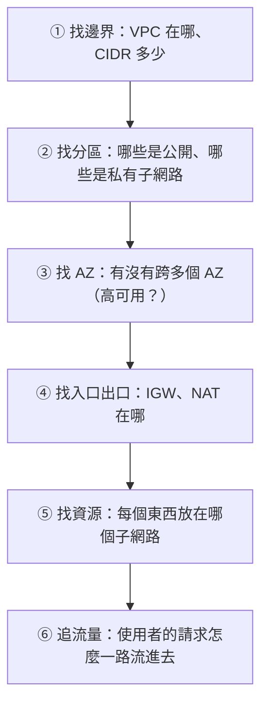

# [aws-4-9] 看懂 VPC 架構圖：讀懂公司的雲端網路全貌

> **本章目標**：把整個 Part 4 學的組件，整合成「讀懂一張真實 VPC 架構圖」的能力——這是你進公司第一天就用得上的技能。

## 你會學到

- 怎麼系統化地閱讀一張 VPC 架構圖
- 從圖上認出各個組件、看懂流量怎麼流
- 一套「拿到任何架構圖都能拆解」的方法
- Part 4 完整知識的整合

## 概念說明

### 為什麼這章重要

大綱說 Part 4 是「理解公司雲端架構的核心」，而這章是它的收尾——**把零散的組件知識，變成「看一張圖就讀懂整個架構」的能力**。

進公司第一天，主管很可能丟給你一張「我們的雲端架構圖」。能不能看懂它，決定了你能多快上手。好消息是——你 Part 4 已經學完所有組件了，這章教你怎麼把它們「在圖上」串起來。

---

### 讀 VPC 架構圖的系統化方法

拿到一張 VPC 圖，別被它的複雜嚇到。照這個順序拆解，再複雜的圖都能讀懂：



每一步都對應你 Part 4 學的：

| 步驟 | 看什麼 | 對應章節 |
|------|--------|---------|
| ① 邊界 | 最外框的 VPC、它的 CIDR | 4-1, 4-2 |
| ② 分區 | 公開 vs 私有子網路 | 4-3 |
| ③ AZ | 圖是不是分成左右兩半（兩個 AZ）| 4-7 |
| ④ 入口出口 | IGW（通常在頂部）、NAT | 4-4 |
| ⑤ 資源 | ALB、EC2、RDS 各在哪 | 4-3 |
| ⑥ 流量 | 箭頭怎麼從使用者連到資料庫 | 4-6 |

---

### 認出常見的圖示與位置慣例

VPC 架構圖有一些「擺放慣例」，認得它們就讀得快：

- **網際網路 / 使用者**：通常在圖的**最上方**。
- **IGW**：在 VPC 框的**頂部邊緣**（連接 VPC 和網際網路）。
- **公開子網路**：通常畫在**上半部**（靠近 IGW）。裡面常有 ALB、NAT Gateway。
- **私有子網路**：通常畫在**下半部**（離網際網路遠）。裡面是應用、資料庫。
- **多個 AZ**：圖常**左右分成兩半**（或更多），每半是一個 AZ，左右對稱（代表跨 AZ 冗餘）。
- **流量箭頭**：從上（使用者）往下（資料庫）流。

記住這個「**上面是外、下面是內；左右是不同 AZ**」的慣例，你掃一眼就能抓到架構的骨架。

---

### 讀圖時要問自己的問題

邊讀邊問這幾個問題，能幫你真正「讀懂」而非只是「看到」：

1. **這個服務對外嗎？** → 看它在公開還是私有子網路。
2. **這個架構高可用嗎？** → 看資源有沒有跨多個 AZ。
3. **資料庫安全嗎？** → 它該在私有子網路、外界連不到。
4. **流量怎麼進來？** → 從使用者 → IGW → ALB（公開）→ 應用（私有）→ 資料庫（私有）。
5. **私有資源怎麼上網？** → 找 NAT Gateway。

能回答這些，你就真的讀懂這張圖了。

## 範例：拆解一張真實架構圖

```
拿到這張公司架構圖，用六步法拆解：

                    使用者（網際網路）
                         │
                    ┌────┴────┐ IGW
        ╔═══════════╪═════════╪═══════════╗ VPC 10.0.0.0/16
        ║      AZ-a │         │ AZ-b      ║
        ║  ┌────────┴──┐   ┌──┴────────┐  ║
        ║  │公開子網路  │   │公開子網路  │  ║  ← ② 公開區（上半）
        ║  │  ALB ←───────────→ ALB    │  ║  ← ⑤ ALB 在公開區
        ║  │  NAT      │   │  NAT      │  ║  ← ④ NAT 在公開區
        ║  └─────┬─────┘   └─────┬─────┘  ║
        ║  ┌─────┴─────┐   ┌─────┴─────┐  ║
        ║  │私有子網路  │   │私有子網路  │  ║  ← ② 私有區（下半）
        ║  │  EC2(app) │   │  EC2(app) │  ║  ← ⑤ 應用在私有區
        ║  │  RDS主 ←──────→ RDS副本   │  ║  ← ⑤ 資料庫在私有區
        ║  └───────────┘   └───────────┘  ║
        ╚═══════════════════════════════════╝
            ↑ ③ 左右兩個 AZ（高可用！）

讀出來的結論：
  ① 邊界：一個 VPC，10.0.0.0/16
  ② 分區：上半公開（ALB、NAT）、下半私有（app、RDS）
  ③ AZ：跨 AZ-a、AZ-b → 高可用 ✅
  ④ 出入口：IGW 在頂部、NAT 在公開區
  ⑤ 資源：ALB 公開、app 和 RDS 私有（資料庫躲好了 ✅）
  ⑥ 流量：使用者 → IGW → ALB → app → RDS
         app 要上網 → 走 NAT

評估：這是個健康的架構——分層、跨 AZ 高可用、資料庫躲在私有區。
```

看到了嗎？同一張「看起來很複雜」的圖，用六步法一拆，就清清楚楚。這就是 Part 4 給你的能力——**不只懂單個組件，更能讀懂它們組成的完整架構**。

---

### Part 4 完整回顧

你現在掌握了 VPC 的全部：

| 組件 | 角色 | 章節 |
|------|------|------|
| VPC | 你的私有網路（社區）| 4-1 |
| CIDR | IP 範圍規劃 | 4-2 |
| 子網路（公開/私有）| 分區，把寶貴的藏私有 | 4-3 |
| IGW / NAT | 進出的門（雙向/只出）| 4-4 |
| Security Group / NACL | 兩層防火牆 | 4-5 |
| Route Table | 決定流量去向、定義公開/私有 | 4-6 |
| Multi-AZ | 跨機房冗餘，高可用 | 4-7 |

這七塊組起來，就是「公司雲端架構」的骨架。**你看懂了 VPC，就看懂了大半的雲端架構圖。** 接下來的 Part（儲存、受管服務、容器…），都是「放進這個 VPC 裡的東西」。

## 小練習

### 練習 1：六步法

不看上面，說出「讀一張 VPC 架構圖」的六個步驟。

---

### 練習 2：評估一個架構

假設你看到一張圖，資料庫畫在「公開子網路」、而且只有一個 AZ。用六步法的視角，指出這個架構的兩個問題。

---

### 練習 3：畫出你的架構

把你 aws-4-8 建的 VPC，自己畫成一張架構圖（手繪即可）。標出 VPC、子網路、IGW、NAT、EC2，畫出流量箭頭。能畫出來，代表你真的懂了。

## 課外讀物

> 看懂架構圖後，下一步是了解「放進 VPC 的各種服務」——儲存（Part 5）、受管服務（Part 6）。它們都住在你現在看得懂的這個 VPC 裡。
