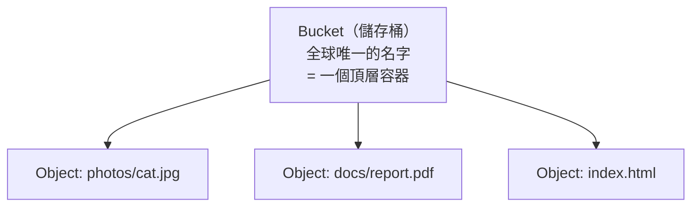

# [aws-5-1] S3 物件儲存：概念、Bucket Policy、使用場景

> **本章目標**：完整理解 S3（你 aws-1-5 用過的）——什麼是「物件儲存」、Bucket Policy 怎麼控制存取、以及 S3 適合拿來做什麼。

## 你會學到

- 「物件儲存（Object Storage）」是什麼、和檔案/區塊儲存的差別
- S3 的核心概念：Bucket、Object、Key
- Bucket Policy 怎麼控制誰能存取
- S3 的常見使用場景

## 概念說明

### 回頭看懂 aws-1-5 做了什麼

aws-1-5 你「先嚐甜頭」用 S3 放了網頁。這章把 S3 講透，你會回頭「啊，原來那天做的是這個」。

**S3（Simple Storage Service）** 是 AWS 最老牌、最重要的服務之一。它是一種**「物件儲存（Object Storage）」**——這個詞要先搞懂。

---

### 三種儲存方式

儲存資料有三種主要方式，先分清楚（這也接到下一章 EBS/EFS）：

| 類型 | 是什麼 | 類比 | AWS 服務 |
|------|--------|------|---------|
| **區塊儲存（Block）** | 像一顆「裸硬碟」，要掛載到機器上用 | 機器的本機硬碟 | EBS（5-2）|
| **檔案儲存（File）** | 像「網路共享資料夾」，多台機器一起掛載 | 公司的共用磁碟機 | EFS（5-2）|
| **物件儲存（Object）** | 透過 API/網址存取的「檔案倉庫」 | 一個巨大的雲端置物櫃 | **S3** |

**物件儲存（S3）** 的特點：

- 你不「掛載」它，而是透過 **API 或網址**存取（上傳、下載檔案）。
- 它能存「無限多」的檔案，且超級耐用、便宜。
- 每個檔案有一個獨一無二的「網址」可以存取（aws-1-5 的網頁就是這樣被連到的）。

用類比：S3 像一個**無限大的雲端置物櫃**——你把東西（檔案）丟進去，拿到一張「取物編號（網址/key）」，之後憑編號隨時取回。它不在乎你存什麼、存多少。

---

### S3 的核心概念



| 概念 | 是什麼 |
|------|--------|
| **Bucket（儲存桶）** | 最頂層的容器，名字**全球唯一**（aws-1-5 你建過）|
| **Object（物件）** | 你存進去的每個檔案 |
| **Key（鍵）** | 物件的「完整路徑名」，例如 `photos/cat.jpg` |

> 小細節：S3 其實**沒有真正的「資料夾」**——`photos/cat.jpg` 裡的 `photos/` 只是 key 的一部分（前綴），S3 用它「模擬」出資料夾的感覺。但本質上 bucket 裡是「一堆有 key 的物件」，扁平的。

---

### Bucket Policy：控制誰能存取

aws-1-5 你貼過一段 JSON 讓 bucket 公開——那就是 **Bucket Policy**。它和 IAM Policy（aws-2-3）是同一種 JSON 語法，專門控制「**誰能對這個 bucket 做什麼**」。

回想 aws-1-5 那段：

```json
{
  "Effect": "Allow",
  "Principal": "*",
  "Action": "s3:GetObject",
  "Resource": "arn:aws:s3:::你的bucket/*"
}
```

現在你看得懂了（aws-2-3 的訓練）：「**允許（Allow）任何人（Principal: \*）讀取（s3:GetObject）這個 bucket 的所有物件**」。`Principal` 是 Bucket Policy 比 IAM Policy 多的欄位——它指定「對象是誰」。

**重要安全提醒**（呼應 aws-2-2 最小權限）：

> **預設情況下，S3 bucket 是「私有」的——誰都連不到，這是好的。** 只有在「真的需要公開」時（如 aws-1-5 的靜態網站），才開放。**「不小心把 bucket 設成公開」是常見的資料外洩事故**——很多公司的機密就是這樣被搜出來的。

所以 S3 還有一道「Block Public Access」的總開關（aws-1-5 你為了做公開網站才關掉它）——一般情況該開著，當作防呆。

---

### S3 的常見使用場景

S3 用途極廣，常見的：

| 場景 | 說明 |
|------|------|
| **靜態網站託管** | aws-1-5 做過——放 HTML/CSS/JS |
| **存使用者上傳的檔案** | 圖片、影片、文件（5-4 會做）|
| **備份與封存** | infra Part 8 的備份，異地那份常存 S3 |
| **資料湖 / 大數據** | 存海量原始資料供分析 |
| **CDN 的來源** | 搭配 CloudFront（6-5）加速靜態內容 |
| **應用的靜態資源** | 前端打包後的檔案 |

核心心法：**「不常變動、要長期存、要被很多地方存取」的檔案，丟 S3 就對了。** 它便宜、耐用（AWS 宣稱 99.999999999% 的耐久性，「11 個 9」）、又能輕鬆對接其他服務。

> 還記得 SRE Part 7-3、aws-3-4 說的「無狀態設計，資料要存機器之外」嗎？S3 正是「存機器之外」的常見選擇——使用者上傳的檔案存 S3，這樣機器可以隨意增減、丟棄，檔案都還在。

## 範例：S3 在一個應用裡的角色

```
一個社群 App，S3 的用途：

使用者上傳大頭貼：
  App → 把圖片存到 S3 bucket「user-avatars」
  → 不存在 EC2 機器上（機器會被 Auto Scaling 增減，aws-3-4）
  → 存 S3，機器隨意換都不影響

前端靜態檔案：
  打包好的 JS/CSS → 放 S3 bucket「app-static」
  → 搭配 CloudFront（6-5）→ 全球使用者就近快速載入

備份：
  資料庫每日備份 → 上傳到 S3 bucket「db-backups」
  → infra Part 8 的「異地那份」（3-2-1 原則）

安全設定：
  - user-avatars、db-backups：私有（只有 App 透過 IAM 權限能存取）
  - app-static：可透過 CloudFront 公開讀取（但 bucket 本身仍受控）
```

注意——**不同 bucket 依用途設不同的存取權限**。私密的（備份）鎖死、要公開的（靜態資源）透過 CloudFront 開放。這就是 S3 + Bucket Policy 的實務應用。

## 小練習

### 練習 1：三種儲存

用一句話分別說明區塊、檔案、物件儲存的差別。S3 是哪一種？

---

### 練習 2：核心概念

回答：

1. Bucket、Object、Key 各是什麼？
2. aws-1-5 你貼的那段 Bucket Policy 在說什麼？（用 aws-2-3 學的拆解）

---

### 練習 3：安全意識

回答：

1. S3 bucket 預設是公開還是私有？哪個比較安全？
2. 為什麼「不小心把 bucket 設成公開」是常見的資料外洩事故？怎麼避免？

## 課外讀物

> S3 常搭配 CDN 加速全球存取，想了解 CDN 原理 → [課外讀物 E-11-5：CDN 是什麼？](../../../課外讀物/E-11-performance/E-11-5-cdn.md)
