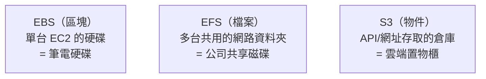

# [aws-5-2] EBS vs EFS：本機硬碟 vs 共享檔案系統

> **本章目標**：理解 EBS（區塊儲存）和 EFS（檔案儲存）的差別，知道它們各自像什麼、何時用哪個，補完 S3 之外的另外兩種儲存。

## 你會學到

- EBS 是什麼——EC2 的「本機硬碟」
- EFS 是什麼——多台機器共用的「網路資料夾」
- EBS、EFS、S3 三者的差別與選擇
- 它們和你 infra Part 2-4 學的「磁碟與掛載」的關係

## 概念說明

### 補完三種儲存

aws-5-1 介紹了三種儲存（區塊/檔案/物件），並講了物件儲存（S3）。這章補完另外兩種：**EBS（區塊）** 和 **EFS（檔案）**。

你 infra Part 2-4 學過「磁碟與掛載」——EBS 和 EFS 正是那些概念在 AWS 的實現，你會很有共鳴。

---

### EBS：EC2 的「本機硬碟」

**EBS（Elastic Block Store，彈性區塊儲存）** 是**掛載到單一 EC2 的「硬碟」**。

回想 aws-3-1 開 EC2 時的「儲存」設定——那個硬碟就是 EBS。它的特點：

- **像一顆裸硬碟**：掛載到 EC2 後，就是那台機器的硬碟（infra Part 2-4 的「掛載」概念）。
- **通常一對一**：一個 EBS volume 通常掛在「一台」EC2 上（不是給多台共用）。
- **跟著 AZ**：EBS 在某個 AZ，只能掛給同 AZ 的 EC2。
- **獨立於 EC2 生命週期**：EC2 終止了，EBS 可以選擇保留（資料還在）——這呼應 infra Part 5-2 的「容器可丟、資料要留」，也是 aws-3-1 stop/terminate 的細節。

用類比：EBS 像**你筆電裡的那顆硬碟**——是「這台機器」專屬的儲存，作業系統和資料都放上面。

EBS 也有不同類型（SSD 快但貴、HDD 慢但便宜），依需求選——這呼應 infra Part 2-4 的磁碟概念。

---

### EFS：多台機器共用的「網路資料夾」

**EFS（Elastic File System，彈性檔案系統）** 是一個**能被「多台」EC2 同時掛載的共享檔案系統**。

特點：

- **多台共用**：好幾台 EC2 可以同時掛載同一個 EFS，**看到、讀寫同一份檔案**。
- **跨 AZ**：EFS 能被不同 AZ 的機器掛載（不像 EBS 綁單一 AZ）。
- **自動擴容**：你存多少它就長多大，不用預先設容量。

用類比：EFS 像**公司的網路共享磁碟機**——大家把它掛載到自己電腦，都能存取同一份共享檔案（infra Part 2-4 的「掛載」+「共享」）。

什麼時候需要 EFS？當**多台機器需要共用同一份檔案**時。例如：

- 一組 web 伺服器（Auto Scaling 的多台），需要共用同一份「使用者上傳的內容」。
- 多台機器要讀同一份設定或資料。

> 不過要注意——很多「多台共用檔案」的需求，其實用 **S3 更好**（更便宜、更有彈性）。EFS 適合「真的需要『檔案系統』介面（像本機資料夾那樣操作）」的場景。

---

### 三者對照：EBS vs EFS vs S3



| | EBS | EFS | S3 |
|---|-----|-----|-----|
| 類型 | 區塊 | 檔案 | 物件 |
| 怎麼存取 | 掛載到 EC2 當硬碟 | 多台 EC2 掛載 | API / 網址 |
| 共用 | 通常單台 | 多台共用 | 任何地方都能存取 |
| 範圍 | 綁單一 AZ | 跨 AZ | 跨 Region 可達 |
| 適合 | EC2 的系統碟/資料碟 | 多機共用檔案 | 海量檔案、備份、靜態資源、上傳內容 |
| 類比 | 筆電硬碟 | 公司共享磁碟 | 雲端置物櫃 |

**怎麼選的口訣**：

- 要給「一台 EC2」當硬碟 → **EBS**（它本來就有）。
- 要「多台 EC2 共用檔案」、且要像本機資料夾操作 → **EFS**。
- 要存「海量檔案、備份、上傳內容、靜態資源」、從各處存取 → **S3**（最常用、最便宜）。

實務上，**S3 是用得最多的**（便宜、彈性、無限），EBS 是 EC2 的標配（系統碟），EFS 相對少用（特定的多機共用需求）。

## 範例：一個應用怎麼用三種儲存

```
一個影片網站，三種儲存各司其職：

EBS：
  每台 EC2 的「系統碟」——裝作業系統、應用程式
  （這是 EC2 的標配，aws-3-1 開機時就有）

S3：
  存「上傳的影片檔案」（海量、要長期存、要被很多人下載）
  存「前端靜態資源」（搭配 CloudFront 加速）
  存「資料庫備份」（異地）
  → 用 S3，因為便宜、無限、各處可達

EFS（如果有需要）：
  假設有一組「影片轉檔機器」需要共用同一份「待處理檔案區」
  → 多台機器掛載同一個 EFS，共享這個工作目錄
  （但其實這需求也常用 S3 解決）

選擇邏輯：
  機器自己的碟 → EBS
  海量、要長存、各處存取 → S3（首選）
  非要「多機共用的檔案系統介面」→ EFS
```

## 小練習

### 練習 1：三種儲存的類比

不看上面，用「筆電硬碟 / 公司共享磁碟 / 雲端置物櫃」分別對應 EBS、EFS、S3，並說明各自特點。

---

### 練習 2：選儲存

下面的需求，該用 EBS、EFS 還是 S3？

1. 一台 EC2 的作業系統要裝在哪
2. 存使用者上傳的幾百萬張圖片
3. 資料庫的每日備份
4. 一組機器需要即時共用同一份檔案、像本機資料夾那樣操作

---

### 練習 3：對照 infra

回答：EBS/EFS 的「掛載」概念，和你 infra Part 2-4 學的有什麼關聯？

## 課外讀物

> 「磁碟、掛載、檔案系統」的基礎概念，infra 課 Part 2-4 有完整說明 → 參見 **infra 課程** Part 2-4（`lessons/infra/課程大綱.md`）
