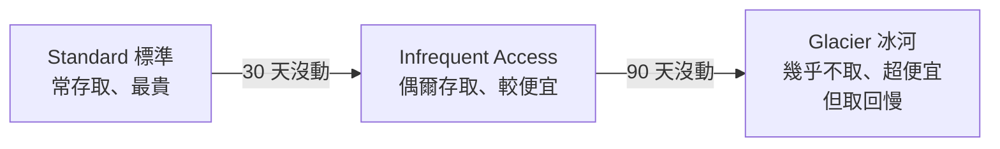

# [aws-5-3] S3 進階：Versioning、Lifecycle、Presigned URL

> **本章目標**：認識 S3 三個超實用的進階功能——版本控制、生命週期管理、預簽章網址，讓你能更安全、更省錢、更靈活地用 S3。

## 你會學到

- Versioning（版本控制）：防止誤刪與覆蓋
- Lifecycle Policy（生命週期）：自動省儲存費
- Presigned URL（預簽章網址）：安全地臨時授權存取
- 這些功能各解決什麼實際問題

## 概念說明

### S3 不只是「放檔案」

aws-5-1 你學了 S3 的基礎。但 S3 還有很多強大功能，這章挑三個最實用、最常考也最常用的。

---

### Versioning：防止誤刪與覆蓋

**Versioning（版本控制）** 開啟後，S3 會**保留每個物件的「所有歷史版本」**。

問題場景：你不小心覆蓋或刪除了一個重要檔案——沒有 versioning 的話，舊版就永遠消失了。

開了 versioning 之後：

- 覆蓋檔案 → 舊版本還留著，可以還原。
- 「刪除」檔案 → 其實只是加一個「刪除標記」，舊版本還在，可以救回。

用類比：versioning 像檔案的「**復原歷史**」（類似 Git 的版本記錄，你 basic 課程學過版本控制的概念）。任何改動都留痕、都能回溯。

這對「重要資料」很關鍵——它是防範「人為誤刪」「程式 bug 刪錯」「甚至勒索軟體加密」的安全網（呼應 infra Part 8-1 的備份精神）。

> 代價：保留所有版本會佔更多空間（= 更多錢）。所以通常搭配下面的 Lifecycle 一起用——舊版本自動清理或降級。

---

### Lifecycle Policy：自動省儲存費

**Lifecycle Policy（生命週期政策）** 讓你設定「**檔案隨時間自動『搬家』或『刪除』**」的規則，用來省錢。

關鍵背景——S3 有不同的**儲存級別（storage class）**，越「冷」（越少存取）越便宜：



Lifecycle Policy 就是設定這種「自動搬家」規則。例如：

- 「上傳 30 天後的檔案，自動轉到較便宜的級別。」
- 「90 天後，轉到超便宜的 Glacier（冰河儲存）。」
- 「365 天後，自動刪除。」

用類比：像你整理衣櫃——常穿的放外面（標準）、換季的收進箱子（IA）、幾乎不穿的送倉庫（Glacier）、太舊的丟掉（刪除）。自動分層，省下大量儲存成本。

這對「日誌、備份、舊資料」特別有用（呼應 infra Part 7-1 的 logrotate、Part 8 的備份保留策略）——舊的自動降級或刪除，不用人管。

---

### Presigned URL：安全地臨時授權

這是最巧妙的功能。問題場景：

> 你的 S3 bucket 是**私有**的（aws-5-1，這是好的）。但你想讓「某個特定使用者，在限定時間內，下載/上傳某個特定檔案」——又不想把整個 bucket 公開。怎麼辦？

**Presigned URL（預簽章網址）** 解決這個：

> 它是一個**「帶有臨時授權的特殊網址」**——任何拿到這個網址的人，能在「限定時間內」對「特定檔案」做「特定操作」（下載或上傳）。時間一過，網址就失效。

用類比：presigned URL 像一張**「限時、限定用途的臨時通行證」**。你給某人一張「24 小時內，只能領取 3 號置物櫃東西」的票券——他能用，但過期作廢，也不能拿去開別的櫃子。

運作方式：

```
你的後端（有 S3 權限）
  → 用程式產生一個「presigned URL」
    （例如「允許下載 report.pdf，有效 1 小時」）
  → 把這個網址給特定使用者
  → 使用者用這個網址，1 小時內能下載那個檔案
  → 1 小時後，網址失效；且他不能用它存取別的東西
```

好處（呼應 aws-2-2 最小權限）：

- **不用公開 bucket**——bucket 維持私有、安全。
- **精確授權**——只授權「特定檔案、特定操作、特定時間」。
- **安全分享**——適合「讓使用者下載自己的私密檔案」「讓使用者直接上傳到 S3」（5-4 會做）。

## 範例：三功能解決實際問題

```
一個雲端硬碟服務，用上三個功能：

Versioning（防誤刪）：
  使用者的檔案開啟版本控制
  → 使用者不小心覆蓋了文件 → 能還原舊版
  → 即使被誤刪，也能救回（防呆 + 防勒索軟體）

Lifecycle（省錢）：
  設定規則：
    - 檔案 90 天沒被存取 → 自動轉到便宜的級別
    - 刪除的舊版本 → 30 天後真正清除（搭配 versioning）
  → 自動省下大量儲存費，不用人管

Presigned URL（安全分享）：
  使用者要下載自己的私密檔案
  → bucket 是私有的（安全）
  → 後端產生一個「有效 15 分鐘、只能下載這個檔案」的 presigned URL
  → 使用者用它下載，過期失效
  → 全程 bucket 沒有公開，安全又方便
```

這三個功能讓 S3 從「單純放檔案」升級成「安全、省錢、靈活的儲存平台」。

## 小練習

### 練習 1：三功能各解決什麼

不看上面，說出 Versioning、Lifecycle、Presigned URL 各自解決什麼問題。

---

### 練習 2：理解 Presigned URL

回答：

1. 如果你想「讓使用者下載私密檔案，又不想公開整個 bucket」，該用什麼？
2. Presigned URL 的「臨時通行證」比喻，體現了哪個安全原則？（提示：aws-2-2）

---

### 練習 3：設計儲存策略

你要存「應用的日誌檔」到 S3。用 Lifecycle 設計一個省錢的策略：新日誌、30 天後、90 天後、365 天後，各該怎麼處理？

> 提示：呼應 infra Part 7-1 logrotate、Part 8 備份保留——越舊越便宜或刪除。

## 課外讀物

> S3 的儲存分層與「冷熱資料」概念，和效能/成本優化的思維相通 → [課外讀物 E-11-8：多層次快取全景](../../../課外讀物/E-11-performance/E-11-8-cache-layers.md)
