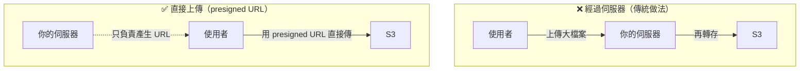
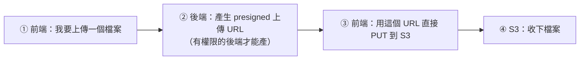

# [aws-5-4] 🔧 動手做：用 S3 + Presigned URL 做「安全上傳」

> **本章目標**：實作一個「使用者直接上傳檔案到 S3」的功能，用 presigned URL 達成「安全、不公開 bucket、不經過你的伺服器」的上傳。

## 你會學到

- 「直接上傳到 S3」的架構為什麼比「經過伺服器」好
- 用後端產生上傳用的 presigned URL
- 前端用 presigned URL 直接上傳
- IAM 權限與 bucket 設定的安全配置

## 概念說明

### 這一章在做什麼

aws-5-3 學了 presigned URL 的概念，這章實作一個最經典的應用——**讓使用者直接上傳檔案到 S3**（例如上傳大頭貼、文件）。

先理解為什麼要「直接上傳到 S3」，而不是「上傳到你的伺服器、再由伺服器轉存 S3」：



「經過伺服器」的問題：大檔案會佔用伺服器的頻寬、記憶體、處理能力——使用者一多就撐不住（呼應 SRE 的容量問題）。

「直接上傳」的好處：

- **伺服器只負責「產生一個 presigned URL」**（很輕量），真正的檔案傳輸是「使用者 ↔ S3」直接進行，不經過你的伺服器。
- 伺服器不會被大檔案上傳拖垮，能扛更多使用者。
- 而且因為用 presigned URL，**bucket 維持私有、安全**（aws-5-3）。

這是業界上傳檔案的標準做法。

---

### 流程概覽



## 程式碼範例

### 前置：權限與 bucket 設定

1. **建一個私有 bucket**（例如 `my-app-uploads`，aws-5-1，**保持私有、別公開**）。
2. **給後端一個 IAM 權限**（用 Role，aws-2-1）——只允許「對這個 bucket 上傳」（最小權限，aws-2-2）：

```json
{
  "Version": "2012-10-17",
  "Statement": [
    {
      "Effect": "Allow",
      "Action": "s3:PutObject",
      "Resource": "arn:aws:s3:::my-app-uploads/*"
    }
  ]
}
```

（你 aws-2-3 學的政策，這裡只給 `PutObject` 上傳權限，最小權限。）

---

### 第一步：後端產生 presigned 上傳 URL

後端用 AWS SDK 產生一個「允許上傳」的 presigned URL。以 Node 為例：

```javascript
// 後端：用 AWS SDK 產生 presigned 上傳 URL
const { S3Client, PutObjectCommand } = require("@aws-sdk/client-s3");
const { getSignedUrl } = require("@aws-sdk/s3-request-presigner");

const s3 = new S3Client({ region: "ap-northeast-1" });

// 一個 API 端點：前端來要上傳網址
async function getUploadUrl(fileName) {
  const command = new PutObjectCommand({
    Bucket: "my-app-uploads",
    Key: `uploads/${fileName}`,    // 檔案存在 bucket 的哪個 key
  });

  // 產生有效 5 分鐘的上傳 URL
  const url = await getSignedUrl(s3, command, { expiresIn: 300 });
  return url;
}
```

重點：

- 後端有 IAM 權限（透過 Role），所以它能「簽發」這個授權網址。
- `expiresIn: 300` —— URL 只有效 5 分鐘（aws-5-3 的「限時通行證」）。
- 後端**只產生網址，不碰實際檔案**——很輕量。

---

### 第二步：前端用 URL 直接上傳到 S3

前端拿到 URL 後，直接把檔案 `PUT` 上去（不經過你的伺服器）：

```javascript
// 前端：拿到 presigned URL 後，直接上傳到 S3
async function uploadFile(file) {
  // 1. 跟自己的後端要一個上傳 URL
  const res = await fetch(`/api/upload-url?fileName=${file.name}`);
  const { url } = await res.json();

  // 2. 用這個 URL 直接 PUT 到 S3（不經過後端）
  await fetch(url, {
    method: "PUT",
    body: file,
  });

  console.log("上傳完成！檔案直接進了 S3");
}
```

注意第 2 步——`fetch(url, ...)` 直接打的是 **S3 的網址**，檔案從使用者瀏覽器**直接傳到 S3**，完全不經過你的後端。後端在這整個過程只做了「產生 URL」這件輕量的事。

---

### 為什麼這樣安全

把安全點串起來（呼應 aws-2-2、5-3）：

- **bucket 私有**：誰都不能隨便存取。
- **presigned URL 限時、限定操作**：只能「上傳」「這個檔名」「5 分鐘內」。過期失效。
- **後端用最小權限 Role**：只能 `PutObject`，不能讀、不能刪、不能碰別的 bucket。
- **金鑰不外洩**：前端拿到的是「臨時授權網址」，不是 AWS 金鑰——就算被看到，過期就沒用（呼應 aws-1-3 防金鑰外洩）。

這是「安全」和「效能」兼顧的漂亮設計。

---

### 下載也可以用 presigned URL

同理，「讓使用者下載私密檔案」也用 presigned URL——把上面的 `PutObjectCommand` 換成 `GetObjectCommand` 即可。產生一個「限時下載」的網址，使用者用它下載自己的私密檔案，bucket 仍維持私有（aws-5-3 的下載場景）。

## 小練習

### 練習 1：為什麼直接上傳

回答：「使用者直接上傳到 S3」比「經過你的伺服器再轉存」好在哪？（提示：伺服器負擔、容量）

---

### 練習 2：安全分析

回答：這個方案怎麼做到「bucket 不公開，但使用者仍能上傳」？presigned URL 的「限時、限定」體現了哪個原則？

---

### 練習 3：實作（進階）

如果你有 AWS 帳號和一點程式基礎，試著實作這個流程：建私有 bucket、給後端最小權限、產生 presigned URL、用它上傳一個檔案。驗證「bucket 私有、但能透過 URL 上傳成功」。

## 課外讀物

> 這個架構讓「檔案傳輸」不經過後端，減輕伺服器負擔——是 SRE 容量規劃會欣賞的設計 → 參見 **SRE 課程** Part 7（`lessons/sre/課程大綱.md`）
