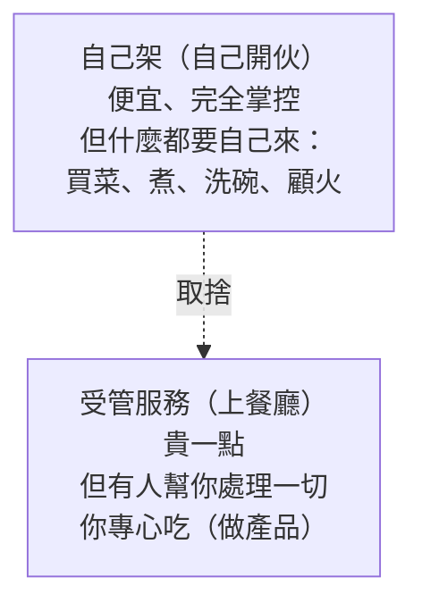

# [aws-6-1] 為什麼用受管服務？自己架 vs 給 AWS 顧

> **本章目標**：理解「受管服務（managed service）」的價值與取捨，建立「該自己顧還是給 AWS 顧」的判斷力——這是 Part 6 的總綱。

## 你會學到

- 受管服務（Managed Service）是什麼
- 「自己架 vs 受管」的取捨（呼應 infra Part 9-3）
- 受管服務幫你扛走了什麼
- 怎麼判斷該用受管還是自己架

## 概念說明

### Part 6 在講什麼

前面的 Part 你學了「自己掌控」的服務——EC2（自己的機器）、VPC（自己的網路）。Part 6 換一個主題：**受管服務（Managed Service）**——「**AWS 幫你架好、顧好的現成服務**」。

你其實在 infra Part 9-3 已經碰過這個概念了（自架 vs 雲端託管）。這個 Part 就是把那些「你在 infra 辛苦自己架的東西」，看 AWS 怎麼用受管服務幫你搞定：資料庫（RDS）、快取（ElastiCache）、負載平衡（ALB）、CDN（CloudFront）…。

---

### 受管服務是什麼

**受管服務**一句話：

> **你只管「用」，底層的安裝、設定、維護、修補、備份、高可用，全部由 AWS 幫你處理。**

對比 EC2——EC2 給你一台機器，但「機器上要裝什麼、怎麼維護、怎麼做高可用」都是你的事（infra 課教的那些）。受管服務則是「**連這些都幫你顧了**」。

例如資料庫：

- **自己架（在 EC2 上裝 PostgreSQL）**：你要自己安裝、設定、調效能、做備份、設主從複製、修補安全漏洞、處理故障轉移……（infra 課的全套苦工）。
- **用 RDS（受管資料庫）**：點幾下開好，AWS 自動幫你備份、修補、做 Multi-AZ 高可用。你只管「連上去用」。

---

### 用「自己開伙 vs 上餐廳」理解（呼應 infra Part 9-3）



| | 自己架（EC2 上自己裝）| 受管服務 |
|---|---------------------|---------|
| 成本 | 機器費便宜，但**人力維運成本高** | 服務費較貴，但**省維運人力** |
| 掌控度 | 完全掌控、想怎麼調都行 | 受限於服務提供的選項 |
| 維護 | 全部自己扛（安裝/修補/備份/高可用）| **AWS 幫你扛** |
| 上手速度 | 慢（要自己搭）| 快（點幾下）|
| 適合 | 需要特殊客製、或想省服務費 | 大多數情況（省心、可靠）|

---

### 受管服務幫你扛走了什麼

具體來說，受管服務通常自動處理這些「你在 infra 課學的苦工」：

| AWS 幫你做的 | 在 infra 課你要自己做的 |
|------------|---------------------|
| 自動備份 | infra Part 8-2 手動寫備份腳本 |
| 自動安全修補 | infra Part 8-3 手動更新 |
| 高可用 / 故障轉移 | infra Part 9-2 手動做冗餘 |
| 自動擴展 | infra Part 9 手動加機器 |
| 監控 | infra Part 7 自己架 Prometheus |

換句話說——**受管服務把 infra 課大半的「維運 toil」（SRE Part 6）自動化掉了**。這正是雲端最迷人的價值：你不用什麼都自己顧，可以專注做產品。

---

### 怎麼判斷該用哪個

回到 infra Part 9-3 的判斷框架，問自己：

1. **這件事是我的核心價值嗎？** 「維護資料庫」通常不是你的產品重點 → 交給 RDS，把時間花在產品上。
2. **我有人力維運嗎？** 自己架資料庫的隱藏成本是「要有人 24 小時顧它、處理故障」。小團隊往往撐不起 → 用受管。
3. **可靠性要求多高？** 要做到真正的高可用（Multi-AZ 故障轉移），受管服務通常比自己土法煉鋼更穩、更省事。
4. **成本算過了嗎？** 受管服務費較貴，但算進「人力 + 出事損失」，常常反而划算。

**實務上的傾向**：**大多數情況優先用受管服務**——尤其資料庫、快取、負載平衡這種「自己架很費工、又攸關可靠性」的。只有「需要特殊客製」或「規模大到自己架更省」時，才考慮自己架。

> 但你「先學了 infra 自己架」這件事超有價值——因為你**真懂底層在做什麼**。當受管服務出問題，只會點按鈕的人束手無策，而你能判斷、能除錯。這就是 infra Part 9-3 說的「先學自架、再上雲會更強」。

## 範例：一個團隊的受管 vs 自架決策

```
一個 5 人新創團隊，決定每個元件怎麼處理：

資料庫 → 用 RDS（受管）
  理由：自己架資料庫 + 做主從複製 + 備份太費工，
        而且資料庫掛了是大事，受管的高可用更可靠
        → 不是核心價值，交給 AWS

快取 Redis → 用 ElastiCache（受管）
  理由：同上，省得自己維護

負載平衡 → 用 ALB（受管）
  理由：自己架兩台 Nginx 做高可用很麻煩（infra Part 9）

某個特殊的自訂運算服務 → 自己架在 EC2
  理由：需要特殊的客製設定，受管服務不支援
        → 這個才自己顧

結果：把「標準化的苦工」交給受管服務，
      人力專注在「真正獨特、核心」的部分。
```

這就是成熟的決策——**不是「全自己架」也不是「全受管」，而是依「核心價值、人力、可靠性、成本」逐項判斷**。接下來幾章，就帶你認識最常用的受管服務。

## 小練習

### 練習 1：受管服務是什麼

用「自己開伙 vs 上餐廳」的類比，解釋受管服務的價值與代價。

---

### 練習 2：它扛走了什麼

回答：用 RDS（受管資料庫）而不是「自己在 EC2 裝 PostgreSQL」，AWS 幫你扛走了哪些「你在 infra 課要自己做的事」？

---

### 練習 3：做決策

用判斷框架（核心價值/人力/可靠性/成本），分析：一個 3 人團隊，該自己在 EC2 架資料庫，還是用 RDS？為什麼？

## 課外讀物

> 「自架 vs 雲端託管」的完整取捨，infra 課 Part 9-3 深入討論過 → 參見 **infra 課程** Part 9-3（`lessons/infra/課程大綱.md`）
