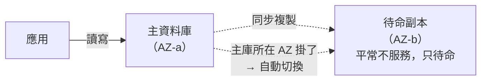
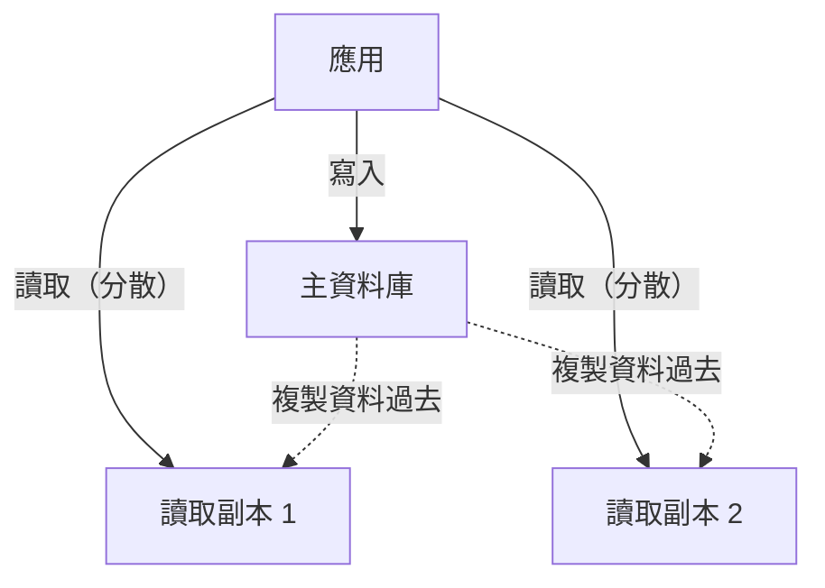

# [aws-6-2] RDS：受管關聯式資料庫

> **本章目標**：理解 RDS 怎麼幫你顧資料庫，搞懂 Multi-AZ（高可用）和 Read Replica（讀取擴展）這兩個常被混淆的功能。

## 你會學到

- RDS（關聯式資料庫服務）是什麼、幫你顧什麼
- Multi-AZ：為「高可用」而生
- Read Replica：為「讀取擴展」而生
- 兩者的關鍵差別（很多人搞混）

## 概念說明

### RDS：把資料庫的苦工交給 AWS

你 basic Part 5 學過資料庫、infra 課知道「自己架資料庫」要做多少事（安裝、備份、主從複製、修補…）。**RDS（Relational Database Service，關聯式資料庫服務）** 就是受管服務的代表——把這些苦工全包了。

RDS 支援常見的關聯式資料庫：**PostgreSQL、MySQL、MariaDB、SQL Server、Oracle**，以及 AWS 自家高效能的 **Aurora**。

它幫你自動處理（呼應 aws-6-1）：

- **自動備份**：每天自動備份，還能「時間點還原」（還原到任意時刻）。
- **自動修補**：資料庫軟體的安全更新自動處理。
- **高可用**：Multi-AZ 故障轉移（下面講）。
- **監控**：內建效能指標。

你只管「**建立資料庫、拿到連線位址、連上去用**」。資料庫該放在哪？**私有子網路**（aws-4-3——資料庫絕不該對外公開！），只讓應用伺服器連得到。

---

### Multi-AZ：為「高可用」而生

**Multi-AZ** 你在 aws-4-7、SRE Part 8-3 學過概念，這裡是 RDS 的具體實現：



開啟 Multi-AZ 後，RDS 會：

- 在**另一個 AZ** 維護一個**待命副本（standby）**，和主庫**同步複製**。
- 主庫所在的 AZ 掛掉時，**自動把待命副本升為主庫（故障轉移）**，連線位址不變。

**關鍵特性**：

- 待命副本**平常不處理請求**——它只是「待命備援」，純粹為了「主庫掛了能頂上」。
- 目的是**高可用**（SRE 的「出事了使用者幾乎無感」）。
- 它**不會**幫你分擔讀取負載（這是下面 Read Replica 的事）。

---

### Read Replica：為「讀取擴展」而生

**Read Replica（讀取副本）** 解決的是完全不同的問題——**讀取負載太大**。

很多應用「讀」遠多於「寫」（例如看貼文的人，遠多於發貼文的人）。當讀取請求把資料庫壓垮，Read Replica 來幫忙：



- 你建立一個或多個**讀取副本**，主庫的資料會複製過去。
- 應用把**「寫入」送主庫，「讀取」分散到副本**——讀取負載被分攤（SRE Part 7-3 的水平擴展，用在資料庫讀取上）。

**關鍵特性**：

- 讀取副本**會實際處理讀取請求**（不像 Multi-AZ 的待命副本只待命）。
- 目的是**擴展讀取效能**，不是高可用。
- 副本資料是「**非同步複製**」——可能有極短暫的延遲（讀到的可能不是最新的那一瞬間，叫「最終一致」）。

---

### Multi-AZ vs Read Replica：別搞混！

這兩個最容易混，務必分清——它們解決**完全不同的問題**：

| | Multi-AZ | Read Replica |
|---|----------|--------------|
| 目的 | **高可用**（防故障）| **讀取擴展**（分攤負載）|
| 副本做什麼 | 待命，平常不服務 | 實際處理讀取請求 |
| 複製方式 | 同步（資料一致）| 非同步（可能極短延遲）|
| 主庫掛了 | 自動切換到副本 | 不自動切換（它是來分讀取的）|
| 跨 AZ/Region | 通常同 Region 跨 AZ | 可跨 AZ，甚至跨 Region |

一句話記住：

> **Multi-AZ 是「備胎」（為了壞掉時頂上）；Read Replica 是「幫手」（為了平常分擔讀取）。**

而且——**兩者可以同時用**！正式環境常見「Multi-AZ（高可用）+ 多個 Read Replica（讀取擴展）」的組合，既穩又能扛大量讀取。

## 範例：一個高流量應用的 RDS 配置

```
一個讀多寫少的社群網站，RDS 配置：

主資料庫（在私有子網路，AZ-a）
  + Multi-AZ：待命副本在 AZ-b（高可用）
     → AZ-a 掛了，自動切到 AZ-b，使用者幾乎無感
  + 2 個 Read Replica（讀取擴展）
     → 大量「看貼文」的讀取，分散到副本，不壓垮主庫

應用怎麼用：
  發文、按讚（寫入）→ 送主資料庫
  看貼文、看個人頁（讀取）→ 分散到 Read Replica
  → 寫入有主庫穩穩處理，讀取被副本分攤
  → 主庫掛了，Multi-AZ 待命副本自動頂上

結果：
  既高可用（Multi-AZ）、又能扛大量讀取（Read Replica）
  而這一切的備份、修補、故障轉移，全是 RDS 自動處理
  → 團隊完全不用碰「資料庫維運」這個大坑（aws-6-1 的價值）
```

## 小練習

### 練習 1：RDS 幫你顧什麼

回答：用 RDS 而不是「自己在 EC2 裝 PostgreSQL」，AWS 自動幫你處理了哪些事？

---

### 練習 2：Multi-AZ vs Read Replica

這是重點——用自己的話回答：

1. Multi-AZ 和 Read Replica 各解決什麼問題？
2. 它們的「副本」平常有沒有在服務請求？
3. 用「備胎 vs 幫手」的比喻說明差別。

---

### 練習 3：設計配置

一個「讀取量超大、且要求高可用」的服務，你會怎麼配置 RDS？（提示：兩個都用）

## 課外讀物

> Multi-AZ 的「故障轉移」、Read Replica 的「讀取擴展」，分別對應 SRE 的冗餘與水平擴展 → 參見 **SRE 課程** Part 8-3、Part 7-3（`lessons/sre/課程大綱.md`）
