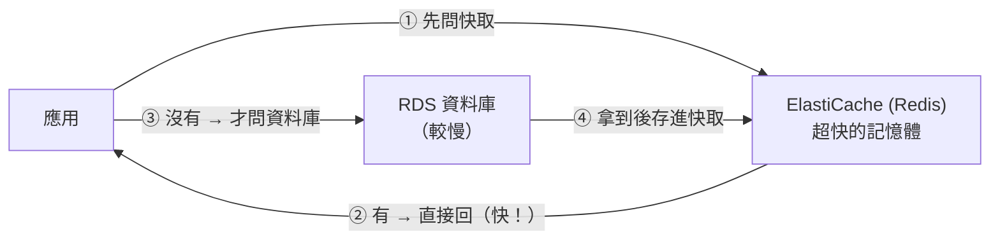

# [aws-6-3] ElastiCache：受管的 Redis 快取

> **本章目標**：理解快取為什麼能大幅提升效能，以及 ElastiCache 怎麼提供受管的 Redis，讓你不用自己維護快取層。

## 你會學到

- 快取（Cache）為什麼能加速、減輕資料庫負擔
- ElastiCache 是什麼（受管的 Redis / Memcached）
- 受管快取 vs 自己架 Redis 的差別
- 快取的常見使用場景與注意事項

## 概念說明

### 先複習：快取為什麼重要

你在課外讀物 E-11 學過快取（cache）。快速複習核心：

> **快取是「把常用的資料，暫存在一個『拿取超快』的地方」，避免每次都去『慢』的來源（如資料庫）拿。**

用類比：快取像你**桌上的便條紙**——常查的電話寫在便條紙上（快取），不用每次都翻整本通訊錄（資料庫）。

快取帶來兩個巨大好處：

1. **更快**：從快取（記憶體）拿資料，比從資料庫（要查詢、可能讀硬碟）快幾個數量級。
2. **減輕資料庫負擔**：大量重複的讀取被快取擋下，資料庫壓力大減（呼應 aws-6-2 讀取擴展、SRE Part 7 容量）。

最常用的快取工具是 **Redis**（你 basic Part 5 / 課外讀物 E-11-3 碰過）——一個超快的「記憶體資料庫」。

---

### ElastiCache：受管的快取

自己架 Redis 也要維運（安裝、設定、高可用、修補——又是 infra 的苦工）。**ElastiCache** 就是 AWS 的受管快取服務，支援 **Redis** 和 **Memcached** 兩種引擎（Redis 較常用、功能較多）。

它幫你顧（呼應 aws-6-1）：

- 自動安裝、設定 Redis。
- 高可用（多節點、故障轉移）。
- 自動修補、監控。
- 輕鬆擴展（加節點）。

你只管「**拿到連線位址，把它當 Redis 用**」。和 RDS 一樣，它該放在**私有子網路**（aws-4-3——快取也不該對外公開，只給應用連）。

---

### 快取在架構裡的位置

快取通常坐在「應用」和「資料庫」之間：



這個流程叫 **Cache-Aside（旁路快取）**，最常見：

1. 應用要資料 → **先問快取**。
2. 快取**有**（cache hit）→ 直接回，超快。
3. 快取**沒有**（cache miss）→ 才去問資料庫，拿到後**順手存進快取**。
4. 下次要同樣的資料，快取就有了。

效果：大量重複的讀取，第一次之後都從快取拿——又快、又不煩資料庫。

---

### 快取的常見場景

| 場景 | 說明 |
|------|------|
| **快取資料庫查詢結果** | 最常見——熱門資料存快取，減輕 DB |
| **Session（登入狀態）** | 存使用者的登入 session（呼應 basic 認證章節）|
| **排行榜 / 計數器** | Redis 很擅長這種即時排序、計數 |
| **限流（rate limiting）** | SRE Part 8-2 的限流，常用 Redis 計數實現 |

---

### 快取的注意事項

快取很強，但有兩個經典問題要知道：

**① 資料一致性（cache 與 DB 不同步）**

資料庫的資料更新了，但快取裡還是舊的——使用者讀到過期資料。解法是設定「**過期時間（TTL）**」（例如「快取 5 分鐘後自動失效」），或更新 DB 時一併更新/清除快取。要在「效能」和「資料新鮮度」之間取捨（呼應 SRE Part 2-1 使用者在乎的「新鮮」）。

**② 不該存「不能遺失」的資料**

快取是「記憶體」，本質是「可以丟的暫存」——它可能因重啟、淘汰而清空。所以**永久、重要的資料要存在資料庫（RDS），快取只放「副本/暫存」**。別把唯一的資料只存在快取裡（呼應 SRE 的「為失敗而設計」——快取掛了，要能回去問資料庫）。

## 範例：用快取加速一個熱門頁面

```
情境：一個新聞網站的「熱門文章」頁面，每秒幾千人看

沒有快取：
  每個請求 → 查資料庫「算出熱門文章」（複雜查詢，慢）
  → 幾千個請求 → 資料庫被壓垮、頁面變慢（SRE Part 7 的容量問題）

加上 ElastiCache：
  第一個請求 → 查資料庫算出結果 → 存進快取（TTL 設 60 秒）
  接下來 60 秒內的所有請求 → 直接從快取拿（超快、不碰資料庫）
  60 秒後快取過期 → 再算一次、再存 60 秒

效果：
  - 資料庫只需「每 60 秒算一次」，而不是「每個請求都算」
    → 負擔從「每秒幾千次查詢」降到「每分鐘一次」
  - 使用者拿到的回應超快（從記憶體拿）
  - 代價：熱門排名最多「過期 60 秒」（可接受的取捨）
```

這就是快取的威力——**用一點點「資料新鮮度」的取捨，換來巨大的效能提升和資料庫減壓**。而 ElastiCache 讓你不用自己維護這個快取層。

## 小練習

### 練習 1：快取為什麼快

用「便條紙 vs 通訊錄」的類比，解釋快取為什麼能加速、又能減輕資料庫負擔。

---

### 練習 2：Cache-Aside 流程

不看上面，描述「旁路快取（cache-aside）」的流程：應用要資料時，先做什麼、有/沒有快取各怎麼處理？

---

### 練習 3：注意事項

回答：

1. 為什麼「重要、不能遺失的資料」不該只存在快取裡？
2. 「快取的資料和資料庫不一致」怎麼緩解？這是在取捨什麼？

## 課外讀物

> 想深入 Redis 與快取策略的細節 → [課外讀物 E-11-3：Redis 與快取策略](../../../課外讀物/E-11-performance/E-11-3-redis-cache.md)
