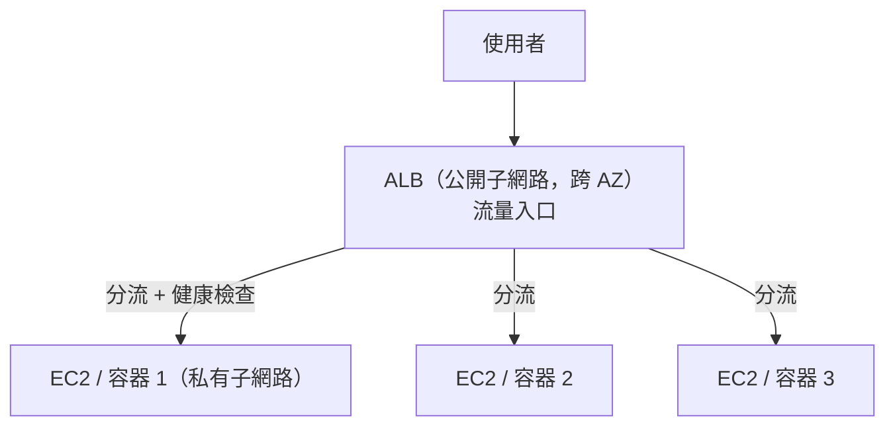
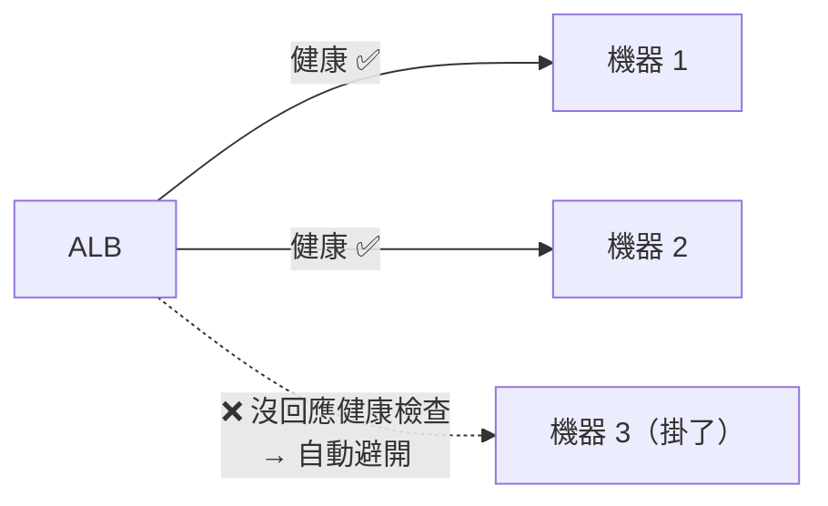

# [aws-6-4] Application Load Balancer：流量分配與健康檢查

> **本章目標**：理解 ALB 怎麼把流量分配到多台機器、怎麼用健康檢查自動避開壞掉的機器，把你 infra/SRE 學的負載平衡用 AWS 受管服務實現。

## 你會學到

- ALB（應用負載平衡器）是什麼、在架構裡的位置
- 健康檢查怎麼自動避開壞掉的機器
- Target Group（目標群組）與路由規則
- ALB 怎麼支撐高可用與自動擴縮

## 概念說明

### 複習：為什麼需要負載平衡

你在 infra Part 9-1、SRE Part 7-3 學過負載平衡——把流量分配到多台機器，讓大家分攤、又能在某台掛掉時避開它。

infra 課你用 Nginx 自己架負載平衡器，但發現「要讓負載平衡器本身也高可用很麻煩」（infra Part 9-2 的 SPOF）。**ALB（Application Load Balancer）** 是 AWS 的受管負載平衡器——它**本身就跨 AZ 高可用**，你不用煩惱「負載平衡器自己掛掉」的問題。

---

### ALB 在架構裡的位置

ALB 是「流量的入口」，坐在使用者和你的機器之間（呼應 aws-4-3 它放公開子網路）：



它做的事（呼應 infra Part 4-3 Nginx 反向代理 + Part 9-1 負載平衡）：

- **接收所有外部流量**（唯一對外的入口，後端機器躲在私有子網路）。
- **把流量分配**到後面的多台機器。
- **健康檢查**：持續確認每台機器健不健康，自動避開壞掉的。
- 處理 HTTPS（搭配憑證，6-6）。

「Application」指它運作在「應用層（HTTP/HTTPS）」——它看得懂 HTTP，能依「網址路徑」做進階分流（下面講）。

---

### 健康檢查：自動避開壞掉的機器

這是 ALB 最重要的功能之一（呼應 SRE Part 8-3、infra Part 9-1）：

> **ALB 會持續對每台後端機器發「健康檢查」請求。如果某台機器沒正常回應，ALB 就自動「把它從分流名單拿掉」，不再把流量送給它——直到它恢復健康。**



效果：某台機器掛了，ALB 自動把流量導到健康的機器，**使用者幾乎無感**。這就是高可用（SRE「出事使用者無感」）的具體實現——而且 ALB 自動做，你不用管。

健康檢查通常是「對某個路徑發請求，看回不回 200」——所以你的應用最好提供一個 `/health` 端點（呼應 SRE 監控、infra Part 9-1）讓 ALB 檢查。

---

### Target Group 與路由規則

ALB 用 **Target Group（目標群組）** 來管理「要分流給哪些機器」：

- **Target Group** = 一組後端目標（一組 EC2、或一組容器）。
- ALB 把流量分到 Target Group 裡的健康成員。
- 健康檢查就是針對 Target Group 裡的每個成員做的。

ALB 還能依「**網址路徑**」做進階分流（這是它「應用層」的能力，infra Part 4-3 Nginx 也能做類似的）：

```
ALB 路由規則：
  /api/*    → 轉給「API 服務」的 Target Group
  /admin/*  → 轉給「後台服務」的 Target Group
  其他       → 轉給「主網站」的 Target Group
```

這讓一個 ALB 能服務多個服務，依路徑分派——很實用。

---

### ALB 怎麼支撐高可用與自動擴縮

把 ALB 和前面學的串起來，它是雲端彈性架構的關鍵樞紐：

```
ALB（跨 AZ，本身高可用）
  ↓ 分流 + 健康檢查
Auto Scaling Group（aws-3-4）的多台機器（跨 AZ）
```

- **ALB 跨 AZ** → 流量入口本身高可用（不像 infra 自架 Nginx 是 SPOF）。
- **配合 Auto Scaling**（aws-3-4）→ ASG 增減機器時，自動把新機器「註冊」到 ALB 的 Target Group、把終止的機器移除。ALB 永遠把流量導到「當前健康的機器」。
- **配合 Multi-AZ** → 機器跨 AZ，ALB 跨 AZ，一個 AZ 掛了還能服務。

這就是「ALB + ASG + Multi-AZ」的黃金組合——**自動擴縮 + 高可用 + 健康檢查**，你 infra/SRE 學的可靠性概念，在這裡用 AWS 受管服務完整落地（而且大半自動）。

> 補充：ALB 是「應用層（HTTP）」的負載平衡器。AWS 還有 NLB（Network Load Balancer，運作在更底層、效能更高，適合非 HTTP 的流量）。一般 web 應用用 ALB 就對了。

## 範例：ALB 在完整架構的角色

```
一個電商網站的流量入口設計：

使用者
  ↓
ALB（公開子網路，跨 AZ-a / AZ-b）
  - 處理 HTTPS（憑證來自 ACM，6-6）
  - 健康檢查每台後端的 /health 端點
  - 路由規則：
      /api/*  → API 服務的 Target Group
      其他     → 前端服務的 Target Group
  ↓ 分流到健康的機器
Auto Scaling Group 的應用機器（私有子網路，跨 AZ）
  - 流量大 → ASG 加機器 → 自動註冊到 ALB
  - 某台掛了 → ALB 健康檢查發現 → 自動避開 → ASG 補一台

運作效果：
  - 流量入口高可用（ALB 跨 AZ）
  - 後端自動擴縮（ASG）
  - 壞掉的機器自動被避開（健康檢查）
  - 後端躲私有子網路，只有 ALB 連得到（安全）
  → 一個又穩、又能擴、又安全的架構
```

## 小練習

### 練習 1：ALB 做什麼

回答：ALB 在架構裡扮演什麼角色？它比 infra 課自己架 Nginx 負載平衡器，好在哪？（提示：infra Part 9-2 的 SPOF）

---

### 練習 2：健康檢查

回答：

1. ALB 的健康檢查怎麼運作？
2. 某台後端機器掛了，ALB 會怎麼處理？這對應 SRE 的什麼概念？
3. 為什麼你的應用該提供一個 `/health` 端點？

---

### 練習 3：黃金組合

回答：「ALB + Auto Scaling Group + Multi-AZ」這個組合，怎麼同時做到「自動擴縮」和「高可用」？

## 課外讀物

> 負載平衡與健康檢查的概念基礎，infra Part 9-1 與 SRE Part 8-3 有完整說明 → 參見 **infra 課程** Part 9、**SRE 課程** Part 8（各自的課程大綱）
