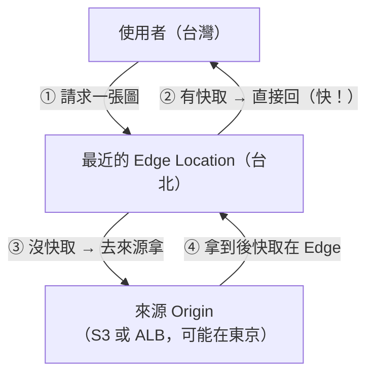

# [aws-6-5] CloudFront CDN：前端靜態資源加速

> **本章目標**：理解 CloudFront 怎麼用全球 Edge Location 加速你的網站，把課外讀物學的 CDN 概念用 AWS 實現——前端工程師必看。

## 你會學到

- CloudFront 是什麼（AWS 的 CDN）
- 它怎麼用 Edge Location 加速（呼應 aws-1-2）
- 快取與「來源（Origin）」的關係
- CloudFront 的常見用法（前端必備）

## 概念說明

### 複習：CDN 為什麼能加速

你在課外讀物 E-11-5、aws-1-2 碰過 CDN 和 Edge Location。快速複習：

> **CDN（內容傳遞網路）把你的內容「快取」到全球各地離使用者很近的節點（Edge Location），讓使用者「就近」拿到內容，而不用大老遠連到你的伺服器。**

用類比（呼應 aws-1-2）：你的伺服器是「總倉庫」，Edge Location 是「遍布各地的便利商店」。使用者買常見的東西（靜態內容），去最近的便利商店就好，不用跑總倉庫——又快、又減輕總倉庫負擔。

**CloudFront** 就是 AWS 的 CDN 服務，靠 aws-1-2 講的那些遍布全球的 **Edge Location** 運作。

---

### CloudFront 怎麼運作



流程（和 ElastiCache 的 cache-aside 很像，只是分散在全球）：

1. 使用者請求內容 → 連到**最近的 Edge Location**。
2. Edge **有快取**（cache hit）→ 直接回，超快（不用連到遠方的來源）。
3. Edge **沒快取**（cache miss）→ 去「**來源（Origin）**」拿，順手快取在 Edge。
4. 下次同一區的使用者要同樣內容 → Edge 就有了。

**來源（Origin）** 是「內容的原始出處」，通常是：

- **S3 bucket**（放靜態資源——呼應 aws-5-1、aws-1-5 的靜態網站）。
- **ALB**（aws-6-4，動態內容的入口）。

---

### CloudFront 帶來的好處

| 好處 | 說明 |
|------|------|
| **更快** | 使用者就近從 Edge 拿，延遲大降（尤其使用者分散全球時）|
| **減輕來源負擔** | 大量請求被 Edge 擋下，S3/ALB 壓力大減（呼應快取的減壓）|
| **省流量費** | 從 Edge 出的流量比直接從 S3/EC2 出便宜 |
| **HTTPS + 安全** | 內建 HTTPS、可整合 WAF（Web 防火牆）擋攻擊 |
| **抗突發流量** | Edge 幫你扛大量靜態請求（呼應 SRE 容量）|

---

### 前端工程師為什麼必看

大綱特別標「前端工程師必看」——因為 **CloudFront 是部署前端的標準做法**：

```
前端打包後的靜態檔案（HTML/CSS/JS/圖片）
  → 放 S3（aws-5-1）
  → 前面套 CloudFront
  → 全球使用者就近、快速、安全地載入你的前端

這就是現代前端部署的黃金組合：S3 + CloudFront
```

好處：

- 前端載入超快（全球就近）。
- 不用自己架伺服器放前端（S3 + CloudFront 全包）。
- 自動 HTTPS、抗流量。

你 aws-1-5 用 S3 做的靜態網站，**正式版就是再套一層 CloudFront**——更快、能用自訂網域+HTTPS（6-6）、更安全。

---

### 快取失效（cache invalidation）

一個實務重點：CloudFront 把內容快取在 Edge，但你**更新了內容**怎麼辦？舊的快取還在 Edge，使用者可能拿到舊版（呼應 ElastiCache 的一致性問題）。

解法：

- **設定快取時間（TTL）**：例如「快取 24 小時」，過期自動重新拿。
- **手動失效（invalidation）**：部署新版前端後，「使檔案快取失效」，強制 Edge 重新拿最新的。
- **檔名加版本**：前端打包常用「`app.[hash].js`」——內容變了檔名就變，自然繞過舊快取（這是最乾淨的做法，前端建置工具會自動做）。

## 範例：前端 + 後端的完整加速架構

```
一個全球使用者的 Web App：

前端（靜態）：
  打包檔案 → S3 bucket「app-frontend」（私有）
  → CloudFront（來源是 S3）
  → 全球使用者就近載入前端，超快
  → 自訂網域 app.example.com + HTTPS（6-6）

後端 API（動態）：
  CloudFront 也可以把 /api/* 的請求
  → 轉給來源 ALB（aws-6-4）→ 後端機器
  （動態內容通常不快取，或短快取）

效果：
  使用者在世界任何角落：
    - 載前端 → 從最近的 Edge（已快取）→ 飛快
    - 呼叫 API → 透過 CloudFront 轉到後端
  S3、後端的負擔都被 Edge 大幅分攤
  全程 HTTPS、可加 WAF 防護
```

這就是 CloudFront 的價值——**讓你的網站對全球使用者都快、又減輕後端負擔、又安全**。對前端工程師來說，「S3 + CloudFront」是必備的部署技能。

## 小練習

### 練習 1：CDN 為什麼快

用「總倉庫 vs 便利商店」的類比，解釋 CloudFront 怎麼讓全球使用者都快速存取你的內容。

---

### 練習 2：來源與快取

回答：

1. CloudFront 的「來源（Origin）」通常是什麼？（兩個常見的）
2. Edge Location 沒有某內容的快取時，怎麼處理？

---

### 練習 3：快取更新問題

回答：你更新了前端，但使用者還拿到舊版（Edge 的舊快取）。有哪些方法解決？（提示：TTL、手動失效、檔名加 hash）

## 課外讀物

> 想深入 CDN 的運作原理與快取策略 → [課外讀物 E-11-5：CDN 是什麼？](../../../課外讀物/E-11-performance/E-11-5-cdn.md)
