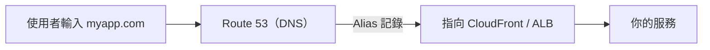

# [aws-6-6] Route 53 + ACM：自訂網域與 HTTPS 憑證

> **本章目標**：理解 Route 53（DNS）怎麼把你的網域指向 AWS 資源，以及 ACM 怎麼免費提供 HTTPS 憑證——讓你的服務有個漂亮的網址和安全鎖頭。

## 你會學到

- Route 53 是什麼（AWS 的 DNS 服務）
- 怎麼把網域指向 ALB / CloudFront / S3
- ACM 怎麼提供免費的 HTTPS 憑證
- 把網域 + HTTPS 串起來的完整流程

## 概念說明

### 最後一塊：讓服務有個「門面」

到目前為止，你的服務可能是透過 ALB 或 CloudFront 提供的——但網址是一串醜醜的 AWS 預設網址（像 `xxx.cloudfront.net`）。要變成專業的服務，需要兩樣東西：

1. **自訂網域**（如 `www.myapp.com`）——靠 **Route 53**。
2. **HTTPS（安全鎖頭）**——靠 **ACM**。

這章把這兩樣串起來，是服務上線的「最後一哩路」。你 infra Part 3-1（DNS）、Part 4-4（HTTPS 憑證）學過這些概念，這裡是 AWS 的版本。

---

### Route 53：AWS 的 DNS 服務

**Route 53** 是 AWS 的 **DNS（網域名稱系統）服務**——你 infra Part 3-1 學過 DNS：「把好記的網域名稱，翻譯成 IP / 資源位址」。

> 名字由來：DNS 用的標準 port 是 53，所以叫 Route 53（「路由」+ 53）。

它做的事（呼應 infra Part 3-1 的 DNS）：

- **管理你的網域**：你可以在 AWS 買網域，或把別處買的網域交給 Route 53 管理。
- **設定 DNS 記錄**：把網域指向你的資源（ALB、CloudFront、S3…）。
- 還有進階功能：健康檢查、依地理位置/延遲的智慧路由等。

---

### 怎麼把網域指向 AWS 資源

核心是設定 **DNS 記錄**。最常見的：

| 記錄類型 | 作用 | 例子 |
|---------|------|------|
| **A 記錄** | 把網域指向一個 IP | `myapp.com → 1.2.3.4` |
| **CNAME** | 把網域指向「另一個網域名」 | `www.myapp.com → myapp.com` |
| **Alias（別名）** | AWS 特有，把網域直接指向 AWS 資源 | `myapp.com → 某個 ALB / CloudFront` |

重點是 AWS 特有的 **Alias 記錄**：

> 一般 DNS 要指向資源得知道 IP，但 ALB、CloudFront 的 IP 會變。**Alias 記錄**讓你直接把網域指向「那個 AWS 資源」（ALB、CloudFront、S3 網站），AWS 自動處理底層 IP 變化。**指向 AWS 資源時，優先用 Alias。**



---

### ACM：免費的 HTTPS 憑證

**ACM（AWS Certificate Manager，憑證管理員）** 提供**免費的 SSL/TLS 憑證**，讓你的服務能用 HTTPS（infra Part 4-4 學過 HTTPS 與憑證）。

回想 infra Part 4-4：HTTPS 需要「憑證」來加密 + 證明身份，憑證由 CA 核發。ACM 的好處：

- **免費**：AWS 幫你簽發、自動續期（不像 infra Part 4-4 要自己跑 certbot）。
- **自動續期**：憑證快過期時自動更新，永遠不會「憑證過期」（infra Part 4-4 提過憑證會過期的問題）。
- **無縫整合**：直接套用到 ALB、CloudFront——它們會自動用這個憑證處理 HTTPS。

> 重要限制：ACM 的免費憑證**只能用在 AWS 服務上**（ALB、CloudFront 等），不能下載到自己的 EC2 用。要在 EC2 上自己處理 HTTPS，還是用 infra Part 4-4 的 Let's Encrypt + certbot。

---

### 把網域 + HTTPS 串起來

完整流程（這是服務上線的標準步驟）：

```
① 用 ACM 申請憑證
   - 為 myapp.com 申請憑證
   - ACM 要你「驗證網域擁有權」（通常在 Route 53 加一筆驗證記錄，自動完成）

② 把憑證套用到 CloudFront / ALB
   - 在 CloudFront/ALB 設定裡，選用這個 ACM 憑證
   - 它們就會用這個憑證處理 HTTPS

③ 用 Route 53 把網域指向資源
   - 加一筆 Alias 記錄：myapp.com → 你的 CloudFront/ALB

完成！使用者連 https://myapp.com：
   - DNS（Route 53）把網域解析到你的資源
   - 資源用 ACM 憑證提供 HTTPS（安全鎖頭）
   - 連到你的服務
```

這就把 aws-1-5 那個「醜網址的 S3 網站」，升級成「`https://myapp.com` 有安全鎖頭的專業服務」。

## 範例：一個完整的對外服務

```
把前面所有 Part 串起來，一個完整對外的網站：

使用者連 https://www.myshop.com
  ↓
① Route 53（DNS）
   www.myshop.com → Alias → CloudFront
  ↓
② CloudFront（6-5，CDN 加速）
   - 用 ACM 憑證提供 HTTPS（本章）
   - 靜態內容從 Edge 快取回（快）
   - 動態請求 /api/* → 轉給來源 ALB
  ↓
③ ALB（6-4，負載平衡）
   - 也用 ACM 憑證
   - 分流到後端機器（健康檢查）
  ↓
④ EC2 / 容器（私有子網路，跨 AZ）
  ↓
⑤ RDS（6-2）+ ElastiCache（6-3）（私有子網路）

對使用者來說：
  一個漂亮的網址 https://www.myshop.com + 安全鎖頭
  載入飛快、又穩、又安全
背後：
  DNS、CDN、HTTPS、負載平衡、高可用、快取、資料庫——全部到位
```

這就是一個專業 AWS 服務的全貌。你現在已經認識了它的每一塊！

## 小練習

### 練習 1：Route 53 與 ACM 各做什麼

用一句話分別說明 Route 53 和 ACM 的作用。它們對應你 infra 課學的什麼概念？

---

### 練習 2：Alias 記錄

回答：為什麼把網域指向 ALB/CloudFront 時，要用 AWS 特有的「Alias 記錄」，而不是一般的 A 記錄（指向 IP）？

---

### 練習 3：串起完整流程

描述「讓使用者能用 `https://myapp.com` 連到你的服務」需要的三個步驟（ACM 憑證、套用、Route 53 指向）。

## 課外讀物

> DNS 的原理 → [課外讀物 E-3-1：網際網路是怎麼運作的？](../../../課外讀物/E-3-network/E-3-1-how-internet-works.md)；HTTPS 憑證的自架做法 → 參見 **infra 課程** Part 4-4
