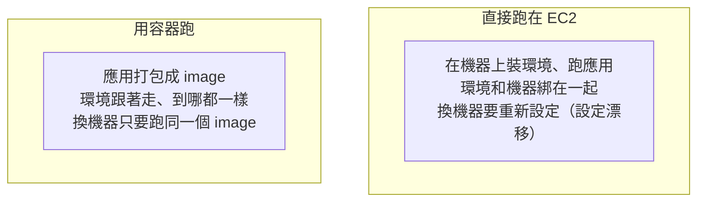
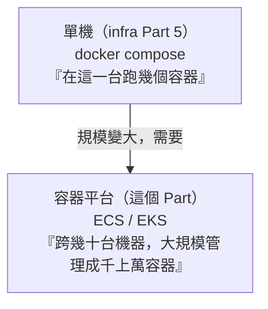

# [aws-7-1] 為什麼要容器？從 EC2 到容器化的演進

> **本章目標**：複習容器的價值（infra Part 5），理解「直接跑在 EC2」和「用容器」的差別，以及為什麼雲端容器平台這麼受歡迎。

## 你會學到

- 複習：容器解決什麼問題（infra Part 5）
- 「直接跑在 EC2」vs「用容器跑」的差別
- 為什麼需要「容器平台」（不只是 Docker）
- Part 7 的學習地圖

## 概念說明

### 複習：容器是什麼（infra Part 5）

你 infra Part 5 學過 Docker 和容器。快速複習核心：

> **容器把「應用程式 + 它需要的整套環境」打包成一個標準盒子，讓它「在哪都能跑、跑起來都一樣」——解決「在我電腦上明明可以跑」的問題。**

容器又輕又快（共用主機核心，不像 VM 自帶整個 OS），秒級啟動、一台機器能跑很多個（infra Part 5-1）。

這章把容器搬到 AWS——看雲端怎麼幫你「大規模地跑容器」。

---

### 「直接跑在 EC2」vs「用容器」

你 aws-3-2 學的是「直接在 EC2 上裝 Nginx 跑」。但用容器跑，有什麼不同、好在哪？



| | 直接跑在 EC2 | 用容器 |
|---|------------|--------|
| 環境一致性 | 容易有設定漂移（infra Part 6-3）| 環境打包進 image，到哪都一樣 |
| 部署 | 要在機器上重新設定 | 拉 image 跑起來就好 |
| 一台機器跑多個應用 | 容易互相干擾 | 容器互相隔離 |
| 擴展 | 要設定每台新機器 | 用同一個 image 開更多容器 |
| 啟動速度 | 慢（開機 + 設定）| 快（容器秒起）|

核心優勢（呼應 infra Part 5-1）：**容器讓「應用 + 環境」可以像積木一樣，到處複製、快速啟動、互相隔離**。這對「要跑很多服務、要頻繁部署、要快速擴展」的現代應用太重要了。

---

### 為什麼需要「容器平台」

你 infra Part 5 用 `docker run`、`docker compose` 在「一台機器」上跑容器。但真實的正式環境有更難的問題：

- 我有**幾十台機器**，容器該跑在哪台？
- 某個容器掛了，誰負責重啟它？
- 流量大了，怎麼自動多開容器、還要分散到多台機器？
- 容器之間怎麼跨機器溝通？
- 怎麼不中斷地更新容器？

這些「**跨多台機器、大規模管理容器**」的問題，`docker compose`（單機）解決不了。需要一個**容器編排平台（container orchestration）**——你在課外讀物 E-13-2/E-13-3 碰過這個概念。



AWS 提供兩條容器平台路線：**ECS** 和 **EKS**（7-3 詳細比較）。它們幫你做「容器的調度、自我修復、擴縮、跨機器網路」——就是把容器版的「高可用、自動擴縮」（你 SRE/infra 學的）自動化。

---

### Part 7 學習地圖

這個 Part 帶你從容器基礎到看懂公司的容器架構：

```
aws-7-1（本章）為什麼要容器
aws-7-2 ECR：放 image 的倉庫
aws-7-3 ECS vs EKS：兩條路線怎麼選
aws-7-4 🔧 動手：ECS Fargate 部署（最簡單的入門）
aws-7-5~7-8 EKS（Kubernetes）深入：架構、網路、擴縮、Helm
aws-7-9 看懂公司的 EKS 架構（整合）
```

> 建議先複習 infra Part 5（Docker 基礎）和課外讀物 E-13-3（Kubernetes 概念），這個 Part 會建立在它們之上。

## 範例：從單機到平台的演進

```
一個 App 的容器化之路：

階段一（infra Part 5）：本機 + 單台伺服器
  docker compose up → 在一台機器跑 app + db + nginx
  → 適合：開發、小專案
  → 問題：一台機器掛了就全掛、扛不住大流量

階段二（這個 Part）：雲端容器平台
  把 app 容器交給 ECS / EKS
  → 平台自動：跨多台機器調度容器、掛了自動重啟、
    流量大自動多開、跨 AZ 高可用
  → 適合：正式環境、要可靠、要規模

關鍵差別：
  單機 docker compose：你自己顧「這一台」
  容器平台：平台幫你顧「一整群機器上的所有容器」
```

這就是為什麼要學雲端容器平台——當你的容器需要「大規模、可靠地跑」，就需要 ECS 或 EKS。

## 小練習

### 練習 1：容器的價值

複習回答：容器解決什麼問題？「用容器跑」比「直接跑在 EC2」好在哪（至少兩點）？

---

### 練習 2：為什麼需要平台

回答：你 infra Part 5 的 `docker compose` 是單機的。當你有「幾十台機器、要跑成千上萬容器」時，會遇到哪些 `docker compose` 解決不了的問題？

---

### 練習 3：定位

回答：「單機 docker compose」和「容器平台 ECS/EKS」各適合什麼場景？它們是取代關係還是不同層次？

## 課外讀物

> 容器編排與 Kubernetes 的概念入門 → [課外讀物 E-13-3：Kubernetes 概念入門](../../../課外讀物/E-13-scaling/E-13-3-kubernetes-intro.md)；Docker 基礎 → 參見 **infra 課程** Part 5
