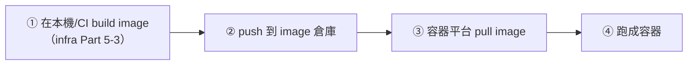

# [aws-7-2] ECR：Docker Image 的倉庫

> **本章目標**：理解 ECR 是什麼——AWS 版的 Docker Hub，以及為什麼容器部署需要一個「image 倉庫」。

## 你會學到

- 為什麼容器部署需要「image 倉庫」
- ECR（彈性容器登錄）是什麼
- ECR 和 Docker Hub 的差別
- push / pull image 的基本流程

## 概念說明

### 複習：image 與 image 倉庫

你 infra Part 5-3 學過用 Dockerfile 把應用打包成 **image**。但打包好的 image 要放哪、怎麼讓「雲端的機器」拿到它？

回想 infra Part 5-2——image 可以從 **Docker Hub**（公開的 image 倉庫）下載別人的（如官方 nginx）。**image 倉庫（registry）** 就是「存放與分發 image 的地方」。

部署容器的流程是：



關鍵是中間的「image 倉庫」——它是「build」和「run」之間的橋樑。你的 image build 好後 push 上去，ECS/EKS 要跑容器時從那裡 pull 下來。

---

### ECR：AWS 版的 Docker Hub

**ECR（Elastic Container Registry，彈性容器登錄）** 就是 **AWS 提供的私有 image 倉庫**——你可以把它理解成「AWS 版的 Docker Hub」。

| | Docker Hub | ECR |
|---|-----------|-----|
| 提供者 | Docker 公司 | AWS |
| 公開/私有 | 有公開有私有 | 私有（你自己的）|
| 整合 | 通用 | **和 AWS 深度整合**（IAM 權限、ECS/EKS）|
| 適合 | 公開 image、開源專案 | 你公司自己的 image |

為什麼用 ECR 而不是 Docker Hub 放自己的 image？

- **私有、安全**：你公司的 image 是機密，存私有的 ECR，用 IAM 控制誰能存取（aws-2-1）。
- **和 AWS 整合**：ECS/EKS 拉 ECR 的 image 很順、權限用 IAM Role 管理（不用另外設帳密）。
- **快**：image 和你的運算資源在同一個 AWS 網路，拉取快。

---

### push / pull 流程

把 image 放上 ECR、再讓容器平台用，流程大致是：

**① 在 ECR 建一個 repository**（放某個 image 的地方，像 Docker Hub 的一個 repo）。

**② 登入 ECR**（用 AWS 權限換取 docker 登入）：

```bash
aws ecr get-login-password --region ap-northeast-1 | \
  docker login --username AWS --password-stdin <你的帳號>.dkr.ecr.ap-northeast-1.amazonaws.com
```

這行用你的 AWS 權限，讓本機 docker 能登入 ECR（細節不用背，理解「用 AWS 身份登入 ECR」即可）。

**③ build 並打上 ECR 的標籤**（infra Part 5-3 的 build，加上 ECR 位址）：

```bash
docker build -t my-app .
docker tag my-app:latest <你的帳號>.dkr.ecr.ap-northeast-1.amazonaws.com/my-app:latest
```

**④ push 到 ECR**：

```bash
docker push <你的帳號>.dkr.ecr.ap-northeast-1.amazonaws.com/my-app:latest
```

**⑤ ECS/EKS 拉取**：之後 ECS/EKS 部署時，指定這個 ECR image 位址，它就會 pull 下來跑（用 IAM Role 自動取得權限，不用帳密）。

---

### ECR 在 CI/CD 裡的角色

實務上，這些 push 的動作通常**不是手動做，而是在 CI/CD 自動跑**（Part 9）：

```
開發者 push 程式碼到 Git
  → CI/CD（如 GitHub Actions）自動：
    build image → push 到 ECR → 通知 ECS/EKS 用新 image 部署
  → 全自動，從「改程式碼」到「新版上線」
```

所以 ECR 是「容器化部署流水線」的關鍵中繼站——它連接了「程式碼」（build 成 image）和「運算平台」（pull 來跑）。Part 9 會把這整條流水線串起來。

## 範例：image 的旅程

```
你的 app 從程式碼到在 ECS 上跑：

① 寫好程式 + Dockerfile（infra Part 5-3）
② docker build → 得到 image「my-app:v1.2」
③ 登入 ECR、tag、push
   → image 上傳到 ECR 的「my-app」repository
④ 在 ECS 的任務定義裡，指定 image 位址：
   <帳號>.dkr.ecr.../my-app:v1.2
⑤ ECS 部署時，從 ECR pull 這個 image，跑成容器
   （用 ECS 的 IAM Role 自動取得 ECR 拉取權限）

下次更新：
  改程式 → build 成 v1.3 → push → ECS 用 v1.3 重新部署
  （Part 9 會把這整串自動化）
```

ECR 就是這趟旅程的「倉庫中繼站」——image 先進倉庫，運算平台再從倉庫取貨。

## 小練習

### 練習 1：為什麼需要 image 倉庫

回答：容器部署為什麼需要一個「image 倉庫」？它在「build」和「run」之間扮演什麼角色？

---

### 練習 2：ECR vs Docker Hub

回答：為什麼公司自己的 image 適合放 ECR 而不是公開的 Docker Hub？（至少兩個理由）

---

### 練習 3：理解流程

不看上面，描述「把一個 image 放上 ECR、讓 ECS 使用」的大致步驟（build → tag → push → ECS 拉取）。

## 課外讀物

> image、Dockerfile、build 的基礎，infra Part 5 有完整教學 → 參見 **infra 課程** Part 5（`lessons/infra/課程大綱.md`）
