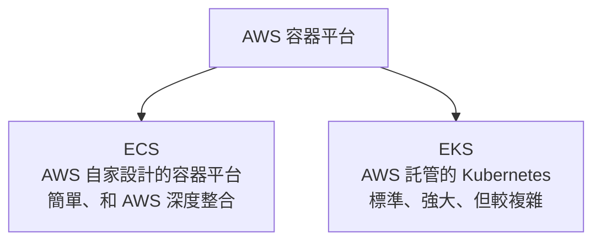
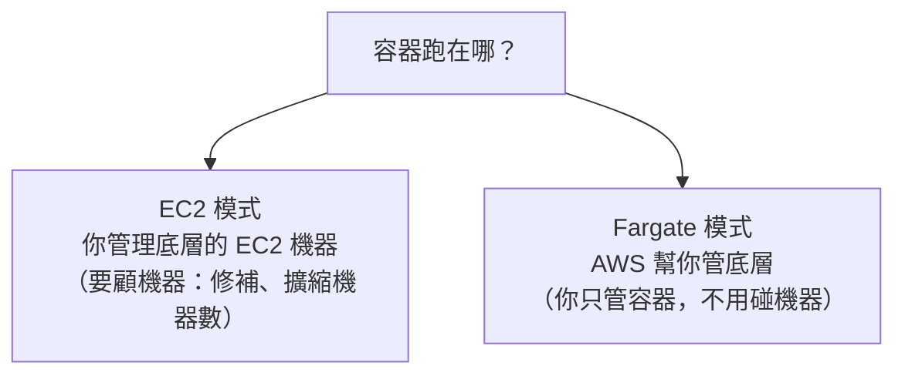
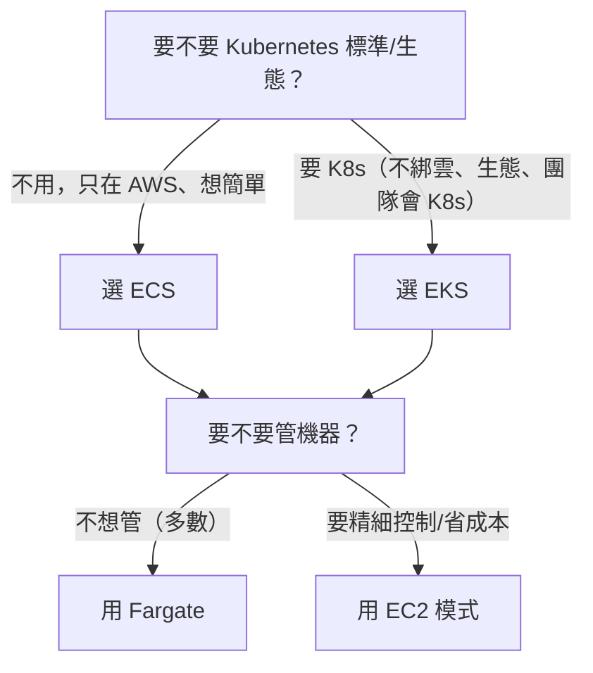

# [aws-7-3] ECS vs EKS：AWS 的兩條容器路線

> **本章目標**：理解 AWS 兩個容器平台 ECS 和 EKS 的差別，以及 Fargate 這個「不用管機器」的選項，知道什麼情況該選哪個。

## 你會學到

- ECS 是什麼（AWS 自家的容器平台）
- EKS 是什麼（AWS 託管的 Kubernetes）
- Fargate：不用管底層機器的「無伺服器容器」
- 怎麼在 ECS / EKS / Fargate 之間選擇

## 概念說明

### AWS 的兩條容器路線

aws-7-1 說 AWS 提供兩個容器平台。它們做的事類似（大規模管理容器），但設計哲學不同：



選哪個，主要看「**你要簡單還是要標準（Kubernetes）**」。

---

### ECS：AWS 自家的容器平台

**ECS（Elastic Container Service，彈性容器服務）** 是 **AWS 自己設計**的容器編排平台。

特點：

- **簡單**：AWS 自己設計，概念較少、上手快、和 AWS 服務（ALB、IAM、VPC）整合得很順。
- **AWS 專屬**：它是 AWS 獨有的，學了不能搬到別的雲（綁定 AWS）。
- 適合：「**只在 AWS 上、想要簡單**」的團隊。

ECS 的核心概念（比 Kubernetes 少很多，好懂）：

| ECS 概念 | 是什麼 |
|---------|--------|
| **Task Definition（任務定義）** | 描述「要跑什麼容器」（用哪個 image、多少資源、環境變數）|
| **Task（任務）** | 跑起來的一組容器（一個 task 可含一或多個容器）|
| **Service（服務）** | 管理「要維持幾個 task 在跑、掛了重啟、接 ALB」|
| **Cluster（叢集）** | 一群運算資源（機器或 Fargate）|

---

### EKS：AWS 託管的 Kubernetes

**EKS（Elastic Kubernetes Service，彈性 Kubernetes 服務）** 是 **AWS 託管的 Kubernetes**。

先說 **Kubernetes（K8s）**（你課外讀物 E-13-3 學過）——它是**業界標準**的容器編排系統（Google 開源），功能極強大，但也較複雜。

EKS 的特點：

- **標準**：用的是標準 Kubernetes，學了**到處都能用**（其他雲、地端都有 K8s），不綁 AWS。
- **強大、生態豐富**：K8s 的功能、工具、社群極龐大。
- **較複雜**：K8s 概念多、學習曲線陡（Pod、Service、Ingress、Deployment…，7-5、7-6 會講）。
- AWS 幫你託管 K8s 最難的部分（Control Plane，7-5），但你還是要懂 K8s。

適合：「**想要 K8s 的標準與生態、不想被單一雲綁定、有能力駕馭其複雜度**」的團隊（尤其中大型組織）。

---

### Fargate：不用管底層機器

不管 ECS 還是 EKS，都有個關鍵的「運算模式」選擇——容器**跑在哪**？兩種：



**Fargate** 是「**無伺服器（serverless）的容器運算**」——你**完全不用管底層的 EC2 機器**，只要說「我要跑這個容器、要多少 CPU/記憶體」，AWS 自動幫你準備運算資源來跑。

| | EC2 模式 | Fargate 模式 |
|---|---------|-------------|
| 誰管底層機器 | 你（要修補、擴縮機器、顧 OS）| **AWS（你完全不用碰機器）** |
| 心智負擔 | 較高 | **很低** |
| 成本 | 機器費（可能較省，若用好）| 按容器資源計費（方便但單價較高）|
| 適合 | 想精細控制、省成本、量大 | 想簡單、不想管機器（多數情況）|

Fargate 可以搭配 **ECS 或 EKS** 用。**ECS + Fargate** 是「最平易近人的雲端容器組合」——簡單的平台 + 不用管機器，這就是 aws-7-4 動手做要用的。

---

### 怎麼選？



實務建議：

- **入門 / 中小團隊 / 只在 AWS** → **ECS + Fargate**（最簡單，本課動手做用這個）。
- **中大型 / 要 K8s 標準與生態 / 多雲** → **EKS**（強大但要投入學習）。
- **不確定** → 先用 ECS + Fargate，它能滿足大部分需求且最省心。

> 沒有「絕對正確」——這又是個取捨（呼應 aws-6-1、infra Part 9-3）。ECS 簡單但綁 AWS；EKS 標準但複雜。依團隊能力與需求選。

## 範例：兩個團隊的選擇

```
團隊 A：5 人新創，只用 AWS，想快速上線、不想養 K8s 專家
  → ECS + Fargate
  → 理由：簡單、不用管機器、和 AWS 整合好
         把精力放在產品，不是學 K8s

團隊 B：50 人公司，多雲策略，已有 K8s 經驗，要豐富生態
  → EKS
  → 理由：K8s 標準不綁雲、生態工具豐富、團隊駕馭得了複雜度
         （底層運算可混用 Fargate + EC2 模式以平衡成本）

關鍵：不是「EKS 比較高級所以一定選它」
     而是「依團隊能力、需求、是否要 K8s 標準」做取捨
     很多時候 ECS + Fargate 才是務實的好選擇
```

## 小練習

### 練習 1：ECS vs EKS

用自己的話說明 ECS 和 EKS 的核心差別（簡單 vs 標準、綁 AWS vs 不綁）。

---

### 練習 2：Fargate 是什麼

回答：Fargate 模式和 EC2 模式差在哪？為什麼 Fargate 對「不想管機器」的團隊很有吸引力？

---

### 練習 3：做選擇

下面的團隊該選什麼（ECS/EKS + Fargate/EC2）？說明理由：

1. 一個只用 AWS、想最快上線的 3 人團隊
2. 一個有 K8s 經驗、要多雲、規模大的公司

## 課外讀物

> Kubernetes 的核心概念，課外讀物有完整入門 → [課外讀物 E-13-3：Kubernetes 概念入門](../../../課外讀物/E-13-scaling/E-13-3-kubernetes-intro.md)
