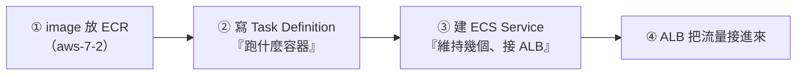

# [aws-7-4] 🔧 動手做：把 Docker app 部署到 ECS Fargate

> **本章目標**：把一個 Docker 化的應用，部署到 ECS Fargate——體驗「不用管機器，就能把容器跑在雲端、對外服務」的完整流程。

## 你會學到

- 把 image 從 ECR 部署到 ECS Fargate 的完整流程
- ECS 的核心概念實作：Task Definition、Service、Cluster
- 用 ALB 把流量接到 Fargate 容器
- 「不用管機器」的雲端容器部署初體驗

## 概念說明

### 這一章在做什麼

aws-7-3 說「ECS + Fargate 是最平易近人的雲端容器組合」。這章你就親手做一次——把 infra Part 5 容器化的 app，部署到 ECS Fargate。

你會發現：**因為用 Fargate，你完全不用開 EC2、不用管機器**——只要說「跑這個容器」，AWS 就幫你跑起來。這跟 aws-3-2 手動開 EC2、SSH 進去裝東西，是完全不同的體驗。

流程：

> 會用到 Fargate、ALB，這些會計費（雖然不多）。**做完記得清理**（aws-1-3）。

## 程式碼範例

### 前置：image 已在 ECR

確認你的 app image 已經 push 到 ECR（aws-7-2 的流程）。例如：
`<帳號>.dkr.ecr.ap-northeast-1.amazonaws.com/my-app:latest`

### 第一步：建立 ECS Cluster

1. Console 進入 **ECS** → Create cluster。
2. 取名（如 `my-cluster`）。
3. 基礎設施選 **AWS Fargate（serverless）**——這就是「不用管機器」的關鍵選擇。
4. 建立。（注意：選了 Fargate，你不用準備任何 EC2！）

### 第二步：寫 Task Definition（描述「跑什麼容器」）

Task Definition 是「容器的規格書」（aws-7-3）：

1. ECS → Task definitions → Create new。
2. Launch type：**Fargate**。
3. Task 的 CPU / 記憶體：選小一點（如 0.25 vCPU / 0.5GB，省錢）。
4. Container：
   - Name：`my-app`
   - Image URI：你的 ECR image 位址
   - Port mappings：填你的 app 聽的 port（如 3000）
5. **Task Role**（aws-2-1 的 Role！）：如果容器要存取其他 AWS 服務（如 S3），在這裡指定一個 Role——容器就「戴上」這個 role，無需金鑰（呼應 aws-2-1 的 Role 最佳實踐）。
6. 建立。

### 第三步：建立 Service（維持容器在跑 + 接 ALB）

Service 負責「維持幾個容器在跑、掛了重啟、接上負載平衡」（aws-7-3）：

1. 進入 cluster → Create service。
2. 用剛建的 Task Definition。
3. **Desired tasks**：設 2（跑 2 個容器，跨 AZ → 高可用，呼應 aws-4-7）。
4. **Networking**：選你的 VPC（aws-4-8）、選**私有子網路**（容器躲起來）、設 Security Group（只允許 ALB 連，aws-4-5）。
5. **Load balancing**：選「Application Load Balancer」，建立或選一個 ALB（aws-6-4），把 ALB 接到這個 service。設定健康檢查路徑（如 `/health`）。
6. 建立。

### 第四步：見證成果

ECS 會自動：

- 從 ECR 拉你的 image。
- 在 Fargate 上跑起 2 個容器（你不用碰任何機器！）。
- 把它們註冊到 ALB。

等 service 穩定後，打開 **ALB 的網址**，你應該看到你的 app 在回應——**它正跑在 Fargate 容器上，而你完全沒開過一台 EC2、沒 SSH 進任何機器。**

這就是 ECS + Fargate 的威力：**你只描述「要跑什麼」，AWS 處理「在哪跑、怎麼跑、掛了重啟、流量怎麼接」**。

---

### 體驗自我修復

ECS Service 會「維持 Desired tasks 數量」。試試看（呼應 SRE Part 8-6、infra 的自我修復）：

- 在 ECS 手動「停止」一個 task。
- 觀察——ECS 會**自動再啟動一個新的**，維持 2 個。

這就是容器平台的「自我修復」——你設「要 2 個」，它就保證永遠有 2 個健康的在跑。掛了自己補，使用者無感（SRE 的高可用）。

---

### 清理（重要）

練習完，依序刪除：刪 ECS Service → 刪 Task Definition（可選）→ 刪 ALB → 刪 cluster。ALB 和 Fargate 都會計費，記得清乾淨（aws-1-3）。

## 小練習

### 練習 1：完成部署

把你 infra Part 5 容器化的 app（image push 到 ECR 後），部署到 ECS Fargate，透過 ALB 看到它運作。做完清理。

---

### 練習 2：體驗自我修復

手動停掉一個 task，觀察 ECS 自動補一個新的。這對應你 SRE/infra 學的什麼概念？

---

### 練習 3：對比 aws-3-2

回答：這次用 ECS Fargate 部署，和 aws-3-2 手動開 EC2 + SSH + 裝 Nginx，體驗上最大的差別是什麼？（提示：你有沒有碰到任何「機器」？）

## 課外讀物

> 容器的基礎（image、容器化）來自 infra Part 5；自我修復的概念來自 SRE Part 8 → 參見 **infra 課程** Part 5、**SRE 課程** Part 8（各自的課程大綱）
