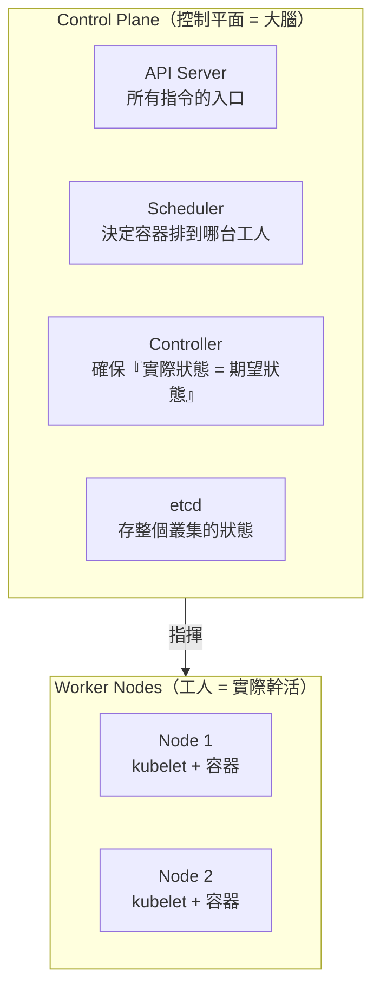
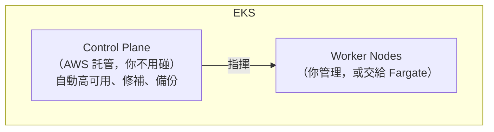

# [aws-7-5] EKS 架構圖解：Control Plane、Node、Fargate

> **本章目標**：理解 Kubernetes / EKS 的核心架構——Control Plane 與 Worker Node 怎麼分工，以及 kubelet、Fargate 各扮演什麼角色。

## 你會學到

- Kubernetes 的「大腦」與「工人」架構
- Control Plane（控制平面）做什麼、EKS 怎麼幫你託管它
- Worker Node 與 Node Group 是什麼
- kubelet 的角色、以及在 EKS 用 Fargate 的選項

## 概念說明

### 先建立 Kubernetes 的核心架構觀

aws-7-3 說 EKS 是「託管的 Kubernetes」。要懂 EKS，得先懂 Kubernetes（K8s）的基本架構。你課外讀物 E-13-3 碰過，這章聚焦「架構分工」。

K8s 的核心是「**大腦 + 工人**」的分工：



- **Control Plane（控制平面）= 大腦**：負責「決策與管理」——接收指令、決定容器排到哪、確保叢集維持你要的狀態。它**不實際跑你的應用容器**。
- **Worker Node（工人節點）= 工人**：實際「跑你的應用容器」的機器。

這個分工就像「**工頭（Control Plane）指揮工人（Node）幹活**」。

---

### Control Plane：叢集的大腦

Control Plane 由幾個元件組成（了解角色即可）：

| 元件 | 角色 | 類比 |
|------|------|------|
| **API Server** | 所有操作的入口，你下的指令都先到這 | 工頭的辦公室前台 |
| **Scheduler** | 決定「新容器該排到哪個 Node」 | 派工的人 |
| **Controller** | 持續確保「實際狀態 = 你要的狀態」 | 監工（少了就補）|
| **etcd** | 儲存整個叢集的狀態資料 | 工地的總帳本 |

**Controller 的「期望狀態」很關鍵**——這是 K8s 的核心哲學（呼應 infra Part 6-3 的宣告式）：你告訴 K8s「我要 3 個這種容器在跑」（期望狀態），Controller 就持續確保「永遠有 3 個」——掛了自動補、多了自動收。**你聲明目標，K8s 自己達成**。這就是 aws-7-4 體驗的自我修復的底層原理。

---

### EKS 幫你託管 Control Plane

Control Plane 是 K8s 最複雜、最關鍵、最難維護的部分（要高可用、要備份 etcd…）。**EKS 最大的價值就是：幫你「託管」Control Plane。**



- **Control Plane → AWS 全託管**：你完全不用管它的安裝、高可用、修補——AWS 包了（aws-6-1 受管服務的精神）。這省下巨大的維運苦工（自己架 K8s 的 Control Plane 是惡夢）。
- **Worker Node → 你的責任**（或交給 Fargate，下面講）。

這就是「託管 Kubernetes」的意思——**最難的大腦交給 AWS，你專注在「跑你的容器」**。

---

### Worker Node、Node Group 與 kubelet

**Worker Node** 是實際跑容器的機器。每個 Node 上有個關鍵元件 **kubelet**：

> **kubelet** 是每個 Node 上的「小管家」——它聽 Control Plane 的指令，在自己這台機器上「啟動/停止容器、回報健康狀態」。它是「大腦」和「這台工人」之間的聯絡員。

**Node Group（節點群組）** 是「一組 Worker Node」的管理單位——你用它設定「用什麼規格的 EC2 當 Node、要幾台、跨哪些 AZ」。它通常搭配 Auto Scaling（aws-3-4、7-7）自動增減 Node 數量。

---

### EKS 上跑容器的兩種方式

和 ECS 一樣（aws-7-3），EKS 跑容器也有兩種模式：

| 模式 | 你管什麼 | 說明 |
|------|---------|------|
| **EC2 Node Group** | 你管理 Worker Node（EC2）| 要顧 Node 的規格、數量、修補；較能控制、省成本 |
| **Fargate** | 不用管 Node | AWS 幫你準備運算跑 Pod，你只管容器（aws-7-3 的 Fargate）|

所以在 EKS，你可以「用 EC2 當 Node（自己管機器）」或「用 Fargate（不管機器）」，甚至混用。Fargate 同樣免去「管機器」的苦工。

---

### 整體分工總結

```
你（操作者）
  → 對 API Server 下指令「我要跑 3 個這種容器」（期望狀態）
       ↓
Control Plane（AWS 託管的大腦）
  - Scheduler 決定排到哪些 Node
  - Controller 確保「永遠維持 3 個」
       ↓ 指揮
Worker Node 上的 kubelet（小管家）
  - 在自己機器上啟動容器、回報狀態
       ↓
你的容器實際在 Node（EC2 或 Fargate）上跑
```

理解這個「大腦指揮工人、你只聲明目標」的架構，就掌握了 K8s/EKS 的核心。下一章看它們怎麼透過網路串起來。

## 小練習

### 練習 1：大腦 vs 工人

用「工頭 vs 工人」的類比，解釋 Control Plane 和 Worker Node 的分工。哪個實際跑你的應用容器？

---

### 練習 2：EKS 的價值

回答：EKS 幫你「託管」了 K8s 的哪個部分？為什麼這很有價值？（提示：那部分自己維護有多難）

---

### 練習 3：理解期望狀態

回答：你告訴 K8s「我要 3 個容器」，某個掛了會怎樣？是哪個元件負責確保「維持 3 個」？這對應 infra Part 6-3 的什麼思維？

## 課外讀物

> Kubernetes 的核心概念與架構入門 → [課外讀物 E-13-3：Kubernetes 概念入門](../../../課外讀物/E-13-scaling/E-13-3-kubernetes-intro.md)
