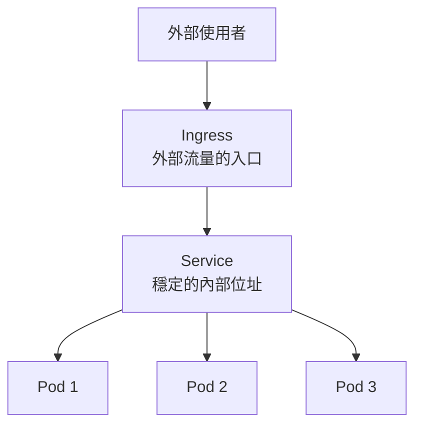
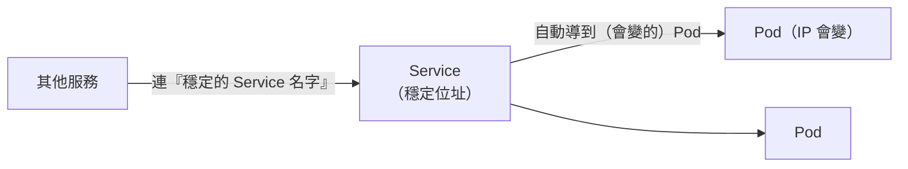

# [aws-7-6] EKS 網路深入：Pod、Service、Ingress

> **本章目標**：理解 Kubernetes 的網路模型——Pod 怎麼得到 IP、Service 怎麼讓 Pod 被穩定找到、Ingress 怎麼把外部流量導進來。

## 你會學到

- Pod 是什麼（K8s 最小的部署單位）
- 為什麼 Pod 的 IP 會變、Service 怎麼解決
- Service、Ingress、CoreDNS 各扮演什麼角色
- EKS 怎麼和 VPC 網路整合

## 概念說明

### K8s 的網路為什麼需要特別講

K8s 裡容器一直在「生生滅滅」（掛了重建、擴縮增減），它們的 IP 一直在變。那「服務之間怎麼穩定找到彼此」「外部流量怎麼進來」就成了問題。K8s 用 Pod、Service、Ingress 三層來解決。先建立全景：



---

### Pod：K8s 最小的部署單位

**Pod** 是 K8s 裡「**最小的部署單位**」——它包著一或多個容器（通常一個）。

> 注意：K8s 不直接管「容器」，而是管「Pod」。你部署應用，部署的是 Pod。一個 Pod 裡的容器共享網路（同一個 IP）。多數情況「一個 Pod = 一個你的應用容器」，可以暫時把 Pod 理解成「容器的包裝」。

**關鍵問題：Pod 的 IP 會變。** 每個 Pod 啟動時拿到一個 IP，但 Pod 是「用完即丟」的（掛了重建、擴縮）——**重建後 IP 就變了**。所以「直接用 Pod 的 IP 連它」是不可靠的（呼應 SRE/infra 的「機器是牲畜、可拋棄」）。這就是需要 Service 的原因。

> 在 EKS，Pod 的 IP 是**直接來自你的 VPC**（aws-4-2 的 CIDR）——這叫 VPC CNI。意思是 Pod 就像 VPC 裡的一等公民，有 VPC 內的 IP，能和其他 AWS 資源直接通訊。（這也是為什麼 VPC 的 IP 範圍要規劃夠大，aws-4-2——Pod 很多時很吃 IP。）

---

### Service：給 Pod 一個「穩定的地址」

**Service** 解決「Pod 的 IP 會變」的問題：

> **Service 提供一個「穩定不變的位址（名字 + 虛擬 IP）」，背後對應到一組會變動的 Pod。其他服務連 Service，Service 自動把流量導到健康的 Pod。**



用類比：Pod 像「**會換座位的員工**」，Service 像「**部門的總機分機號碼**」——你打分機（Service）找「業務部」，不用管現在是哪個員工（Pod）接、他坐哪（IP）。總機自動轉接給在位的人。

Service 同時也做了「**負載平衡**」——把流量分散到背後多個 Pod（呼應 aws-6-4、infra Part 9-1，但這是 K8s 內部的）。

**CoreDNS** 在這裡幫忙——它是 K8s 內部的 DNS（呼應 infra Part 3-1 的 DNS），讓 Pod 能用「Service 的名字」找到它（例如連 `my-api` 這個名字就找到對應的 Service）。這跟你 infra Part 5-4 Docker Compose 的「服務名互連」是同一個精神。

---

### Ingress：外部流量的入口

Service 解決了「內部」找彼此，但「**外部使用者怎麼進來**」呢？這是 **Ingress** 的工作：

> **Ingress 是「外部流量進入叢集的入口」——它依網址路徑/網域，把外部請求路由到對應的 Service。**

```
外部使用者
  → Ingress（入口，依路徑分流）
     /api/*  → api-service
     /*       → web-service
  → 對應的 Service
  → Service 導到 Pod
```

聽起來很熟？對——**Ingress 的角色就像 aws-6-4 的 ALB**（依路徑分流的反向代理）。事實上在 EKS，Ingress 常常**背後就是用 ALB 實現**的（透過 AWS Load Balancer Controller）——你定義 Ingress，它自動幫你建一個 ALB。這就是 K8s 和 AWS 網路的整合。

---

### 三層串起來

```
外部使用者
  ↓
Ingress（入口，≈ ALB，依路徑/網域分流）
  ↓
Service（穩定位址 + 內部負載平衡，靠 CoreDNS 用名字找到）
  ↓
Pod（實際跑容器，IP 會變、用完即丟）
  ↓
跑在 Node（EC2 或 Fargate）上
```

對照你學過的：Ingress ≈ ALB（aws-6-4）、Service ≈ 內部的負載平衡 + 服務發現（infra Part 5-4 的服務名）、Pod ≈ 容器（infra Part 5）。**K8s 不是全新的東西，而是把你學過的網路概念，組成一套標準化的系統。**

## 範例：一個請求在 EKS 的旅程

```
使用者連 https://myapp.com/api/orders：

① DNS（Route 53，aws-6-6）→ 解析到 Ingress 背後的 ALB
② Ingress 規則：/api/* → 導到「order-service」
③ order-service（Service）→ 用內部負載平衡，
   挑一個健康的 order Pod
   （透過 CoreDNS，Service 名字解析到當前的 Pod 們）
④ order Pod（跑在某個 Node 上）處理請求
   - Pod IP 來自 VPC（VPC CNI）
   - 要連資料庫 → 連 RDS（aws-6-2，在私有子網路）
⑤ 回應沿原路回去

若某個 order Pod 掛了：
  - Controller（aws-7-5）自動重建一個新 Pod（新 IP）
  - Service 自動更新、把流量導到新 Pod
  - 使用者無感（Service 的穩定位址沒變）
```

這就是 EKS 網路的全貌——Pod 在底層生滅，Service 提供穩定接點，Ingress 接外部流量，全部和 VPC 整合。

## 小練習

### 練習 1：為什麼需要 Service

回答：Pod 的 IP 為什麼會變？這造成什麼問題？Service 怎麼解決它？用「員工換座位 vs 部門分機」的類比說明。

---

### 練習 2：三層角色

用一句話分別說明 Pod、Service、Ingress 的角色。Ingress 類似你 Part 6 學的哪個服務？

---

### 練習 3：對照已學

回答：

1. K8s 的 CoreDNS（用名字找 Service），和你 infra Part 5-4 學的什麼很像？
2. EKS 的 Pod IP 來自哪裡？這為什麼影響 VPC 的 IP 規劃（aws-4-2）？

## 課外讀物

> Kubernetes 網路與核心物件的概念 → [課外讀物 E-13-3：Kubernetes 概念入門](../../../課外讀物/E-13-scaling/E-13-3-kubernetes-intro.md)
