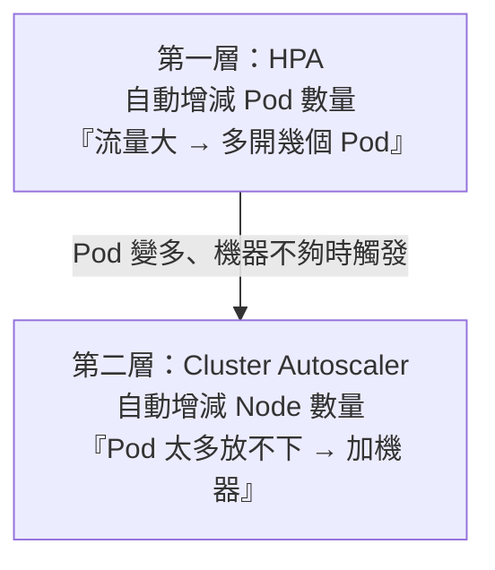
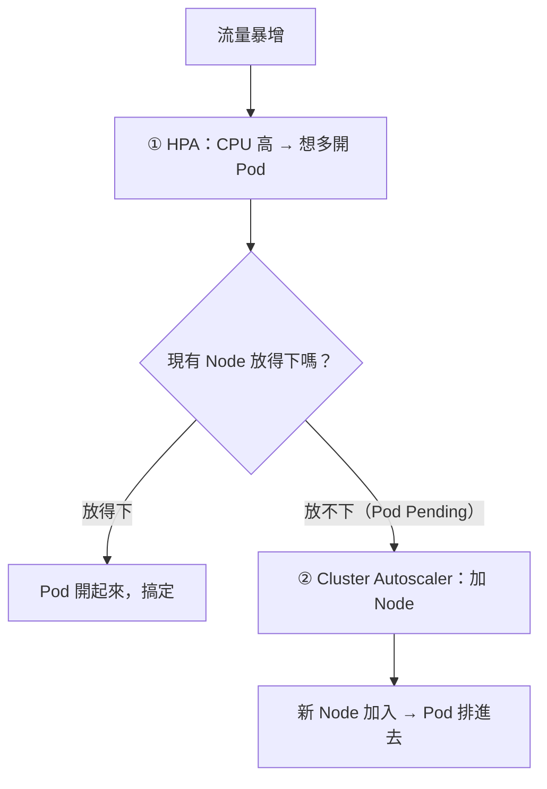

# [aws-7-7] HPA 與 Cluster Autoscaler：兩層自動擴縮

> **本章目標**：理解 Kubernetes 的兩層自動擴縮——HPA（自動增減 Pod）和 Cluster Autoscaler（自動增減 Node），以及它們怎麼配合。

## 你會學到

- 為什麼 K8s 的自動擴縮分「兩層」
- HPA（Horizontal Pod Autoscaler）：自動增減 Pod
- Cluster Autoscaler：自動增減 Node
- 兩者怎麼配合（缺一不可）

## 概念說明

### K8s 的擴縮分兩層

你 SRE Part 7-3、aws-3-4 學過自動擴縮。K8s 的自動擴縮特別之處是——它**分兩層**，因為 K8s 有「Pod」和「Node」兩個層次（aws-7-5、7-6）：



理解這兩層的關係是關鍵：**HPA 管「容器（Pod）的數量」，Cluster Autoscaler 管「機器（Node）的數量」。**

---

### HPA：自動增減 Pod

**HPA（Horizontal Pod Autoscaler，水平 Pod 自動擴縮器）** 根據負載，**自動增減 Pod 的數量**。

> 「Horizontal（水平）」呼應 infra Part 9-1 的水平擴展——加更多 Pod 分攤，而不是把單一 Pod 變大。

運作（呼應 SRE Part 7-3、aws-3-4）：

- 你設規則：「當 Pod 的平均 CPU > 70%，就多開 Pod；< 30% 就減少。」
- HPA 持續看指標，自動調整 Pod 數量。
- 例如：「維持 2~10 個 Pod，依 CPU 自動增減」。

```
流量大 → Pod 的 CPU 升高 → HPA 多開幾個 Pod → 分攤負載
流量小 → CPU 降低 → HPA 減少 Pod → 省資源
```

這就是「容器層」的自動擴縮——讓「跑你應用的 Pod 數量」隨負載自動調整。

---

### 問題：Pod 變多了，機器放得下嗎？

HPA 想多開 Pod，但 Pod 要跑在 Node（機器）上（aws-7-5）。如果現有的 Node **資源不夠**了，新 Pod 就「**排不進去**」（沒地方跑，卡在 Pending 狀態）。

這時光有 HPA 沒用——你需要**更多 Node**。這就是 Cluster Autoscaler 的工作。

---

### Cluster Autoscaler：自動增減 Node

**Cluster Autoscaler** 根據「Pod 排得下排不下」，**自動增減 Node（機器）的數量**：

- 當有 Pod「排不進現有 Node」（資源不夠）→ **自動加 Node**（多開 EC2 機器加入叢集）。
- 當某些 Node「太閒、上面的 Pod 可以挪到別台」→ **自動移除 Node**（省錢）。

它通常搭配 aws-3-4 的 **Auto Scaling Group** 來增減 EC2 Node。

```
HPA 想多開 Pod，但 Node 資源不夠 → Pod 卡在 Pending
  → Cluster Autoscaler 偵測到 → 自動加 Node（EC2）
  → 新 Node 加入 → Pod 排進去、跑起來
```

---

### 兩層怎麼配合（缺一不可）

這是這章的核心——**兩層要一起運作，才能真正自動擴縮**：



| 層 | 管什麼 | 對應 |
|---|--------|------|
| **HPA** | Pod 數量（容器層）| 「應用要幾份」|
| **Cluster Autoscaler** | Node 數量（機器層）| 「要幾台機器來裝這些 Pod」|

一句話：**HPA 決定「要幾個容器」，Cluster Autoscaler 確保「有足夠的機器來跑這些容器」。** 兩者配合，才能從「流量來」一路自動到「容器和機器都備足」。

> 如果用 **Fargate**（aws-7-3）跑 Pod，就**不需要 Cluster Autoscaler**——因為 Fargate「不用管 Node」，AWS 自動準備運算給每個 Pod。這又是 Fargate「不管機器」的好處：你只要 HPA 管 Pod 數量就好。

---

### 對照你學過的擴縮

把這些串起來，你會發現 K8s 的兩層擴縮，其實是你學過的概念的精緻版：

| K8s | 對應 |
|-----|------|
| HPA 增減 Pod | aws-3-4 的 ASG 增減 EC2、SRE Part 7-3 水平擴展（但這裡是容器層）|
| Cluster Autoscaler 增減 Node | aws-3-4 的 Auto Scaling（機器層）|
| 兩層配合 | 容器和機器都隨負載自動調整 |

K8s 把「擴縮」拆成 Pod 和 Node 兩層，更精細——能「先盡量塞滿現有機器（省錢），真不夠才加機器」。

## 範例：一次流量暴增的自動應對

```
情境：EKS 上的服務，平常 2 個 Pod 在 2 台 Node 上，流量突然暴增

① HPA 啟動（容器層）：
   Pod CPU 飆到 90% → HPA 規則觸發
   → 想把 Pod 從 2 個擴到 8 個

② 但 Node 不夠：
   現有 2 台 Node 只裝得下 4 個 Pod
   → 多出的 4 個 Pod 卡在 Pending（排不進去）

③ Cluster Autoscaler 啟動（機器層）：
   偵測到有 Pod Pending → 自動加 2 台 Node（EC2）
   → 新 Node 加入叢集

④ Pending 的 Pod 排進新 Node → 8 個 Pod 全跑起來
   → 流量被分攤，服務撐住

流量退去後：
  HPA 把 Pod 縮回 2 個 → Cluster Autoscaler 移除多餘的閒置 Node
  → 回到省錢狀態

（若用 Fargate：跳過第②③步，AWS 直接幫每個 Pod 準備運算，HPA 一層搞定）
```

這就是 K8s 兩層自動擴縮的威力——容器和機器都隨負載自動調整，扛住尖峰又不浪費。

## 小練習

### 練習 1：兩層的差別

回答：HPA 和 Cluster Autoscaler 各自增減什麼？為什麼 K8s 的擴縮需要分這兩層？

---

### 練習 2：為什麼缺一不可

回答：如果只有 HPA（沒有 Cluster Autoscaler），流量暴增、現有機器資源不夠時，會發生什麼？

---

### 練習 3：Fargate 的差別

回答：如果用 Fargate 跑 Pod，為什麼就不需要 Cluster Autoscaler 了？

## 課外讀物

> HPA 與叢集擴縮是 K8s 自動擴展的核心 → [課外讀物 E-13-3：Kubernetes 概念入門](../../../課外讀物/E-13-scaling/E-13-3-kubernetes-intro.md)；擴展策略 → 參見 **SRE 課程** Part 7-3
