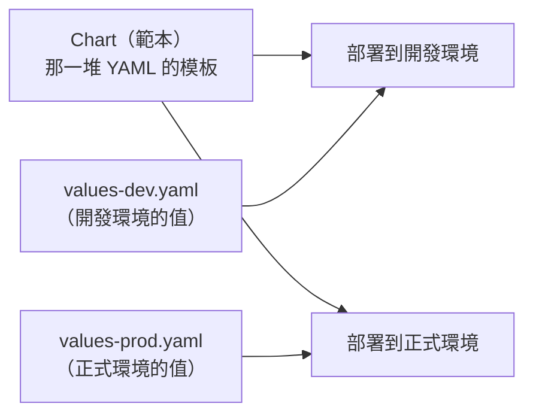

# [aws-7-8] Helm Chart：Kubernetes 的套件管理員

> **本章目標**：理解 Helm 怎麼解決「K8s 設定檔太多太雜」的問題，把它當成「Kubernetes 的套件管理員」，並看懂 values.yaml。

## 你會學到

- 為什麼 K8s 的原始設定檔會變得難以管理
- Helm 是什麼——K8s 的套件管理員
- Chart 與 values.yaml 的概念
- Helm 怎麼讓部署變簡單、可重用

## 概念說明

### 痛點：K8s 的設定檔又多又雜

部署一個應用到 K8s，要寫很多 YAML 設定檔——Deployment（部署）、Service（aws-7-6）、Ingress、ConfigMap、Secret…。一個稍微複雜的應用，可能有十幾個 YAML 檔。

問題來了：

- **檔案多、難管理**：一堆 YAML 散落各處。
- **重複設定**：開發、測試、正式三個環境，設定大同小異，卻要各維護一套（呼應 infra Part 6-3 的設定漂移）。
- **要部署別人的東西很麻煩**：想裝個 Redis、Prometheus 到 K8s，要自己找齊、寫好一堆 YAML。

這跟你 infra Part 2-5 學的「套件管理」問題很像——當年是「安裝軟體很麻煩」，用 `apt` 解決；現在是「部署 K8s 應用很麻煩」，用 **Helm** 解決。

---

### Helm：K8s 的套件管理員

**Helm** 一句話：

> **Helm 是「Kubernetes 的套件管理員」——就像 `apt` 之於 Linux、`npm` 之於 Node，Helm 讓你「一個指令」就能安裝、設定、管理一整套 K8s 應用。**

對照你學過的套件管理（infra Part 2-5、課外讀物 E-2 npm）：

| | apt（Linux）| npm（Node）| **Helm（K8s）** |
|---|-----------|-----------|----------------|
| 管什麼 | 系統軟體 | JS 套件 | K8s 應用 |
| 安裝 | `apt install nginx` | `npm install` | `helm install` |
| 套件叫 | package | package | **Chart** |

所以 Helm 對 K8s 的意義，就跟 apt 對 Linux 一樣——**把「一堆繁瑣的設定」打包成「一個指令就能裝」**。

---

### Chart 與 values.yaml

Helm 的核心概念：

**Chart（圖表）**：一個「打包好的 K8s 應用範本」——把那十幾個 YAML 設定檔，打包成一個可重用的 Chart。它就是 Helm 的「套件」。

社群有大量現成的 Chart（像 Docker Hub 的 image、npm 的套件）。想在 K8s 裝 Redis、Prometheus、Nginx Ingress？不用自己寫一堆 YAML——找現成的 Chart，`helm install` 一下就好：

```bash
helm install my-redis bitnami/redis
```

一行就把整套 Redis（含 Deployment、Service 等）裝進 K8s。

**values.yaml（值檔案）**：Chart 是「範本」，而 `values.yaml` 是「**填進範本的參數**」。它讓你「**同一個 Chart，用不同的設定值，部署到不同環境**」——解決前面說的「三個環境重複設定」的痛點。



例如同一個應用 Chart：

```yaml
# values-dev.yaml（開發）
replicas: 1          # 開發只要 1 個 Pod
resources:
  cpu: "0.25"

# values-prod.yaml（正式）
replicas: 5          # 正式要 5 個 Pod
resources:
  cpu: "1"
```

用同一個 Chart + 不同的 values，部署出「設定不同但結構一致」的環境——**一套範本，多環境重用**。這正是 infra Part 6-3 IaC「可重現、消除設定漂移」的精神，用在 K8s 上。

---

### 讀懂 values.yaml

看一個應用 Chart 的 values.yaml 片段，學會讀：

```yaml
replicaCount: 3              # 要幾個 Pod 副本（對應 7-7 的 Pod 數）

image:
  repository: my-app        # 用哪個 image（aws-7-2 的 ECR）
  tag: "v1.2"

service:
  type: ClusterIP           # Service 類型（aws-7-6）
  port: 80

ingress:
  enabled: true             # 要不要開 Ingress（aws-7-6）
  host: myapp.com

resources:
  limits:
    cpu: "1"
    memory: "512Mi"
```

你會發現——這些參數對應的，正是你 7-5~7-7 學的 K8s 概念（Pod 副本數、image、Service、Ingress、資源）。**values.yaml 就是「用簡單的參數，控制那一整套複雜的 K8s 設定」。** 看懂它，你就能調整一個 Helm 部署的行為，不用碰底層那堆 YAML。

---

### Helm 在實務的價值

```
沒有 Helm：
  部署應用 → 手動寫、管理十幾個 YAML
  多環境 → 每個環境複製一套、各自修改（設定漂移）
  裝別人的東西 → 自己找齊、拼湊 YAML

有 Helm：
  部署應用 → 打包成一個 Chart，helm install 一行搞定
  多環境 → 同一 Chart + 不同 values.yaml
  裝別人的東西 → 找現成 Chart，helm install
  更新 → helm upgrade；出問題 → helm rollback（一鍵回滾！）
```

Helm 讓 K8s 的部署從「管理一堆零散 YAML」變成「管理打包好的、可重用、可版本化的 Chart」——這對中大型的 K8s 應用是必備工具。

## 小練習

### 練習 1：Helm 是什麼

用「apt / npm」的類比，解釋 Helm 對 K8s 的意義。它解決什麼痛點？

---

### 練習 2：Chart 與 values

回答：

1. Chart 和 values.yaml 各是什麼？
2. 「同一個 Chart + 不同 values.yaml」怎麼解決「多環境重複設定」的問題？這呼應 infra Part 6 的什麼概念？

---

### 練習 3：讀 values.yaml

看上面那段 values.yaml，回答：這個部署要幾個 Pod？用哪個 image 的哪個版本？有沒有開 Ingress？

## 課外讀物

> 「套件管理員」的概念，infra Part 2-5（apt）和課外讀物 E-2（npm）是很好的對照 → 參見 **infra 課程** Part 2-5、[課外讀物 E-2-1：npm 是什麼？](../../../課外讀物/E-2-npm/E-2-1-npm-intro.md)
