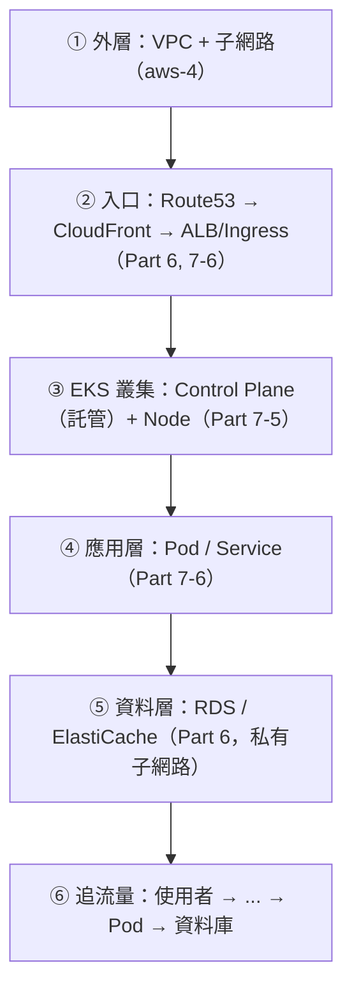

# [aws-7-9] 看懂公司的 EKS 架構：全景拆解

> **本章目標**：把 Part 7 學的全部整合，加上前面 Part 的 VPC、ALB、RDS，讀懂一張真實公司的 EKS 完整架構圖。

## 你會學到

- 怎麼系統化地讀懂一張 EKS 架構圖
- EKS 怎麼和 VPC、ALB、RDS 整合成完整系統
- 一個請求在這個架構裡的完整旅程
- Part 7 完整知識的整合

## 概念說明

### 為什麼這章重要

aws-4-9 你學會讀「VPC 架構圖」。這章更進一步——讀懂「**EKS + VPC + ALB + RDS 的完整公司架構**」。這是中大型公司最常見的雲端架構，能看懂它，你就具備了「進公司看懂他們在做什麼」的能力。

好消息：你 Part 4~7 已經學完所有組件了。這章教你怎麼把它們「在一張圖上」串起來。

---

### 讀 EKS 架構圖的方法

延伸 aws-4-9 的六步法，加上 EKS 的層次。讀一張 EKS 圖，由外而內：



每一層都對應你學過的：外層是 VPC（aws-4）、入口是 Part 6 的服務、中間是 EKS（Part 7-5/7-6）、最裡面是資料（Part 6）。

---

### EKS 怎麼和其他服務整合

關鍵理解——**EKS 不是獨立存在的，它「住在 VPC 裡」，和 ALB、RDS 整合**：

| EKS 元件 | 怎麼和 AWS 整合 |
|---------|----------------|
| **Node / Pod** | 跑在 VPC 的私有子網路（aws-4-3）；Pod IP 來自 VPC（aws-7-6 VPC CNI）|
| **Ingress** | 背後常是 ALB（aws-6-4、7-6）|
| **跨 AZ** | Node 分散在多個 AZ 的子網路（aws-4-7 高可用）|
| **連資料庫** | Pod 連 RDS（aws-6-2，在私有子網路）|
| **image** | 從 ECR 拉（aws-7-2）|
| **權限** | Pod 用 IAM Role（aws-2-1）存取 AWS 服務 |

換句話說——**EKS 是「把容器跑起來的平台」，但它周圍的網路（VPC）、入口（ALB）、資料（RDS）、image（ECR）、權限（IAM），都是你前面 Part 學的東西。EKS 把它們黏在一起。**

---

### 完整架構全景

```
                 使用者
                   ↓
            Route 53（DNS, aws-6-6）
                   ↓
          CloudFront（CDN, aws-6-5）
                   ↓
  ╔════════════════════════════════════════╗ VPC（aws-4）
  ║  公開子網路（跨 AZ-a/b）                 ║
  ║    ALB / Ingress（aws-6-4, 7-6）        ║ ← 流量入口
  ║         ↓                               ║
  ║  ┌──────────────────────────────────┐  ║
  ║  │ EKS 叢集                          │  ║
  ║  │  Control Plane（AWS 託管, 7-5）   │  ║ ← 大腦（你不用管）
  ║  │  ───────────────────────────     │  ║
  ║  │  私有子網路（跨 AZ）的 Node       │  ║
  ║  │    Service（7-6）→ Pod, Pod...    │  ║ ← 你的應用容器
  ║  │    （HPA 自動擴縮 Pod, 7-7）      │  ║
  ║  └──────────────────────────────────┘  ║
  ║         ↓                               ║
  ║  私有子網路（跨 AZ）                     ║
  ║    RDS（aws-6-2）+ ElastiCache（6-3）   ║ ← 資料層（最裡面）
  ╚════════════════════════════════════════╝
       ECR（aws-7-2）← Node 從這拉 image
```

看起來複雜，但每一塊你都認識！這就是 Part 4~7 的總整合。

---

### 一個請求的完整旅程

把上圖「動起來」——使用者買東西，請求怎麼跑：

```
使用者連 https://shop.com/api/orders（要下單）
  ↓
① Route 53 解析網域 → CloudFront
  ↓
② CloudFront：動態 API 請求 → 轉給來源 ALB
  ↓
③ ALB（公開子網路）→ 作為 EKS 的 Ingress，依 /api/* 路由
  ↓
④ Service「order-service」（7-6）→ 用內部負載平衡挑一個 order Pod
  ↓
⑤ order Pod（私有子網路的 Node 上）處理下單邏輯
   - 用 IAM Role（aws-2-1）權限
   - 先查 ElastiCache（6-3）看快取
   - 寫入 RDS（6-2，私有子網路的資料庫）
  ↓
⑥ 回應沿原路回給使用者

過程中的自動化（你學過的全在運作）：
  - 流量大 → HPA 多開 order Pod（7-7）→ 不夠機器 → Cluster Autoscaler 加 Node
  - 某個 Pod 掛了 → Control Plane 自動重建（7-5）→ Service 自動更新（7-6）
  - 某個 AZ 掛了 → 其他 AZ 的 Node 和 RDS 副本頂上（aws-4-7, 6-2）
  - 全程 HTTPS（ACM, 6-6）、資料庫躲私有區（aws-4-3）
```

這就是一個現代公司的完整雲端架構在運作。**你現在能讀懂它的每一塊、追蹤每一個請求、理解每一個自動化機制——這是非常扎實的能力。**

---

### Part 7 回顧

| 章節 | 學到的 |
|------|--------|
| 7-1 | 為什麼要容器、容器平台 |
| 7-2 | ECR（image 倉庫）|
| 7-3 | ECS vs EKS、Fargate |
| 7-4 | 🔧 ECS Fargate 部署 |
| 7-5 | EKS 架構（Control Plane / Node）|
| 7-6 | EKS 網路（Pod / Service / Ingress）|
| 7-7 | 自動擴縮（HPA / Cluster Autoscaler）|
| 7-8 | Helm（套件管理）|
| 7-9 | 看懂完整架構（本章）|

## 小練習

### 練習 1：EKS 怎麼整合

回答：EKS 不是獨立的——它怎麼和 VPC、ALB、RDS、ECR、IAM 整合？（各舉它和其中之一的關係）

---

### 練習 2：追一個請求

不看上面，描述「使用者下單」的請求，從 Route 53 一路到 RDS 的旅程（經過哪些元件）。

---

### 練習 3：讀懂自動化

在這個架構裡，當「流量暴增」「某個 Pod 掛了」「某個 AZ 掛了」時，分別是哪些機制自動應對？（對應你 Part 4~7 學的）

## 課外讀物

> 這種大型架構是「規模化」的體現，想看更廣的規模化全景 → [課外讀物 E-13-4：Monolith vs Microservices](../../../課外讀物/E-13-scaling/E-13-4-monolith-vs-microservices.md)
