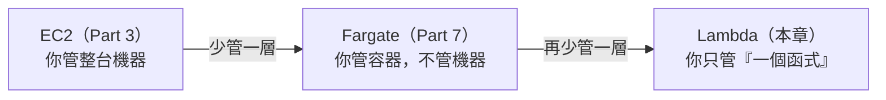
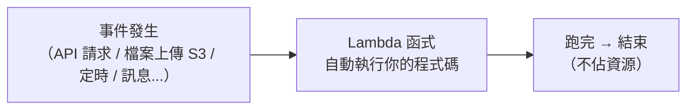
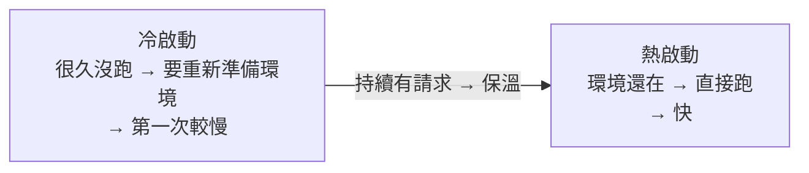

# [aws-8-1] Lambda 是什麼？函數即服務與冷啟動

> **本章目標**：理解 Lambda 這個「無伺服器（serverless）」運算服務——你只寫一個函式，不用管任何機器，以及它的特性與「冷啟動」問題。

## 你會學到

- 「無伺服器（Serverless）」是什麼意思
- Lambda 是什麼、怎麼運作
- Lambda 的計費方式（為什麼可能超省）
- 「冷啟動（cold start）」是什麼問題

## 概念說明

### 運算的演進：你管的東西越來越少

回顧你學的運算選項，會發現一條清晰的「你管的東西越來越少」的演進：



- **EC2**：你管整台機器（OS、修補、擴縮…）。
- **Fargate**：你管容器，不管機器。
- **Lambda**：你**只寫一個函式**，連容器都不用管。

Lambda 是這條路的終點——「無伺服器」的極致。

---

### 「無伺服器（Serverless）」是什麼

**無伺服器（Serverless）** 這個詞有點誤導——**不是「沒有伺服器」**，而是「**你不用管伺服器**」。伺服器還在（AWS 的），只是 AWS 全幫你打理，你完全不用碰。

**Lambda（AWS 的 FaaS）** 一句話：

> **Lambda 讓你「只上傳一段函式程式碼」，AWS 在「有事件觸發時」自動跑它，跑完就結束。你不用管任何伺服器、不用管擴縮——全自動。**

FaaS = **Function as a Service（函數即服務）**——你提供「函式」，AWS 提供「執行它的一切」。

---

### Lambda 怎麼運作

Lambda 是「**事件驅動**」的——它平常不跑，**有事件觸發時才執行**：



常見的觸發來源：

| 觸發來源 | 例子 |
|---------|------|
| **API Gateway** | 有人呼叫你的 API → 觸發 Lambda（8-2 會做）|
| **S3** | 有檔案上傳到 S3 → 觸發 Lambda（如自動產生縮圖）|
| **定時** | 像 cron（infra Part 6-2）每天定時觸發 |
| **訊息佇列** | 有新訊息 → 觸發處理 |

關鍵特性：**Lambda 平常不存在、不佔資源；事件來才「瞬間起一個」執行、跑完就消失。** 這跟 EC2「一直開著」完全不同。

---

### 計費：可能超省（也可能不划算）

Lambda 的計費方式很特別（呼應 aws-1-3）：

> **按「執行次數」+「執行時間 × 記憶體」計費。沒被觸發 = 完全不花錢。**

這帶來一個巨大優勢——**閒置零成本**：

- 你的 API 半夜沒人用 → Lambda 沒被觸發 → **一毛錢都不用付**。
- 對比 EC2：半夜沒人用，機器還開著、還在計費。

而且 Lambda 有**永久免費額度**（每月前 100 萬次請求免費，aws-1-3）——對小流量服務，幾乎免費。

但反過來——**如果流量超大、持續高頻**，Lambda 一直被觸發，加起來可能比「一台一直開的 EC2」還貴。所以它適合「**流量不定、有時閒、突發性**」的工作，不適合「持續高頻」的（8-3 的選型會詳談）。

---

### 冷啟動（Cold Start）：Lambda 的招牌問題

Lambda 有個必須知道的特性——**冷啟動（cold start）**：

> 當一個 Lambda **很久沒被觸發**（或同時來很多請求要起新實例），AWS 要「**從頭準備執行環境**」（載入程式、初始化）——這會多花一點時間（幾百毫秒到數秒），這就是冷啟動。之後若持續有請求，環境會被「保溫」重用，就快了（熱啟動）。



冷啟動的影響：

- 對「偶爾才被呼叫」的 Lambda，使用者第一次可能感受到「慢一下」（延遲，呼應 SRE Part 2-2）。
- 對「延遲超敏感」的服務（如即時互動），冷啟動可能是個問題。
- 緩解方法：保持「預熱」、用 Provisioned Concurrency（預留並發，讓環境常駐，但要錢）、或選啟動快的執行環境。

這是 Lambda 的取捨——換來「不用管伺服器 + 閒置零成本」，代價是「偶爾的冷啟動延遲」。

## 範例：Lambda 適合什麼

```
Lambda 超適合的場景（流量不定、事件驅動、不用一直開）：

① 圖片處理：
   使用者上傳圖到 S3 → 觸發 Lambda → 自動產生縮圖
   → 沒人上傳就不花錢，上傳才跑

② 輕量 API（8-2 會做）：
   API Gateway + Lambda → 不用養一台 EC2 也能有 HTTP API
   → 流量小、半夜沒人用 → 零成本

③ 定時任務：
   每天凌晨產報表（取代 infra Part 6-2 在伺服器上跑 cron）
   → 不用為了「每天跑一次」養一台機器

④ 黏合服務：
   各 AWS 服務之間的小型自動化（例如某事件發生時做點事）

不適合 Lambda 的：
  - 持續高頻、長時間運算（一直跑 → 可能比 EC2 貴、有執行時間上限）
  - 延遲超敏感、不能忍受冷啟動的
  → 這些用 ECS/EC2（8-3 詳談）
```

## 小練習

### 練習 1：Serverless 是什麼

回答：「無伺服器」真的是「沒有伺服器」嗎？Lambda 讓你「只管」什麼、「不用管」什麼？

---

### 練習 2：計費特性

回答：

1. Lambda 的計費方式是什麼？為什麼「閒置零成本」是它的大優勢？
2. 什麼情況下 Lambda 反而可能比 EC2 貴？

---

### 練習 3：理解冷啟動

回答：什麼是冷啟動？它對「偶爾才被呼叫」和「延遲敏感」的服務分別有什麼影響？

## 課外讀物

> Lambda 的「事件驅動」是一種架構風格，和 basic 課程的事件驅動概念相通 → 參見 **basic 課程** Part 3（事件驅動）；運算選型在下一章與 8-3 詳談
