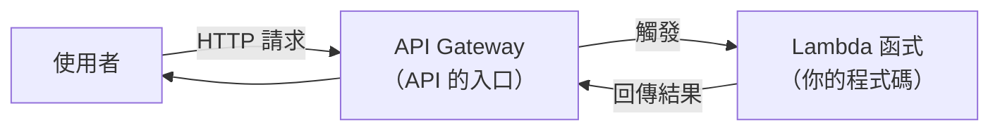

# [aws-8-2] 🔧 動手做：API Gateway + Lambda 做無伺服器 API

> **本章目標**：用 API Gateway + Lambda 做一個「無伺服器 API」——不用開任何 EC2、不用管伺服器，就能提供一個 HTTP API。

## 你會學到

- API Gateway 是什麼、怎麼和 Lambda 搭配
- 建立一個 Lambda 函式
- 用 API Gateway 給它一個 HTTP 端點
- 體驗「沒有伺服器」的 API 開發

## 概念說明

### 這一章在做什麼

aws-8-1 學了 Lambda。這章把它和 **API Gateway** 搭起來，做一個「**用網址就能呼叫的 API**」——但**完全沒有伺服器**。

對比你 basic Part 4 / aws-3-2 的做法：以前要「開 EC2、裝 Node、跑 Express、設 Nginx」才能有一個 API。這次——**只寫一個函式，就有一個能對外的 HTTP API**，AWS 處理其餘一切。



### API Gateway 是什麼

**API Gateway** 是「**API 的受管入口**」——它接收 HTTP 請求、做路由、然後觸發後面的 Lambda（或其他後端）。它幫你處理「對外的 HTTP 端點、路由、限流、驗證」等，你不用自己架（呼應 aws-6-4 ALB 的「入口」角色，但這是給 serverless 用的）。

API Gateway + Lambda 是經典的 serverless API 組合——**API Gateway 當門面，Lambda 當大腦**。

## 程式碼範例

### 第一步：建立一個 Lambda 函式

1. Console 進入 **Lambda** → Create function。
2. 選「Author from scratch」。
3. Function name：`hello-api`。
4. Runtime：選 **Node.js**（或 Python，你熟悉的）。
5. 建立。

進入函式，寫程式碼（Lambda 的程式碼是一個「handler 函式」，事件來時被呼叫）：

```javascript
// Lambda handler：事件（請求）來時被呼叫
export const handler = async (event) => {
  // event 裡有請求的資訊（路徑、參數等）
  const name = event.queryStringParameters?.name || "世界";

  return {
    statusCode: 200,
    headers: { "Content-Type": "application/json; charset=utf-8" },
    body: JSON.stringify({ message: `你好，${name}！這是無伺服器 API。` }),
  };
};
```

逐段看：

- `handler` 是 Lambda 的進入點——請求來時 AWS 呼叫它，把請求資訊放在 `event`。
- 從 `event` 取出查詢參數 `name`。
- 回傳一個物件（含狀態碼、標頭、body）——API Gateway 會把它變成 HTTP 回應。

注意：你**沒有寫任何「啟動伺服器、監聽 port」的程式碼**（對比 basic Part 4 的 Express `app.listen`）——因為沒有伺服器！你只寫「收到請求要做什麼」。

### 第二步：用 API Gateway 給它 HTTP 端點

1. 在 Lambda 函式頁面 → Add trigger（新增觸發器）。
2. 選 **API Gateway**。
3. 選「Create a new API」→ HTTP API（較簡單）。
4. Security：學習用先選 Open（之後正式環境要加驗證）。
5. 建立。

API Gateway 會給你一個**網址端點**（像 `https://xxxx.execute-api.../hello-api`）。

### 第三步：呼叫你的無伺服器 API

打開那個網址（或加參數）：

```bash
curl "https://xxxx.execute-api.../hello-api?name=小明"
```

你應該收到：

```json
{"message": "你好，小明！這是無伺服器 API。"}
```

**恭喜——你做出了一個 HTTP API，但你沒開過任何一台機器、沒設過任何伺服器。** 它平常不佔資源、被呼叫才跑、閒置零成本（aws-8-1）。AWS 自動處理擴縮——一個人呼叫和一萬個人同時呼叫，它都自動應付（自動起多個 Lambda 實例）。

---

### 對比傳統做法

```
傳統（basic Part 4 / aws-3-2）：
  開 EC2 → SSH → 裝 Node → 寫 Express（含 app.listen）
  → 跑起來 → 設 Nginx → 設 Security Group → 機器要一直開著計費
  → 還要自己處理「流量大了怎麼擴展」

Serverless（這章）：
  寫一個 handler 函式 → 接 API Gateway → 完成
  → 沒有機器、閒置零成本、自動擴縮
  → AWS 處理一切

差別：你只專注「業務邏輯（收到請求做什麼）」，
     基礎設施完全不用碰
```

這就是 serverless 的魅力——**極致地「只管程式、不管基建」**。

---

### 清理

學習做完，刪除 Lambda 函式和 API Gateway（這兩個閒置幾乎不計費，但好習慣，aws-1-3）。

## 小練習

### 練習 1：完成一個 serverless API

照步驟做一個 Lambda + API Gateway 的 API，用 curl 或瀏覽器呼叫成功。改一下回傳內容，重新測試。

---

### 練習 2：對比傳統

回答：這個 serverless API，和 basic Part 4 用 Express 在 EC2 上跑的 API，在「你要管的東西」上有什麼根本差別？

---

### 練習 3：思考適用

回答：你的 Lambda 函式裡，為什麼沒有 `app.listen`（啟動伺服器）這種程式碼？這個「無伺服器 API」適合什麼樣的流量場景？（提示：aws-8-1 的計費、冷啟動）

## 課外讀物

> 對比傳統的 Express API 開發，理解兩種模式的差異 → 參見 **basic 課程** Part 4（HTTP / Express）
