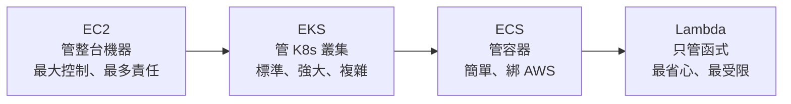
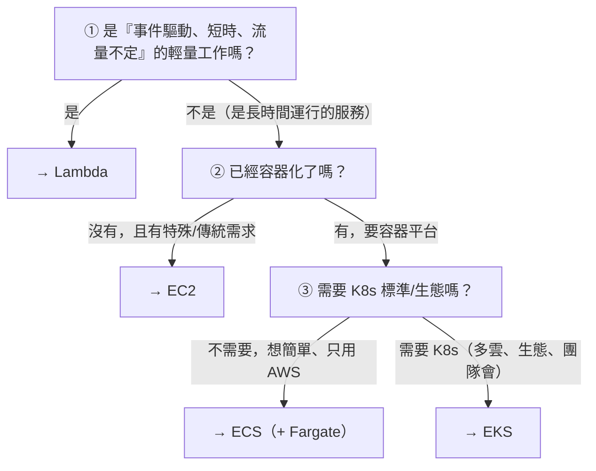

# [aws-8-3] 選型指南：Lambda vs ECS vs EKS vs EC2

> **本章目標**：整合你學過的所有運算選項，建立「什麼場景該用什麼」的判斷力——這是 AWS 架構決策最常被問的問題。

## 你會學到

- 四種運算選項的定位總整理
- 「你管多少 vs AWS 管多少」的光譜
- 怎麼依場景選擇運算服務
- 選型的判斷框架

## 概念說明

### 把所有運算選項放在一起

走到這裡，你學完了 AWS 的主要運算選項。這章把它們整合，建立選型判斷力——這是工作和面試最常見的問題：「**這個工作該用什麼跑？**」

四個主要選項，依「你管的東西多少」排成一條光譜：



> 註：ECS/EKS 可搭 Fargate（不管機器）或 EC2 模式（管機器），讓光譜更細。

---

### 四個選項的定位

| 選項 | 你管什麼 | 適合 | 取捨 |
|------|---------|------|------|
| **EC2**（Part 3）| 整台機器 | 要完全控制、特殊需求、傳統應用 | 最彈性，但維運責任最重 |
| **EKS**（Part 7）| K8s 叢集 | 要 K8s 標準/生態、多雲、大規模 | 強大標準，但最複雜 |
| **ECS**（Part 7）| 容器 | 容器化、只用 AWS、想簡單 | 簡單，但綁 AWS |
| **Lambda**（Part 8）| 一個函式 | 事件驅動、流量不定、輕量 | 最省心，但有限制（執行時間、冷啟動）|

核心權衡（貫穿整個 AWS 課、呼應 aws-6-1、infra Part 9-3）：

> **越往「管得多」（EC2），你的控制力越大、但責任越重；越往「管得少」（Lambda），越省心、但越受限、彈性越小。** 沒有最好的，只有最適合場景的。

---

### 選型的判斷框架

面對「該用什麼」，依序問這些問題：



**實用判斷重點**：

1. **輕量、事件驅動、流量不定** → **Lambda**（API、檔案處理、定時任務、黏合）。閒置零成本是殺手鐧。
2. **長時間運行的服務 + 已容器化 + 想簡單** → **ECS + Fargate**（多數 web 應用的甜蜜點）。
3. **要 K8s 的標準與生態 / 多雲 / 大規模** → **EKS**（有能力駕馭複雜度時）。
4. **需要完全控制 / 特殊需求 / 不想/不能容器化** → **EC2**。

---

### 常見場景對照

| 場景 | 建議 | 理由 |
|------|------|------|
| 輕量 API、流量小或不定 | **Lambda** | 閒置零成本、自動擴縮、不管伺服器 |
| 圖片處理、檔案上傳觸發 | **Lambda** | 事件驅動的完美場景 |
| 定時任務（取代 cron）| **Lambda** | 不用為了定時跑養機器 |
| 一般 web 應用（中小團隊、只用 AWS）| **ECS + Fargate** | 簡單、不管機器、長時間服務 |
| 大規模微服務、要 K8s 生態 | **EKS** | 標準、強大、不綁雲 |
| 需要特殊 OS 設定、GPU、傳統軟體 | **EC2** | 完全控制 |
| 不想被 AWS 綁定 | **EKS（K8s）** 或 **EC2** | 可移植 |

---

### 不是非此即彼——常常混用

真實系統常常**混合使用**多種運算：

```
一個完整應用可能：
  - 主要 API、web 服務 → ECS Fargate（長時間服務）
  - 圖片縮圖、非同步處理 → Lambda（事件驅動）
  - 定時報表 → Lambda（取代 cron）
  - 某個需要特殊環境的服務 → EC2
  - 核心的大規模微服務群 → EKS

→ 每個元件選「最適合它的」運算方式
```

**選型不是「全公司只能用一種」，而是「每個工作選最適合的工具」。** 這才是成熟的架構思維。

---

### 回到取捨的本質

這章其實是整個 AWS 課「取捨思維」的總結（aws-1-1 租房、aws-6-1 受管、infra Part 9-3 自架vs雲）：

> **沒有「最強的選項」，只有「最適合這個場景的選項」。** 判斷依據永遠是：控制力需求、團隊能力、流量特性、成本、是否要可移植。能依情況做出對的取捨——這正是一個有價值的雲端工程師的核心能力。

而你能做這個判斷，是因為你**真的懂每個選項在做什麼**（從 infra 的底層、到 AWS 的各種服務）——這就是「先學 infra、再學 AWS」一路走來的回報。

## 小練習

### 練習 1：四選項光譜

把 EC2、ECS、EKS、Lambda 依「你管的東西多少」排序，並各用一句話說明定位。

---

### 練習 2：場景選型

為下面的工作各選一個運算選項，說明理由：

1. 一個「使用者上傳圖片後自動產生縮圖」的功能
2. 一個中小團隊、只用 AWS 的一般 web 應用
3. 一個需要特殊 GPU、跑機器學習的服務
4. 一個每天凌晨產報表的定時任務

---

### 練習 3：理解混用

回答：為什麼一個真實應用常常「混用」多種運算選項，而不是全部用同一種？這體現了什麼思維？

## 課外讀物

> 選型的「取捨」思維，貫穿 aws-6-1（受管 vs 自架）與 infra Part 9-3（自架 vs 雲端）→ 參見 **infra 課程** Part 9-3（`lessons/infra/課程大綱.md`）
