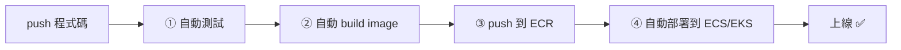

# [aws-9-1] GitHub Actions + AWS：推上去自動部署

> **本章目標**：理解 CI/CD 怎麼把「改程式碼 → 上線」這條路自動化，用 GitHub Actions 建立一條自動部署到 AWS 的流水線。

## 你會學到

- CI/CD 是什麼、解決什麼問題
- GitHub Actions 怎麼運作
- 一條「程式碼 → build → 部署到 AWS」的流水線
- 自動化部署為什麼是現代開發的標配

## 概念說明

### 痛點：手動部署又慢又危險

前面你學的部署，都帶點「手動」——手動 build image、手動 push ECR、手動更新 ECS。這有幾個問題（呼應 infra Part 6-3、SRE）：

- **慢又煩**：每次上線都要手動跑一串步驟。
- **容易出錯**：手動步驟可能漏、可能打錯（SRE Part 8-4 說「部署是事故大來源」）。
- **不一致**：每個人手動做的可能不一樣。

解法是 **CI/CD**——把「從程式碼到上線」自動化。

---

### CI/CD 是什麼

**CI/CD** 是兩個概念：

- **CI（Continuous Integration，持續整合）**：每次有人推程式碼，**自動執行測試、build**——確保新程式碼沒把東西弄壞、能正常建置。
- **CD（Continuous Deployment/Delivery，持續部署/交付）**：build 通過後，**自動部署到環境**。

合起來：

> **CI/CD 是一條「自動流水線」——你 push 程式碼，它自動測試、build、部署，全程不用人手動操作。**

用類比：CI/CD 像**工廠的自動化生產線**——原料（程式碼）從一端進去，經過自動的各站（測試、組裝、品檢、出貨），成品（上線的服務）從另一端出來，不用人工搬運。



---

### GitHub Actions：在 GitHub 裡的 CI/CD

**GitHub Actions** 是 GitHub 內建的 CI/CD 工具——你在程式碼 repo 裡寫一個設定檔（workflow），定義「當某事發生時（如 push），自動執行哪些步驟」。

它的好處：和你的程式碼放一起（程式碼在 GitHub，CI/CD 也在 GitHub）、設定簡單、生態豐富。當然也有別的選擇（GitLab CI、AWS CodePipeline 等），概念都類似。

---

### 一條部署到 AWS 的流水線

workflow 設定檔是 YAML（你已經很熟 YAML 了——Part 5/7 的 compose、Helm），放在 repo 的 `.github/workflows/`。概念示意：

```yaml
name: Deploy to AWS

on:
  push:
    branches: [main]          # 當 push 到 main 分支時觸發

jobs:
  deploy:
    runs-on: ubuntu-latest
    steps:
      - uses: actions/checkout@v4        # ① 取出程式碼

      - name: Run tests                   # ② 跑測試（CI）
        run: npm test

      - name: Build & push to ECR         # ③ build image、推到 ECR（aws-7-2）
        run: |
          docker build -t my-app .
          # （登入 ECR、tag、push 的指令）

      - name: Deploy to ECS               # ④ 更新 ECS 服務用新 image（aws-7-4）
        run: |
          # （觸發 ECS 用新 image 重新部署）
```

逐段對照你學過的：

- `on: push` → 觸發條件（推程式碼就跑）。
- 測試 → CI（確保沒弄壞）。
- build + push ECR → aws-7-2 的流程，自動化。
- deploy to ECS → aws-7-4 的部署，自動化。

**結果**：你只要 `git push`，剩下全自動——測試、build、推 image、部署上線。從「改程式碼」到「新版上線」，可能幾分鐘內全自動完成。

---

### 怎麼讓 GitHub Actions 有權限存取 AWS

一個關鍵——GitHub Actions 要操作 AWS（推 ECR、更新 ECS），需要權限。**最佳做法是用 OIDC（而非把 AWS 金鑰寫進 GitHub）**：

- ❌ 笨方法：把 AWS 存取金鑰存在 GitHub → 金鑰可能外洩（aws-1-3 的天價帳單風險！）。
- ✅ 好方法：用 **OIDC** 讓 GitHub Actions「臨時取得」一個 AWS Role（aws-2-1 的 Role！）的權限——不用儲存長期金鑰，且最小權限（aws-2-2）。

這再次呼應「用 Role、不用金鑰」的安全原則（aws-2-1）——連 CI/CD 的權限也該這樣設計。

---

### 自動化部署的價值

把好處串起來（呼應 SRE）：

| 好處 | 說明 |
|------|------|
| **快** | push 完幾分鐘自動上線，不用手動 |
| **可靠** | 每次都跑一樣的步驟，不會漏、不會手滑（SRE Part 8-4 降低部署風險）|
| **有測試把關** | CI 確保「沒通過測試的程式碼不會上線」|
| **可追溯** | 每次部署都有記錄（哪個 commit、誰推的）|
| **能整合安全發布** | 可結合金絲雀、自動回滾（SRE Part 8-4）|

這就是為什麼 CI/CD 是現代開發的標配——它把 SRE Part 8-4「讓上線變安全」、infra Part 6「自動化消除 toil」的理念，落實在部署流程上。

## 範例：一次自動部署

```
開發者修好一個功能：

① git push origin main
       ↓（自動觸發 GitHub Actions）
② 跑測試 → 通過 ✅（沒通過就停，不會上線壞的）
③ build image → push 到 ECR（aws-7-2）
④ 更新 ECS 服務 → 用新 image 滾動部署（aws-7-4）
   （可設成金絲雀，先導一小部分流量，SRE Part 8-4）
⑤ 新版上線 ✅

整個過程：
  - 開發者只做了「git push」這一個動作
  - 其餘全自動，幾分鐘完成
  - 有測試把關、有記錄、不會手滑
  - 出問題可快速回滾（CI/CD 通常保留前版）

對比手動：開發者要手動 build、push、更新…，慢、煩、易錯
```

## 小練習

### 練習 1：CI/CD 是什麼

用「自動化生產線」的類比，解釋 CI 和 CD 各做什麼。它解決手動部署的哪些問題？

---

### 練習 2：看懂流水線

回答：一條「部署到 AWS」的流水線，通常有哪幾個步驟（從 push 到上線）？

---

### 練習 3：權限安全

回答：為什麼「把 AWS 金鑰存進 GitHub」是壞做法？比較好的方式是什麼？（提示：aws-2-1 的 Role、aws-1-3 的金鑰外洩）

## 課外讀物

> CI/CD 讓部署變安全可靠，呼應 SRE 的安全發布 → 參見 **SRE 課程** Part 8-4；Git 協作流程 → [課外讀物 E-8-7：Git Flow 與 GitHub Flow](../../../課外讀物/E-8-git/E-8-7-git-flow.md)
