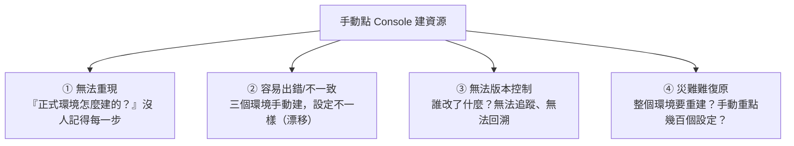
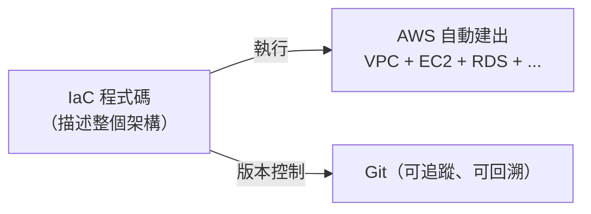

# [aws-9-2] 為什麼不能一直點 Console？IaC 的必要性

> **本章目標**：理解「手動點 Console 建資源」的問題，以及為什麼要用「基礎設施即代碼（IaC）」——把整個 AWS 架構寫成程式碼。

## 你會學到

- 「手動點 Console」會帶來什麼問題
- IaC（基礎設施即代碼）是什麼（複習 infra Part 6-3）
- IaC 用在雲端的價值
- 宣告式 IaC 的核心思想

## 概念說明

### 你一直在「手動點 Console」

回想前面的動手做——建 VPC（aws-4-8）、開 EC2（aws-3-2）、設 ECS（aws-7-4）……你都是**在網頁 Console 上「點選」操作**的。學習時這樣很好（直觀、看得到）。

但正式環境這樣做，會遇到大問題——這其實是你 infra Part 6-3 學過的「設定漂移」問題，在雲端的版本。

---

### 手動點 Console 的問題



具體來說（呼應 infra Part 6-3）：

1. **無法重現**：你手動建了一個複雜的 VPC + EKS + RDS 架構。要在「另一個環境」「另一個 Region」建一個一模一樣的？得手動重點幾百次，還可能漏、可能錯。
2. **設定漂移**：開發、測試、正式三個環境手動建，遲早設定不一致，出現「在測試好好的、正式就壞」（infra Part 6-3 的雪花伺服器）。
3. **無法追蹤**：誰改了哪個設定？什麼時候改的？為什麼改？手動點 Console 沒有記錄。
4. **災難復原困難**：整個環境要重建（infra Part 8-4 的災難復原），手動重做幾百個設定是惡夢。

---

### 解法：IaC（基礎設施即代碼）

**IaC（Infrastructure as Code）** 你 infra Part 6-3 學過核心思想，這裡是雲端的應用：

> **把「整個 AWS 架構（VPC、子網路、EC2、RDS、IAM…）」寫成「程式碼」，而不是手動點 Console。**

也就是說——你不再「點選建立一個 VPC」，而是「**寫一段程式碼描述這個 VPC**」，然後執行程式碼，工具自動幫你建出來。



---

### IaC 用在雲端的價值

IaC 把上面那四個問題全解決了（呼應 infra Part 6-3 的好處，在雲端威力更大）：

| 問題 | IaC 怎麼解 |
|------|-----------|
| 無法重現 | 跑同一份程式碼 → 建出一模一樣的環境（要幾個建幾個）|
| 設定漂移 | 三個環境用同一份程式碼（+ 不同參數）→ 結構一致 |
| 無法追蹤 | 程式碼放 Git → 誰改了什麼、何時、為何，全都有記錄 |
| 災難復原 | 整個環境掛了 → 跑一次程式碼，分鐘級重建（infra Part 8-4）|

額外的好處：

- **是文件**：程式碼本身就是「這個架構長什麼樣」最準確的說明書。
- **可審查**：改架構前先 review 程式碼（像 review PR）——避免手滑改錯正式環境。
- **可測試、可重用**：把常用的架構模組化、重複使用。

---

### 宣告式：描述「要什麼」，而非「怎麼做」

IaC 工具（如下一章的 Terraform）多採**宣告式**（infra Part 6-3 學過）：

> **你描述「我要的最終架構長什麼樣」（要一個 VPC、兩個子網路、一台 RDS…），工具自己想辦法達成——該建什麼、該改什麼，它自己算。**

這呼應 infra Part 6-3 的「給司機目的地，而非逐步指示」、也呼應 K8s 的「期望狀態」（aws-7-5）。你聲明目標狀態，工具負責讓現實符合它。

好處是**冪等**（infra Part 6-4）——同一份程式碼跑幾次，結果都一樣（已經是目標狀態就不動）。你可以放心地「改程式碼、重跑」，工具只套用差異。

---

### 這是雲端工程的成熟標誌

```
新手 / 學習階段：手動點 Console（直觀，OK）
       ↓
專業 / 正式環境：用 IaC（VPC、EC2、RDS… 全寫成程式碼）
```

成熟的 AWS 使用，幾乎都是 IaC——**整個雲端基礎設施都在程式碼裡、用 Git 管、用 CI/CD 部署**（結合 aws-9-1）。這是 infra Part 1-1 說的「現代 infra 靠程式碼，不靠雙手」的最終體現，在雲端規模下尤其重要——因為雲端資源又多又複雜，手動根本管不來。

> 你「先學手動點 Console」很有價值——因為你**懂每個資源是什麼、在做什麼**。寫 IaC 時，你不是在背語法，而是在「用程式碼描述你已經理解的架構」。這就是為什麼這門課先讓你手動做、再introduce IaC。

## 範例：手動 vs IaC

```
情境：要建「開發、測試、正式」三個一模一樣的環境

❌ 手動點 Console：
   - 開發環境：手動建 VPC、子網路、EC2、RDS…（點幾百下）
   - 測試環境：再手動點一遍（可能漏、可能設不一樣）
   - 正式環境：再點一遍（更怕出錯）
   → 三個環境設定漂移、無記錄、難維護
   → 要再加一個環境？再痛苦一次

✅ IaC：
   - 寫一份描述架構的程式碼（一次）
   - 開發環境：跑程式碼（帶 dev 參數）
   - 測試環境：跑同一份（帶 test 參數）
   - 正式環境：跑同一份（帶 prod 參數）
   → 三個環境結構完全一致、全在 Git、可追溯
   → 要再加一個環境？跑一次就好
   → 正式環境掛了？跑一次重建（災難復原）
```

下一章就帶你用 Terraform，把你 aws-4-8 手動建的 VPC，改寫成 IaC 程式碼。

## 小練習

### 練習 1：手動的問題

回答：「手動點 Console 建正式環境」會帶來哪些問題？（至少三個）

---

### 練習 2：IaC 的價值

回答：IaC 怎麼解決「要建三個一模一樣的環境」這個需求？比手動好在哪？

---

### 練習 3：對照 infra

回答：這章的 IaC，和你 infra Part 6-3/6-4 學的（設定漂移、Ansible、宣告式、冪等）有什麼關聯？

## 課外讀物

> IaC 的核心概念與「設定漂移」「宣告式」思維，infra Part 6 有完整鋪陳 → 參見 **infra 課程** Part 6（`lessons/infra/課程大綱.md`）
