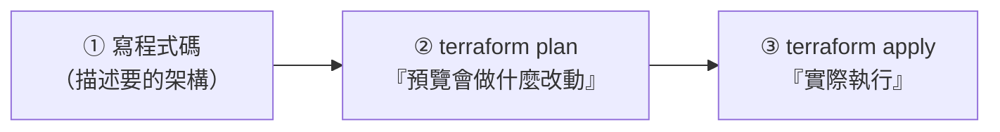

# [aws-9-3] 🔧 動手做：用 Terraform 把 VPC 寫成程式碼

> **本章目標**：用 Terraform 把你 aws-4-8 手動建的 VPC，改寫成 IaC 程式碼，體驗「用程式碼建 + 改 + 刪整個基礎設施」。

## 你會學到

- Terraform 是什麼、為什麼這麼受歡迎
- HCL 語法的基本結構
- `terraform plan` / `apply` / `destroy` 的工作流
- 把手動架構改寫成程式碼

## 概念說明

### Terraform：最受歡迎的 IaC 工具

aws-9-2 講了 IaC 的價值。**Terraform**（HashiCorp 出品）是目前最受歡迎的 IaC 工具，原因：

- **跨雲**：不只 AWS——GCP、Azure 等都能用同一套工具（不綁單一雲）。
- **宣告式**：你描述「要什麼」，Terraform 算出「該怎麼建」（aws-9-2、infra Part 6-3）。
- **生態龐大**：幾乎所有服務都有對應的 Terraform 支援。

> AWS 也有原生的 IaC 工具（CloudFormation、CDK，9-5 會比較）。Terraform 因為跨雲、生態大，是業界最常用的。

---

### Terraform 的工作流

Terraform 的核心是三個指令，組成一個清晰的工作流：


```mermaid
graph LR
    WRITE["① 寫程式碼<br/>（描述要的架構）"]
    PLAN["② terraform plan<br/>『預覽會做什麼改動』"]
    APPLY["③ terraform apply<br/>『實際執行』"]
    WRITE --> PLAN --> APPLY
```

| 指令 | 做什麼 |
|------|--------|
| `terraform plan` | **預覽**——它比對「程式碼描述的」和「現實的」，告訴你「會新增/修改/刪除什麼」，但**不真的執行** |
| `terraform apply` | **執行**——真的去建立/修改資源 |
| `terraform destroy` | **刪除**——把這份程式碼建的資源全部清掉 |

`plan` 這一步是 Terraform 的精髓——**執行前先預覽會發生什麼**，避免手滑改錯（呼應 infra Part 4-3 `nginx -t` 先測試、SRE 降低風險的精神）。

---

### HCL：Terraform 的語法

Terraform 用一種叫 **HCL（HashiCorp Configuration Language）** 的語法。它很好讀，基本結構是「**resource 區塊**」——每個區塊描述「一個資源」：

```hcl
resource "資源類型" "你取的名字" {
  設定欄位 = 值
}
```

## 程式碼範例

### 把 aws-4-8 的 VPC 改寫成 Terraform

回想你 aws-4-8 手動建的：VPC + 公開子網路 + IGW。用 Terraform 寫出來：

```hcl
# 1. 建立 VPC（對應 aws-4-1, 4-2）
resource "aws_vpc" "main" {
  cidr_block = "10.0.0.0/16"        # aws-4-2 的 CIDR
  tags = {
    Name = "my-vpc"
  }
}

# 2. 建立公開子網路（對應 aws-4-3）
resource "aws_subnet" "public" {
  vpc_id            = aws_vpc.main.id    # 屬於上面那個 VPC
  cidr_block        = "10.0.1.0/24"
  availability_zone = "ap-northeast-1a"
  tags = {
    Name = "public-subnet"
  }
}

# 3. 建立 Internet Gateway（對應 aws-4-4）
resource "aws_internet_gateway" "igw" {
  vpc_id = aws_vpc.main.id
  tags = {
    Name = "my-igw"
  }
}

# 4. 路由表，讓子網路公開（對應 aws-4-6）
resource "aws_route_table" "public" {
  vpc_id = aws_vpc.main.id
  route {
    cidr_block = "0.0.0.0/0"             # 所有外部流量
    gateway_id = aws_internet_gateway.igw.id   # 走 IGW → 公開！
  }
}

# 5. 把路由表關聯到子網路
resource "aws_route_table_association" "public" {
  subnet_id      = aws_subnet.public.id
  route_table_id = aws_route_table.public.id
}
```

逐段看——**每個 resource 區塊，對應你 aws-4-8 手動點的一個東西**：

- `aws_vpc` → 建 VPC（手動是 aws-4-8 第一步）。
- `aws_subnet` → 建子網路（第二步）。
- `aws_internet_gateway` → 建 IGW（第三步）。
- `aws_route_table` + association → 路由表，讓子網路公開（第四步，aws-4-6 的「`0.0.0.0/0 → IGW` 讓它變公開」）。

注意 `aws_vpc.main.id` 這種寫法——它**引用**另一個資源（「子網路屬於 main 這個 VPC」）。Terraform 會自動算出「要先建 VPC，再建子網路」的順序。**你只描述關係，它自己排順序**（宣告式，aws-9-2）。

---

### 執行工作流

```bash
# 初始化（第一次，下載 AWS 的 Terraform 套件）
terraform init

# 預覽：會建立什麼？（不真的執行）
terraform plan
# → 它會列出「會新增 5 個資源：vpc, subnet, igw...」

# 確認沒問題後，執行
terraform apply
# → 它再列一次、問你 yes/no，輸入 yes
# → Terraform 自動建立整個 VPC 架構！
```

跑完 `apply`，你 aws-4-8 手動點半天的東西，**Terraform 一次自動建好**。去 Console 看，VPC、子網路、IGW、路由表都在——但這次是「程式碼建的」。

---

### 體驗 IaC 的威力

**① 改架構**：想改子網路的 CIDR？改程式碼那一行，`terraform plan` 看它會改什麼，`apply` 執行。Terraform 只動「有變的部分」（冪等，infra Part 6-4）。

**② 重現**：把這份程式碼複製、改幾個參數，就能在另一個 Region/環境建一模一樣的（aws-9-2 的重現）。

**③ 版本控制**：把這份 `.tf` 檔放 Git——整個架構的歷史都有記錄（aws-9-2）。

**④ 一鍵清理**：

```bash
terraform destroy
```

這會把這份程式碼建的所有資源**一次刪光**（呼應 aws-1-3 的清理習慣——比手動一個個刪安全又徹底，不會漏掉還在計費的東西）。

---

### 你完成了什麼

你把「手動點 Console 的 VPC」變成了「**一份程式碼**」。這份程式碼：

- 能一鍵建出整個架構（`apply`）
- 能安全地預覽改動（`plan`）
- 能一鍵清理（`destroy`）
- 能放 Git 版本控制、能重現、能多環境重用

**這就是專業的雲端基礎設施管理方式**——你不再「點按鈕」，而是「寫程式碼描述你要的架構」。這呼應 infra Part 6-5 的 Ansible playbook（同樣是 IaC，只是 Ansible 偏「設定機器」、Terraform 偏「建雲端資源」）。

## 小練習

### 練習 1：Terraform 工作流

回答：`terraform plan`、`apply`、`destroy` 各做什麼？為什麼 `plan`（先預覽）這一步很重要？

<details>
<summary>參考解答</summary>

- **`terraform plan`**：**預覽**。它比對「程式碼描述的架構（期望）」和「現實已經有的（state）」，列出「會新增／修改／刪除哪些資源」，但**不真的執行**。像出手前先看一遍。
- **`terraform apply`**：**執行**。真的去 AWS 建立／修改資源（通常會再列一次 plan、問你 yes/no，確認後才動手）。
- **`terraform destroy`**：**清理**。把這份程式碼建的所有資源一次刪光，方便省錢、避免留下還在計費的東西（呼應 aws-1-3 的清理習慣）。

**為什麼 `plan` 很重要**：它讓你在真正動到正式環境**之前**，先看清楚「這次改動會發生什麼」——尤其能提早發現危險操作（例如某個改動會導致資源被**刪除重建**）。這就像 infra Part 4-3 的 `nginx -t` 先測試設定、或 SRE 降低部署風險的精神：**先預覽、確認無誤，再執行**，避免手滑改壞線上環境。

</details>

---

### 練習 2：讀懂 HCL

看上面的 Terraform 程式碼，回答：

1. 哪個 resource 對應「VPC」？它的 CIDR 是多少？
2. `aws_subnet.public` 裡的 `vpc_id = aws_vpc.main.id` 是什麼意思？
3. 哪一段讓子網路「變公開」？（對應 aws-4-6）

<details>
<summary>參考解答</summary>

1. **對應 VPC 的是 `resource "aws_vpc" "main"`**，它的 CIDR 是 `cidr_block = "10.0.0.0/16"`。
2. **`vpc_id = aws_vpc.main.id` 是「引用」**——意思是「這個子網路屬於上面那個叫 `main` 的 VPC」。它抓的是 VPC 建好後才會產生的 id。因為有這層引用關係，Terraform 會**自動算出順序**：先建 VPC、再建子網路（你只描述關係，它自己排先後，這就是宣告式）。
3. **讓子網路變公開的是路由表那一段**：

   ```hcl
   resource "aws_route_table" "public" {
     vpc_id = aws_vpc.main.id
     route {
       cidr_block = "0.0.0.0/0"                  # 所有外部流量
       gateway_id = aws_internet_gateway.igw.id  # 走 IGW → 公開！
     }
   }
   ```

   關鍵是這條路由 `0.0.0.0/0 → IGW`（Internet Gateway）——所有要往外網的流量都導去 IGW，子網路因此對外可通（對應 aws-4-6）。再加上 `aws_route_table_association` 把這張路由表關聯到子網路，設定才真正生效。

</details>

---

### 練習 3：改寫並執行（進階）

如果你有 AWS 帳號，試著把這份 Terraform 跑起來（`init` → `plan` → `apply`），到 Console 確認 VPC 建好了，最後 `destroy` 清理。對比 aws-4-8 手動的體驗。

<details>
<summary>參考解答</summary>

> 這是動手題，要在你自己的 AWS 帳號實機操作，下面給做法與驗收點。**請自行在真實環境驗證**（本課程不會、也無法幫你真的建立 AWS 資源）。做完記得 `destroy` 清乾淨，避免留下計費資源。

**做法**：

1. 建一個資料夾，放一個 `main.tf`，先加上 provider 設定，再貼上本章那 5 個 resource：

   ```hcl
   provider "aws" {
     region = "ap-northeast-1"   # 和子網路的 availability_zone 對得上
   }

   # ...（本章的 aws_vpc / aws_subnet / aws_internet_gateway /
   #      aws_route_table / aws_route_table_association 五個區塊）
   ```

2. 先設定好 AWS 憑證（例如 `aws configure`，或用環境變數／SSO），Terraform 才有權限操作你的帳號。
3. 依序執行：

   ```bash
   terraform init      # 下載 AWS provider 套件
   terraform plan      # 預覽：應該顯示「will create 5 resources」
   terraform apply     # 輸入 yes 後真的建立
   ```

4. 最後清理：

   ```bash
   terraform destroy   # 輸入 yes，把這 5 個資源一次刪光
   ```

**驗收點**：

- `plan` 顯示 **Plan: 5 to add, 0 to change, 0 to destroy**。
- `apply` 結束顯示 **Apply complete! Resources: 5 added**。
- 到 AWS Console 的 VPC 頁面，能看到那個 `my-vpc`、`public-subnet`、`my-igw`、路由表都在，設定和程式碼一致。
- `destroy` 後顯示 **Destroy complete! Resources: 5 destroyed**，回 Console 確認資源都消失。

**對比 aws-4-8 手動的體驗**：手動要一頁一頁點、記順序、容易漏；Terraform 只是一份程式碼跑一次就全建好，而且能 `plan` 先預覽、`destroy` 一鍵清光、放 Git 版本控制、複製改參數就能重現到別的環境。這就是「寫程式碼描述架構」相對「點按鈕」的威力。

</details>

## 課外讀物

> Terraform 是 IaC 工具，和 infra 課的 Ansible 是同一種「基礎設施即代碼」精神的不同工具 → 參見 **infra 課程** Part 6（`lessons/infra/課程大綱.md`）
